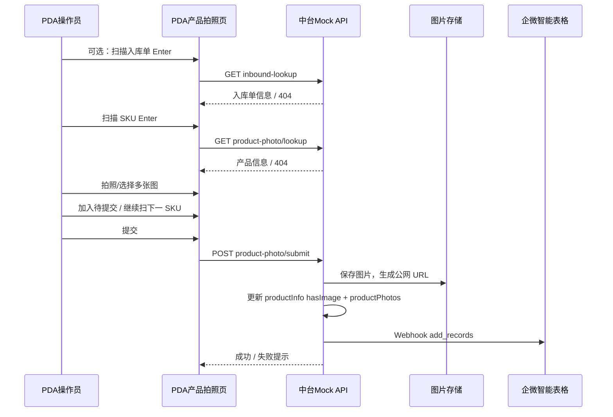

# 仓储中台 · PDA 产品拍照与企微在线表同步需求文档

## 1. 文档基础信息

### 1.1 版本记录

| 时间 | 版本 | 修改人 | 变更内容 |
| --- | --- | --- | --- |
| 2026-06-22 | v1.0 | — | 初版：PDA 产品拍照、SKU/入库单校验、批量提交、企微智能表格 Webhook 同步 |

### 1.2 文档范围

| 项目 | 内容 |
| --- | --- |
| 模块名称 | 仓储中台 · PDA 产品拍照 |
| 适用端 | 仓储中台 PDA Web（`/wh/pda-product-photo.html`） |
| 关联系统 | 产品信息管理（中台 SKU 主数据）、入库单 Mock、企业微信智能表格 Webhook |
| 不在范围 | 客户前台产品创建；SKU 创建时的企微同步（`WECOM_SMARTSHEET_WEBHOOK`）；品牌授权联动；图片 AI 审核；对象存储/CDN 正式方案（原型为本地落盘 + 公网 URL） |

### 1.3 术语表

| 术语 | 说明 |
| --- | --- |
| SKU 编码 | 产品中台 `skuCode` / `productCode`，PDA 扫描后 Enter 触发中台存在性校验 |
| 关联入库单 | PDA 选填字段，写入企微在线表「关联入库单」列；**与 SKU 无绑定/校验关联** |
| 待提交清单 | PDA 端累积多个 SKU + 多图后一次性提交的队列 |
| 图片链接 | 落盘后的 **http(s) 公网可访问 URL**，写入企微 `fhS9ko`（url 类型） |
| 首行 / 续行 | 同 SKU 多图同步企微时：首行写全字段，后续行仅写图片链接列 |

### 1.4 原型入口

| 环境 | 地址 |
| --- | --- |
| 本地 | `http://localhost:3847/wh/pda-product-photo.html` |
| 内网 | 配置 `PUBLIC_BASE_URL` 后，PDA 设备通过内网 IP 访问（需开放防火墙 3847） |

---

## 2. 需求背景

### 2.1 背景描述

仓库收货/质检环节需对 SKU 拍摄实物照片，供客服、关务及中台产品信息核对。线下拍照后通过 Excel 或即时通讯传递，难以与 SKU 主数据、入库单关联，也无法沉淀为可检索台账。

本需求在 **仓储中台 PDA** 提供轻量拍照入口：扫描 SKU → 校验中台产品 → 批量选图提交；提交成功后 **写入产品中台**（`hasImage`、`productPhotos[]`）并 **同步企业微信智能表格**，供运营/关务在线查看与跟进。

### 2.2 需求列表

| 编号 | 用户诉求描述 | 提出人/部门 |
| --- | --- | --- |
| R-01 | PDA 扫描 SKU，Enter 校验中台是否存在 | 仓储运营 |
| R-02 | 校验通过后可拍照/相册多选，支持批量累积后一次提交 | 仓储运营 |
| R-03 | 可选填写关联入库单，Enter 可单独校验（不与 SKU 绑定） | 仓储运营 |
| R-04 | 提交成功后同步企微在线表（SKU、图片链接、审核状态、仓库、上传时间、关联入库单） | 仓储运营/关务 |
| R-05 | 同 SKU 一次提交多张图，企微侧按规则展开多行展示 | 仓储运营 |

### 2.3 核心目标

**作为仓库 PDA 操作员，我希望扫描 SKU 快速上传产品照片并自动同步企微台账，以便减少手工登记、保证图片与 SKU 可追溯。**

核心指标：PDA 拍照提交成功率、企微同步成功率、单 SKU 平均拍照耗时。

---

## 3. 功能总览

### 3.1 业务流程



### 3.2 功能清单

| 编号 | 功能模块 | 功能简述 |
| --- | --- | --- |
| F-01 | 入库单输入（选填） | Enter 校验中台入库单 Mock，展示用户编号/收货仓/状态 |
| F-02 | SKU 扫描校验 | Enter 校验产品中台 SKU 存在，展示产品名称/用户编号/审核状态 |
| F-03 | 拍照/选图 | 支持相机或相册，单次可多选；校验 SKU 通过后可操作 |
| F-04 | 待提交清单 | 多 SKU、多图累积；支持移除、清空当前 SKU 图片 |
| F-05 | 提交 | 落盘、更新中台产品、同步企微 |
| F-06 | 重置 | 清空当前输入、待提交清单 |
| F-07 | 企微 Webhook 同步 | 按字段映射写入智能表格 |

---

## 4. 功能详细设计

### 4.1 PDA 产品拍照（F-01 ~ F-06）

#### A. 用户故事

- **作为** 仓库 PDA 操作员，**我想要** 扫描 SKU 并上传产品照片，**以便** 中台与企微台账留痕。
- **作为** 仓库 PDA 操作员，**我想要** 选填关联入库单且不与 SKU 强绑定，**以便** 灵活记录当次作业上下文。

#### B. 用户旅程

1. 打开 PDA 产品拍照页 → 顶栏展示操作人、当前仓库。
2. （可选）输入入库单 → Enter → 展示入库单信息或错误提示。
3. 输入/扫描 SKU → Enter → 展示产品中台信息或「未找到」。
4. 点击「拍照/选择」→ 选一张或多张图 → 预览缩略图。
5. 可「加入待提交」继续扫下一 SKU，或直接「提交」。
6. 提交成功弹窗；失败展示原因（SKU 不存在、企微失败等）。

#### C. 交互与界面

| 区域 | 说明 |
| --- | --- |
| 顶栏 | 用户名、仓库标签、菜单（产品信息管理 / 预约送仓管理） |
| 表单区 | 入库单（选填）、SKU（必填）、拍照/选择按钮 |
| 信息区 | 入库单信息面板、产品信息面板（校验通过后展示） |
| 图片区 | 当前 SKU 缩略图列表，支持单张删除 |
| 待提交区 | 队列条数、SKU + 张数，支持移除 |
| 底栏 | 提交（主按钮）、重置 |

**字段联动规则**

| 规则 | 说明 |
| --- | --- |
| 入库单与 SKU 独立 | 入库单未填不影响 SKU 校验；SKU 未填不影响入库单 Enter 校验 |
| 入库单选填 | 提交时不强制校验入库单是否存在于中台 |
| 拍照按钮 | SKU 校验通过前禁用 |
| 提交 | 至少有一条待提交项，或当前 SKU 已选图 |

#### D. 字段与逻辑

**1. 页面输入字段**

| 字段 | 组件 | 必填 | 逻辑/备注 |
| --- | --- | --- | --- |
| 入库单 | 文本框 + Enter | 否 | 调用 `GET /api/mock/product-photo/inbound-lookup?orderNo=`；仅展示信息，不阻塞 SKU |
| SKU 编码 | 文本框 + Enter | 是（提交时） | 调用 `GET /api/mock/product-photo/lookup?sku=`；匹配 `skuCode` 或 `productCode`（忽略大小写） |
| 选择图片 | file + capture | 是（每条记录） | `accept=image/*`，`multiple`；PDA 端以 data URL 上传，服务端落盘转 URL |

**2. 提交请求体**

| 字段 | 类型 | 说明 |
| --- | --- | --- |
| warehouse | string | 默认取仓库主数据首个国内仓，如「深圳A仓」 |
| operator | string | 操作员，如「郑剑锋b」 |
| inboundOrderNo | string | 入库单输入框当前值，可为空 |
| items[] | array | `{ skuCode, imageUrl }`；每条图片一条 item |

**3. 校验规则**

| 校验项 | 规则 | 失败提示 |
| --- | --- | --- |
| SKU 存在性 | 必须在 `MOCK_PRODUCT_INFO_LIST` 中存在 | 中台未找到该 SKU |
| 图片 | 每条 item 必须有有效图片 | SKU xxx 缺少图片 |
| 入库单（Enter） | 须在 `MOCK_IN_ORDER_LIST` 中存在 | 中台未找到该入库单 |
| 入库单（提交） | 不强制存在性校验 | — |

---

### 4.2 中台产品数据回写（F-05）

提交成功后，对每条图片更新对应产品：

| 字段 | 写入逻辑 |
| --- | --- |
| hasImage | 置为 `true` |
| productPhotos[] | 追加 `{ url, uploadedAt, warehouse, inboundOrderNo, source: 'pda-product-photo' }` |

图片文件保存路径（原型）：`mock_data/uploads/product-photos/{SKU}_{timestamp}_{随机}.jpg`

公网 URL：`PUBLIC_BASE_URL` + 相对路径；未配置时默认 `http://localhost:3847/...`

---

### 4.3 企微智能表格同步（F-07）

#### A. 配置项

| 环境变量 | 说明 |
| --- | --- |
| `WECOM_SMARTSHEET_WEBHOOK_PHOTO` | 产品拍照专用 Webhook URL |
| `WECOM_PHOTO_INBOUND_ORDER_FIELD` | 关联入库单列 fieldId，默认 `fp0MC5` |
| `WECOM_PHOTO_FIELD_KEY_MAP` | 可选，覆盖全部列 fieldId |
| `PUBLIC_BASE_URL` | 图片外链根地址，生产/测试必配 |

#### B. 企微列定义（Webhook schema）

| 列标题 | fieldId | type | 写入逻辑 |
| --- | --- | --- | --- |
| 运德编号 | fMYD7u | text | 产品中台 `yundeNo` |
| 侵权审核状态 | fJkfBD | text | 产品 `auditStatus`，缺省「待审核」 |
| 关联入库单 | fp0MC5 | text | 提交时入库单输入框值；空则不写该列 |
| 拍照仓库 | fYN4pL | text | 提交时仓库名 |
| 操作账号 | fIS8bc | text | 演示/mock 固定「产品经理」 |
| 上传时间 | f3Qttt | text | `YYYY-MM-DD HH:mm:ss`，同批次相同 |
| 图片链接 | fhS9ko | url | 见 §4.3.C |

#### C. 多图写入规则（当前实现）

同一 SKU、同一次提交的多张图片：

1. 按 SKU 分组，**图片 URL 去重**。
2. 企微 `add_records` **展开为多行**：
   - **首行**：写入全部字段（含 `fp0MC5` 关联入库单，若已填写）。
   - **续行**：**仅**写入 `fhS9ko`（图片链接）。
3. `fhS9ko` 格式（url 列）：

```json
"fhS9ko": [
  {
    "link": "https://example.com/a.jpg",
    "text": "YD20260624679 产品图片 1"
  }
]
```

多图时 `text` 追加序号「产品图片 1 / 2 / …」。

#### D. Webhook 请求示例

```json
{
  "add_records": [
    {
      "values": {
        "fMYD7u": "YD20260624679",
        "fJkfBD": "待审核",
        "fp0MC5": "RD458000240",
        "fYN4pL": "深圳A仓",
        "fIS8bc": "产品经理",
        "f3Qttt": "2026-06-16 20:00:00",
        "fhS9ko": [
          {
            "link": "https://host/mock_data/uploads/product-photos/23123123123_xxx.png",
            "text": "YD20260624679 产品图片 1"
          }
        ]
      }
    },
    {
      "values": {
        "fhS9ko": [
          {
            "link": "https://host/mock_data/uploads/product-photos/23123123123_yyy.png",
            "text": "YD20260624679 产品图片 2"
          }
        ]
      }
    }
  ]
}
```

#### E. 扩展方案（未实现，供评估）

若需 **同一单元格内展示多个图片链接**，企微 url 列支持单格多链接，可改为首行 `fhS9ko` 传多个 `{link,text}` 对象、仅写一行 `add_records`（需开发调整 `buildProductPhotoRows` 逻辑）。

---

## 5. 接口说明（原型 Mock）

| 方法 | 路径 | 说明 |
| --- | --- | --- |
| GET | `/api/mock/product-photo/lookup?sku=` | SKU 校验，200 返回 `{ product }`，404 未找到 |
| GET | `/api/mock/product-photo/inbound-lookup?orderNo=` | 入库单校验，200 返回 `{ inboundOrder }` |
| POST | `/api/mock/product-photo/submit` | 提交拍照，body 见 §4.1.D.2 |
| POST | `/api/wecom/sync-product-photo` | 单独触发企微同步（调试） |

**提交成功响应（节选）**

| 字段 | 说明 |
| --- | --- |
| count | 图片条数 |
| wecomRowCount | 写入企微行数 |
| inboundOrderNo | 本次入库单 |
| inboundSyncWarning | 已填入库单但未配置 fieldId 时的警告 |

---

## 6. 规则与约束

| 类型 | 约束 |
| --- | --- |
| 业务 | 入库单与 SKU **不做关联校验**；关联入库单仅作为企微台账字段 |
| 业务 | SKU 必须存在于产品中台方可提交 |
| 技术 | 企微 `fhS9ko` 必须为合法 http(s) URL；data URL 需服务端落盘后转换 |
| 技术 | 企微 fieldId 必须与在线表 Webhook 示例一致，否则 `field not exists` / `CellValueValid` 失败 |
| 安全 | Webhook Key、`.env` 勿提交 Git |
| 性能 | 单次提交建议 ≤ 50 张图（原型未做硬性限制） |

---

## 7. 异常处理

| 场景 | 处理 |
| --- | --- |
| SKU 不存在 | Enter 后红色提示，禁止拍照 |
| 入库单不存在 | Enter 后红色提示，不影响 SKU 流程 |
| 未选图提交 | 提示「待提交清单为空…」 |
| 企微 Webhook 未配置 | 本地仍保存产品与图片；响应 `wecom.skipped` |
| 已填入库单但未配置 `fp0MC5` | 本地成功；`inboundSyncWarning` 提示未写入企微 |
| 网络失败 | PDA 展示提交失败，不部分更新（原型单次事务） |

---

## 8. 测试要点

| 编号 | 场景 | 预期 |
| --- | --- | --- |
| T-01 | 仅扫 SKU，不填入库单，1 张图提交 | 中台 hasImage 更新；企微 1 行，无 fp0MC5 |
| T-02 | 填入库单 RD458000240 + SKU 23123123123，多图 | 企微首行含 fp0MC5；续行仅 fhS9ko |
| T-03 | SKU Enter 不存在 | 提示未找到，拍照按钮禁用 |
| T-04 | 入库单 Enter 不存在 | 提示未找到，SKU 仍可继续 |
| T-05 | 待提交 2 个 SKU 各 2 图 | 按 SKU 分组，每组首行全字段 + 续行仅链接 |
| T-06 | 重复上传相同 URL | 去重后少写一行 |
| T-07 | 未配置 WECOM_SMARTSHEET_WEBHOOK_PHOTO | 本地成功，企微 skipped |
| T-08 | 未配置 PUBLIC_BASE_URL（生产） | 企微链接可能为 localhost，外链不可访问 |

**Mock 测试数据**

| 类型 | 示例值 |
| --- | --- |
| SKU | `23123123123` |
| 入库单 | `RD458000240` |

---

## 9. 关联文档与代码

| 项 | 路径 |
| --- | --- |
| PDA 页面 | `wh/pda-product-photo.html` |
| PDA 逻辑 | `wh/js/pda-product-photo.js` |
| 提交 API | `scripts/lib/productPhotoApi.js` |
| 企微同步 | `scripts/lib/wecomSmartsheet.js` |
| 环境变量示例 | `.env.example` |
| 品牌授权需求（不含本模块） | `docs/品牌授权与产品信息联动需求文档.md` |

---

## 10. 待生产化事项

| 编号 | 事项 | 说明 |
| --- | --- | --- |
| P-01 | 对象存储 | 替换本地 `mock_data/uploads`，使用 OSS/COS + CDN |
| P-02 | 真实中台 API | 替换 Mock lookup/submit 为正式 WMS/中台接口 |
| P-03 | PDA 登录 | 操作员从登录态获取，非写死 |
| P-04 | 同格多链接 | 若业务确认，可改企微写入为单行多 url 数组 |
| P-05 | 幂等/重试 | 重复提交、弱网重试策略 |
