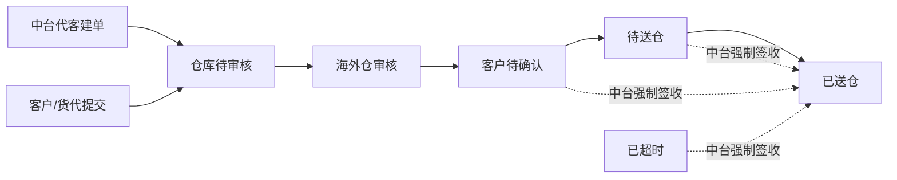

# 仓储中台 · 预约送仓管理需求文档

## 1. 文档基础信息

### 1.1 版本记录

| 时间 | 版本 | 修改人 | 变更内容 |
| --- | --- | --- | --- |
| 2026-06-01 | v1.0 | — | 初版，基于当前原型实现整理 |
| 2026-06-05 | v1.1 | — | 状态「仓库待确认」更名为「仓库待审核」；W.BOL 说明见独立文档 |
| 2026-06-05 | v1.2 | — | 建单固定预约方为用户编号；移除建单联系邮箱；预约仓文案；货代联系邮箱；移除货代公司；总体积/总重量选填 |
| 2026-06-05 | v1.3 | — | 列表新增状态 Tab、列设置、行勾选与强制签收；详情展示总体积/总重量；日志明细与《预约送仓操作日志 PRD》对齐；职责边界更新 |
| 2026-06-05 | v1.4 | — | 列表筛选与客户前台对齐（含日期范围、入库单号等）；新增货物明细列与弹窗（F-08） |

### 1.2 文档范围

| 项目 | 内容 |
| --- | --- |
| 模块名称 | 仓储中台 · 预约送仓管理 |
| 适用端 | 运德仓储中台 Web（`/wh/`） |
| 页面范围 | 预约列表（含状态 Tab、列设置、强制签收）、预约详情、新建入库单预约 |
| 不在范围 | 海外仓审核/Web 签收、PDA 到仓登记、还柜通知、货代端协作页（仅描述衔接关系）；客户前台自助创建（见《客户前台预约送仓需求文档》） |

### 1.3 术语表

| 术语 | 说明 |
| --- | --- |
| 预约方 | 发起预约的主体；**中台建单固定为客户编号**（如 CN0000438）；历史数据仍可见「运德船务」 |
| 预约渠道 | `bookChannel`：customer（客户/代客）；shipping 为历史船务渠道数据，**中台新建不再产生** |
| 预约仓 | 创建页所选送仓仓库（`warehouse`）；与入库单/票号「目的仓」「收货仓」区分 |
| 货代联系邮箱 | 货代端维护的通知邮箱（`emails` / `primaryEmail`）；中台详情只读展示 |
| 预约单号 | 系统正式单号，格式如 YY20260528102 |
| 送仓码 | 6 位业务码，用于生成货代端预约链接 |
| 送仓总箱数 | 预约阶段申报的预计送仓箱数 |
| 收货总箱数 | PDA / 海外仓 Web 签收写入的实际箱数；强制签收不写入；列表/详情只读展示 |
| 装柜清单 | 船务装柜数据，可一键带入创建预约 |
| W.BOL | 入仓凭证；货代确认时段后（待送仓/已送仓）生成；中台**不展示**下载入口，详见 [`W.BOL说明与FAQ.md`](./W.BOL说明与FAQ.md) |
| 平台强制签收 | 中台运营在列表勾选预约单后，将状态直接更新为「已送仓」；写入 `wh_force_signoff` 操作日志，同步客户前台与海外仓 |
| 列设置 | 列表右上角勾选显示/隐藏列；当前页会话内生效，刷新后恢复默认 |

---

## 2. 需求背景

### 2.1 背景描述

预约送仓链路涉及客户前台、货代端、海外仓、PDA 等多端协作。仓储中台作为**内部运营枢纽**，需要：

1. **全局可视**：跨客户查看所有预约单及状态，支撑客服答疑、异常跟进；
2. **代客建单**：客户无法自助时，由中台代指定客户编号创建并直接提交仓库审核；
3. **装柜联动**：从装柜清单带入集装箱与票号，减少重复录入；
4. **运营闭环**：查看仓库审核结果、到仓收货、协商日志；对线下已到仓单据可在列表执行强制签收（审核归属海外仓）。

### 2.2 需求列表

| 编号 | 用户诉求 | 提出人/部门 |
| --- | --- | --- |
| R-01 | 按客户/单号/仓库/状态筛选全量预约单 | 客服/仓储运营 |
| R-02 | 代客户创建预约并直接提交仓库 | 客服/船务 |
| R-03 | 从装柜清单预填整柜预约信息 | 船务 |
| R-04 | 查看预约全貌（含仓库确认、到仓收货、日志） | 客服/运营 |
| R-05 | 获取货代端预约链接转发协作 | 客服 |
| R-06 | 监控送仓箱数与收货箱数差异 | 仓储/财务 |
| R-07 | 线下已到仓但系统未闭环时，代运营强制签收 | 客服/仓储运营 |

### 2.3 核心目标

**作为仓储中台运营人员，我希望集中查看与管理全渠道预约单，并在必要时代客建单，以便提升协同效率、减少线下 Excel 传递。**

核心指标：中台代建单占比、代建单一次提交成功率、客服查询预约详情平均耗时。

---

## 3. 功能总览

### 3.1 业务流程

**仓储中台职责边界：**

| 负责 | 不负责 |
| --- | --- |
| 全量预约单列表查询与详情只读展示 | 海外仓审核（分配时段/驳回） |
| 代客户新建并提交预约 | 货代端期望日期、备注、货代联系邮箱维护 |
| 从装柜清单预填创建页 | PDA 扫码到仓登记 |
| 展示预约链接供转发 | 客户前台草稿/废弃/接受时段等客户侧操作 |
| 展示仓库确认、到仓收货、操作日志 | 修改已提交预约的基础信息 |
| **列表强制签收**（待送仓/客户待确认/已超时 → 已送仓） | 海外仓 Web 签收、PDA 收货、还柜通知 |

### 3.2 功能清单

| 编号 | 功能模块 | 功能简述 |
| --- | --- | --- |
| F-01 | 预约列表 | 多条件筛选、状态 Tab、列设置、行勾选、分页、跳转详情 |
| F-02 | 新建入库单预约 | 代客建单（固定用户编号）、关联入库单、提交至仓库待审核 |
| F-03 | 装柜清单联动 | URL 参数预填整柜预约与票号明细 |
| F-04 | 预约详情 | 预约信息、仓库确认、到仓收货、货物明细、日志 |
| F-05 | 预约链接 | 详情展示货代端链接，供客服转发 |
| F-06 | 强制签收 | 列表勾选批量将符合条件的预约单更新为「已送仓」 |
| F-07 | 列设置 | 自定义列表显示列（当前页会话，默认见 §4.1） |
| F-08 | 货物明细弹窗 | 列表行点击「查看明细」弹窗展示关联入库单 |

### 3.3 与各端差异对照

| 维度 | 客户前台 | 货代端 | 仓储中台 | 海外仓 |
| --- | --- | --- | --- | --- |
| 数据范围 | 当前客户，排除船务渠道 | 凭送仓码单条 | **全量** | 仓库待审核及后续状态 |
| 创建预约 | 有（草稿/提交→待预约） | 无 | **有（直接→仓库待审核）** | 无 |
| 预约方 | 固定当前客户 | — | **固定用户编号**（下拉禁用） | — |
| 审核 | 无 | 无 | 无 | **有** |
| 状态操作 | 提交/取消/接受时段等 | 提交/确认/取消等 | **创建提交 + 列表强制签收**；详情只读 | 审核/PDA/签收 |
| 列表筛选 | 多条件 + 日期范围 | — | **同客户前台 + 客户编号** | 目的仓 + 本周等待 |
| 货物明细列 | 有（弹窗） | — | **有（弹窗）** | — |
| 列表 Tab | 多状态 Tab | 无列表 | **状态 Tab + 下拉联动** | 状态 Tab + 计数 |

---

## 4. 功能详细设计

### 4.1 预约列表（F-01 / F-06 / F-07 / F-08）

#### A. 用户故事

作为仓储中台运营，我想要按客户、单号、仓库等条件筛选预约单，并在必要时对线下已到仓单据执行强制签收，以便快速定位目标单据并完成闭环。

#### B. 用户旅程

入口（单据管理 → 预约送仓管理）→ 默认「全部」Tab → 设置筛选条件 → 点击「查询」或切换 Tab → 可选列设置 / 勾选行 → 点击「详情」或「强制签收」；或点击「新建入库单预约」进入创建页。

#### C. 交互与界面

| 区域 | 说明 |
| --- | --- |
| 页眉 | 仓储中台统一导航；当前二级菜单高亮「预约送仓管理」 |
| 筛选栏 | 多行表单：与客户前台同套筛选项 + **客户编号**（中台独有）；支持 Enter 查询；查询/重置 |
| 状态 Tab | 全部 + 各业务状态；与「状态」下拉联动；点击 Tab 同步下拉并刷新列表 |
| 工具栏 | 右上角「列设置」「新建入库单预约」「强制签收」 |
| 列表区 | 行勾选 + 表格 + 分页（每页 10 条）+ `appt-result-hint` 结果提示 |
| 权限 | 登录中台账号；**展示全量预约单**（含客户渠道与船务渠道） |

**列表列与列设置（F-07）：**

| 列 key | 列名 | 默认显示 | 说明 |
| --- | --- | --- | --- |
| select | 勾选 | ✓ | 固定列；支持本页全选；跨页保留已选 |
| bookerParty | 预约方 | ✓ | 客户编号或「运德船务」 |
| warehouse | 预约仓库 | ✓ | 预约仓 |
| appointmentNo | 预约单号 | ✓ | 无则「-」 |
| deliveryCode | 送仓码 | ✓ | 无则「-」 |
| inboundDetail | 货物明细 | ✓ | 单条显示入库单号；多条「查看明细」打开弹窗 |
| status | 状态 | ✓ | 原状态文案 |
| deliveryType | 送仓类型 | ✓ | 整柜 / 散货 |
| estimatedCartons | 送仓总箱数 | ✓ | 申报箱数 |
| containerNo | 集装箱号 | ✓ | 散货多为「-」 |
| totalVolume | 总体积（m³） | ✗ | 列设置可开启 |
| totalWeight | 总重量（kg） | ✗ | 列设置可开启 |
| receivedCartons | 收货总箱数 | ✓ | PDA/签收写入；未到仓为「-」 |
| isPalletized | 是否打托 | ✗ | 列设置可开启 |
| totalPallets | 送仓总托数 | ✗ | 列设置可开启；未打托为 0 |
| expectedInboundTime | 期望送仓日期 | ✓ | 货代端填写后回显 |
| warehouseConfirmedInboundTime | 仓库确认时段 | ✗ | 列设置可开启 |
| actualDeliveryTime | 实际送仓时间 | ✓ | 签收后回显；美仓附时区 |
| submitTime | 提交时间 | ✗ | 列设置可开启 |
| ops | 操作 | ✓ | 固定列；「详情」链接 |

#### D. 字段与逻辑

**1. 筛选栏（与客户前台对齐 + 客户编号）**

| 筛选元素 | 组件类型 | 默认值 | 逻辑/备注 |
| --- | --- | --- | --- |
| 客户编号 | 文本输入 | 空 | **中台独有**；模糊匹配 `customerCode` |
| 预约单号 | 文本输入 | 空 | 模糊匹配 |
| 送仓码 | 文本输入 | 空 | 模糊匹配 |
| 预约仓库 | 下拉框 | 全部 | 选项来自 `MOCK_IN_ORDER_WAREHOUSES` |
| 送仓类型 | 下拉框 | 全部 | 整柜 / 散货 |
| 状态 | 下拉框 | 全部 | 与 Tab 联动；选项来自 `MOCK_DELIVERY_APPOINTMENT_STATUS_TABS` |
| 入库单号 | 文本输入 | 空 | 匹配明细行 `orderNo`；**支持逗号分隔**多号 |
| 是否打托 | 下拉框 | 全部 | 是 / 否 |
| 送仓总箱数 | 文本输入 | 空 | 数字模糊匹配 |
| 集装箱号 | 文本输入 | 空 | 整柜模糊匹配 |
| 总体积（m³） | 文本输入 | 空 | 数字模糊匹配 |
| 总重量（kg） | 文本输入 | 空 | 数字模糊匹配 |
| 货代联系邮箱 | 文本输入 | 空 | 匹配 `primaryEmail` / `emails` |
| 提交时间 | 日期范围 | 空 | 起止日期，含边界 |
| 期望送仓日期 | 日期范围 | 空 | 匹配货代填写的期望日期（多日期取并集） |
| 实际到仓时间 | 日期范围 | 空 | 签收后回写的 `actualDeliveryTime` |
| Tab | 标签页 | 全部 | **先 Tab 过滤状态，再叠加其余筛选项**；与下拉双向同步 |

> 筛选逻辑复用 `filterWhAppointmentList`（内部调用 `filterCustomerAppointmentList` + 客户编号过滤）。

**2. 结果提示（`appt-result-hint`）**

| 元素 | 说明 |
| --- | --- |
| 命中条数 | 如「共 12 条」 |
| 当前 Tab | 非「全部」时展示，如「状态：待送仓」 |
| 筛选状态 | 无 Tab 但有筛选项时展示「已应用筛选条件」 |
| 分页 | 如「第 1 / 2 页」 |
| 已选 | 有勾选时展示，如「已选 3 条」 |

**3. 分页**

| 规则 | 说明 |
| --- | --- |
| 每页条数 | 10 |
| 翻页 | 上一页 / 页码 / 下一页；筛选变更时重置为第 1 页 |
| 空数据 | 表格居中展示「暂无数据」 |

**4. 行内操作**

| 操作 | 行为 |
| --- | --- |
| 详情 | 跳转 `deliveryAppointmentDetail.html?id={预约单id}` |

**5. 强制签收（F-06）**

| 项目 | 规则 |
| --- | --- |
| 入口 | 工具栏「强制签收」；须先勾选 ≥1 条 |
| 可签收状态 | **待送仓**、**客户待确认**、**已超时** |
| 不可签收 | 其余状态；弹窗提交时自动跳过不符合条件的勾选项 |
| 弹窗字段 | 实际送仓时间（必填，`datetime-local`）；备注（选填，≤200 字） |
| 提交效果 | 状态 → **已送仓**；写入 `actualDeliveryTime`；追加 `wh_force_signoff` 日志（操作人「平台」） |
| 未写入字段 | 不强制填写收货总箱/托数、签收文件（与海外仓 Web 签收区分） |
| 数据同步 | 持久化后同步客户前台、海外仓列表/详情；本页刷新 |
| 成功提示 | 「已强制签收 N 条，已同步至客户与海外仓」 |

**6. 货物明细弹窗（F-08）**

| 元素 | 说明 |
| --- | --- |
| 触发 | 列表「货物明细」列；仅 1 条关联入库单时直接展示单号，≥2 条显示「查看明细」链接 |
| 副标题 | 预约单号 + 送仓码 |
| 表格列 | 入库单号、订单状态、收货仓、发货方式、订单箱数、送仓箱数、提交时间 |
| 空数据 | 「无关联入库单」 |

**7. 数据同步**

| 场景 | 处理 |
| --- | --- |
| 其他 Tab/端修改预约数据 | 监听 storage 变更自动刷新列表 |

---

### 4.2 新建入库单预约（F-02 / F-03）

#### A. 用户故事

作为客服/船务，我想要代客户创建送仓预约并关联入库单，以便跳过客户自助流程、直接进入仓库审核队列。

#### B. 用户旅程

**常规路径：** 列表 → 新建 → 选择预约仓、填写用户编号 → 填写箱托信息 → 添加入库单 → 提交 → 返回列表（状态为仓库待审核）。

**装柜联动路径：** 装柜清单 → 「创建预约」→ 创建页自动预填集装箱、柜型、票号明细 → 核对后提交。

#### C. 交互与界面

| 区域 | 说明 |
| --- | --- |
| 预约基础信息 | 预约仓、预约方（固定）、用户编号、送仓类型、箱托、整柜字段 |
| 货物明细 | 已选入库单表格 + 「添加入库单」按钮 |
| 入库单选择器 | 模态框：按入库单号/集装箱号/目的仓查询勾选 |
| 底部按钮 | 提交预约、取消（返回列表） |

**联动规则：**

| 条件 | 界面行为 |
| --- | --- |
| 预约方 | **固定「用户编号」**，下拉禁用，不可切换运德船务 |
| 用户编号 | 可编辑，默认演示客户 CN0000438，写入 `customerCode` |
| 送仓类型 = 整柜 | 显示集装箱号、柜型，必填 |
| 送仓类型 = 散货 | 隐藏集装箱号、柜型 |
| 是否打托 = 是 | 显示送仓总托数，必填正整数 |
| 是否打托 = 否 | 隐藏送仓总托数，保存时置空 |
| 变更预约仓且已有明细 | 清空已选入库单 |

#### D. 字段与逻辑

**1. 预约基础信息**

| 字段 | 组件 | 必填 | 逻辑/备注 |
| --- | --- | --- | --- |
| 预约仓 | 下拉 | 是 | 系统仓库列表；选中后展示仓库地址提示 |
| 预约方 | 下拉 | — | **固定「用户编号」且禁用** |
| 用户编号 | 文本 | 是 | 写入 `customerCode`；默认 CN0000438 |
| 送仓类型 | 下拉 | 是 | 散货 / 整柜，默认散货 |
| 送仓总箱数 | 数字 | 是 | 正整数 ≥1；添加入库单后可自动合计 |
| 总体积（m³） | 数字 | 否 | 填写时须为正数 |
| 总重量（kg） | 数字 | 否 | 填写时须为正数 |
| 是否打托 | 下拉 | 是 | 是 / 否，默认否 |
| 送仓总托数 | 数字 | 打托时必填 | 正整数 ≥1 |
| 集装箱号 | 文本 | 整柜必填 | — |
| 柜型 | 下拉 | 整柜必填 | 20-GP / 40-gp / 40hq / 45-hq |

**2. 入库单选择规则**

| 条件 | 说明 |
| --- | --- |
| 可添加入库单 | 状态=运输在途；发货方式=客户自发头程；收货仓=预约仓 |

**入库单选择器：**

| 筛选项 | 逻辑 |
| --- | --- |
| 入库单号 | 模糊匹配 |
| 集装箱号 | 从装柜清单查票号；填写时按集装箱维度检索 |
| 目的仓 | 可选 FBA（cn 开头目的仓统一展示为 FBA） |

| 校验 | 错误提示 |
| --- | --- |
| 须先选预约仓（常规添加入库单） | 请先选择预约仓 |
| 勾选目的仓不一致 | 所选入库单目的仓不一致，请按同一目的仓勾选 |
| 至少 1 条明细 | 请至少添加一条入库单 |
| 已添加不可重复勾选 | 选择器内已添加行禁用勾选 |

**3. 货物明细行**

| 字段 | 说明 |
| --- | --- |
| 入库单号 ~ 订单箱数 | 只读 |
| 送仓箱数 | 可编辑；默认=订单箱数；1 ≤ 送仓箱数 ≤ 订单箱数 |
| 操作 | 移除 |

**4. 送仓总箱数一致性**

| 规则 | 说明 |
| --- | --- |
| 适用 | 中台新建单均为 `bookChannel = customer` |
| 公式 | 送仓总箱数 = Σ 各明细行送仓箱数 |
| 不一致 | 模态框展示对比摘要，按钮「我知道了」阻断提交 |

**5. 提交逻辑**

| 项目 | 规则 |
| --- | --- |
| 目标状态 | **仓库待审核**（不经待预约/待提交） |
| 生成字段 | 预约单号、送仓码、提交时间、操作日志 |
| bookChannel | 固定 **customer** |
| 货代联系邮箱 | 中台建单**不录入**；`emails` 留空，由货代端后续维护 |
| 期望送仓日期 | 中台创建时不填，留空；由货代端后续补充（若需货代协作） |
| 装柜来源 | 写入 `sourceType=containerLoading`、`sourceContainerNo` 等溯源字段 |
| 成功提示 | 「预约单已创建，状态为仓库待审核」→ 跳转列表 |

**6. 装柜清单预填（F-03）**

| URL 参数 | 行为 |
| --- | --- |
| `source=containerLoading` | 启用装柜预填模式 |
| `containerNo={箱号}` | 匹配装柜清单，带入集装箱号、柜型、实装箱数、票号明细 |
| 预填默认值 | 预约方仍为用户编号；送仓类型=整柜；预约仓按票号/目的港推断 |

| 目的仓推断规则 | 说明 |
| --- | --- |
| 票号目的仓 cn 开头 | 展示为 FBA |
| 目的港含 SAVANNAH / NEW YORK | 美东仓 |
| 其他默认 | 深圳A仓（演示数据） |

---

### 4.3 预约详情（F-04 / F-05）

#### A. 用户故事

作为客服，我想要查看预约单完整信息、仓库审核结果与到仓收货情况，以便答复客户咨询并转发货代协作链接。

#### B. 用户旅程

列表点「详情」→ 查看预约信息 / 仓库确认 / 到仓收货 → 切换「货物明细 / 日志明细」Tab → 复制预约链接 → 返回列表。

#### C. 交互与界面

| 区域 | 说明 |
| --- | --- |
| 顶部 | 返回列表链接；客户编号强调展示 |
| 预约信息 | 只读字段网格 |
| 仓库确认信息 | 确认地址、确认时段、审核备注 |
| 到仓收货信息 | 实际到仓时间、收货总箱/托数、到仓拍照缩略图 |
| Tab | 货物明细（默认）、日志明细 |
| 操作 | **无状态变更按钮**（只读页；强制签收仅在列表操作） |

#### D. 字段与逻辑

**1. 预约信息**

| 字段 | 展示规则 |
| --- | --- |
| 预约仓库、预约单号、送仓码、状态、送仓类型 | 始终展示 |
| 送仓总箱数、总体积（m³）、总重量（kg） | 始终展示；体积/重量未填为「-」 |
| 是否打托、送仓总托数 | 始终展示；未打托托数为 0 |
| 集装箱号、柜型 | 始终展示；散货多为「-」 |
| 货代联系邮箱 | `emails` 去重顿号拼接；无则「-」 |
| 联系电话 | 货代端填写后回显 |
| 期望送仓日期、货代备注 | 货代端填写后回显 |
| 提交时间 | — |
| 预约链接 | 可点击新窗口打开货代端 `/fg/index.html?code={送仓码}` |

**不展示：** 货代公司、W.BOL 下载入口（归属货代端/海外仓）。

**2. 仓库确认信息**

| 字段 | 展示规则 |
| --- | --- |
| 仓库确认地址 | 未审核时「待确认」 |
| 仓库确认时段 | 未审核时「待确认」 |
| 仓库审核备注 | 无内容「-」 |

**3. 到仓收货信息**

| 字段 | 展示规则 |
| --- | --- |
| 实际到仓时间 | 美仓追加时区标注，如 `(US/Pacific)` |
| 收货总箱数 / 收货总托数 | PDA 写入；未到仓「-」 |
| 到仓拍照 | 缩略图列表；无则占位 |

**4. 货物明细 Tab**

| 列 | 说明 |
| --- | --- |
| 入库单号、订单状态、收货仓、发货方式 | 只读 |
| 订单箱数、送仓箱数、收货箱数 | 收货箱数 PDA 回写 |
| 提交时间 | 入库单创建时间 |
| 空数据 | 「无关联入库单」 |

**5. 日志明细 Tab**

| 元素 | 说明 |
| --- | --- |
| 数据源 | 与客户前台、海外仓、货代端同源 `operationLogs` |
| 展示范围 | **全量原文**（含海外仓审核、平台强制签收、还空通知等）；不做客户侧简化 |
| 排序 | **时间降序**（最新在上）；与海外仓「日志信息」一致 |
| 行格式 | `时间` + **操作人** + 完整 `action` 原文 |
| 空数据 | 「暂无日志」 |

> 各类型日志文案与可见性详见 [`预约送仓操作日志PRD.md`](./预约送仓操作日志PRD.md)。

**6. 异常处理**

| 场景 | 处理 |
| --- | --- |
| URL 无 id 或预约不存在 | 展示「预约单不存在」+ 返回列表 |

---

## 5. 与上下游模块衔接

| 模块 | 衔接说明 |
| --- | --- |
| 客户前台 | 客户自建单经货代端提交后，中台列表可见；客户渠道单 `bookChannel=customer` |
| 货代端 | 详情展示预约链接；货代补充期望日期/备注后状态仍为仓库待审核 |
| 海外仓 | 中台提交 → 仓库待审核 → 海外仓审核 → 客户待确认 / 预约失败 |
| 装柜清单 | ERP 装柜清单跳转创建页并预填；`sourceType` 溯源 |
| 邮件通知 | 中台直接提交至仓库待审核时，是否触发「预约申请已收到」见待确认事项 |
| PDA | 待送仓 → PDA 到仓 → 已送仓；收货数据回写中台列表/详情 |
| 操作日志 | 中台强制签收写入 `wh_force_signoff`；客户前台以「平台已确认送仓」简化展示 |

---

## 6. 规则与约束

### 6.1 权限与访问

| 规则 | 说明 |
| --- | --- |
| 登录访问 | 需仓储中台账号登录（原型为演示用户） |
| 数据范围 | 全量预约单，含 customer 与 shipping 渠道 |
| 操作权限 | 创建 + 列表强制签收 + 只读查看；不可在中台执行审核、代货代提交或 Web 签收 |

### 6.2 业务规则汇总

| 编号 | 规则 |
| --- | --- |
| BR-01 | 中台新建提交：直接 → **仓库待审核**，不经过待预约 |
| BR-02 | 中台建单预约方固定用户编号，`bookChannel` 固定 customer |
| BR-03 | 中台建单须满足送仓总箱数与明细一致性 |
| BR-04 | 中台建单不录入货代联系邮箱，由货代端维护 |
| BR-05 | 预约单号、送仓码在提交时自动生成且唯一 |
| BR-06 | 列表不展示货代公司；总体积/总重量默认隐藏列，可通过列设置开启；详情展示体积/重量 |
| BR-07 | 列表预约方展示：`bookChannel=customer` → 客户编号；历史 `shipping` → 「运德船务」 |
| BR-08 | 详情页不提供状态变更操作；列表可对「待送仓/客户待确认/已超时」执行强制签收 |
| BR-09 | 强制签收须填写实际送仓时间；状态变更为「已送仓」并写入平台操作日志 |
| BR-10 | 日志明细展示全量原文、时间降序；与客户前台操作记录（子集简化）区分 |

### 6.3 非功能要求（原型阶段）

| 分类 | 要求 |
| --- | --- |
| UI 风格 | 仓储中台 legacy 表单/表格风格 |
| 持久化 | mock 源文件（需 `npm run dev`）；sessionStorage 缓存已废弃 |
| 响应式 | 面向 PC 浏览器 |
| 多 Tab 同步 | 列表/详情监听 storage 变更自动刷新 |

---

## 7. 附录

### 7.1 状态—中台能力矩阵

| 状态 | 列表可见 | 详情可见 | 中台可创建进入 | 中台可操作 |
| --- | --- | --- | --- | --- |
| 待提交 | ✓ | ✓ | — | — |
| 待预约 | ✓ | ✓ | — | — |
| 仓库待审核 | ✓ | ✓ | ✓（新建直达） | — |
| 客户待确认 | ✓ | ✓ | — | **强制签收** |
| 待送仓 | ✓ | ✓ | — | **强制签收** |
| 已送仓 | ✓ | ✓ | — | — |
| 已超时 | ✓ | ✓ | — | **强制签收** |
| 预约失败 | ✓ | ✓ | — | — |
| 已废弃 | ✓ | ✓ | — | — |

### 7.2 创建渠道对比

| 维度 | 客户前台创建 | 中台代客创建 |
| --- | --- | --- |
| bookChannel | customer | customer（固定） |
| 预约方 | 固定当前客户 | 固定用户编号（下拉禁用，可改编号） |
| 提交后状态 | 待预约 | 仓库待审核 |
| 箱数一致性 | 强制 | 强制 |
| 入库单发货方式 | 客户自发头程 | 客户自发头程 |
| 货代联系邮箱 | 原型未录入 | 不录入（货代端维护） |
| 装柜预填 | 无 | 支持（仍为用户编号渠道） |
| 客户列表可见 | 是 | 是 |

> 历史演示数据可能存在 `bookChannel=shipping` 的船务单，中台列表/详情仍可见，但**新建入口不再产生**此类单据。

### 7.3 页面路径

| 页面 | 路径 | 脚本 |
| --- | --- | --- |
| 预约列表 | `/wh/deliveryAppointment.html` | `deliveryAppointmentList.js` |
| 新建预约 | `/wh/deliveryAppointmentCreate.html` | `deliveryAppointmentCreate.js` |
| 预约详情 | `/wh/deliveryAppointmentDetail.html?id={id}` | `deliveryAppointmentDetail.js` |
| 公共逻辑 | — | `../customer/js/deliveryAppointment-common.js` |

### 7.4 相关文档

| 文档 | 说明 |
| --- | --- |
| [`客户前台预约送仓需求文档.md`](./客户前台预约送仓需求文档.md) | 客户自助创建与状态操作 |
| [`货代端预约送仓需求文档.md`](./货代端预约送仓需求文档.md) | 货代协作与时段确认 |
| [`预约送仓邮件模板需求文档.md`](./预约送仓邮件模板需求文档.md) | 邮件触发与模板 |
| [`预约送仓操作日志PRD.md`](./预约送仓操作日志PRD.md) | 各端日志类型、文案与展示规则 |
| [`W.BOL说明与FAQ.md`](./W.BOL说明与FAQ.md) | 入仓凭证下载节点、字段说明、FAQ |

---

## 8. 待确认事项

| 编号 | 问题 | 建议 |
| --- | --- | --- |
| OQ-01 | 中台直接提交至仓库待审核，是否跳过货代端？期望送仓日期由谁填写？ | 当前中台创建不填期望日期；若需货代补充，应先进「待预约」或创建后主动转发链接 |
| OQ-02 | 中台代建单是否触发「预约申请已收到」邮件？ | 邮件文档定义为货代/客户提交 → 仓库待审核；中台代建是否等同需业务确认 |
| OQ-03 | 中台是否需要「导出 Excel」？ | 原型未实现；客服对账场景可能需补充 |
| OQ-04 | 中台详情是否需要「代客取消/废弃」？ | 当前仅支持列表强制签收；取消/废弃若需代操作，需定义权限与状态限制 |
| OQ-05 | 历史船务渠道单如何处置？ | 中台已不再新建 shipping 单；存量数据仅列表/详情只读追溯 |
| OQ-06 | 强制签收是否须填写收货箱/托数？ | 当前原型仅填实际送仓时间；若财务对账需要，需与海外仓 Web 签收对齐 |
| OQ-07 | 列设置是否需持久化到用户偏好？ | 当前刷新恢复默认；可按运营习惯评估 localStorage 记忆 |
