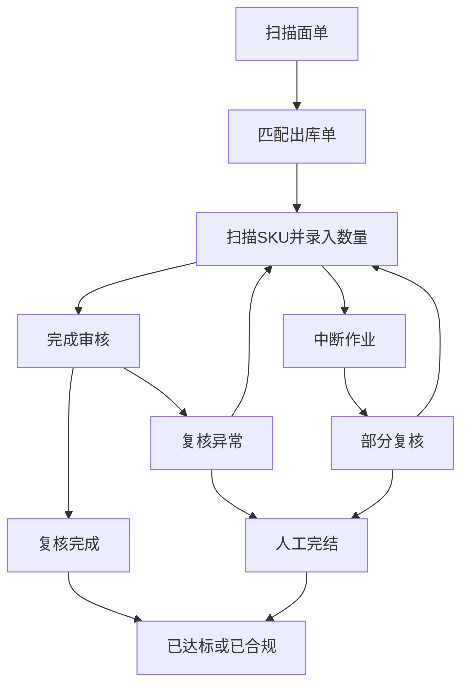

# 海外仓 · 包装复核需求文档

## 1. 文档基础信息

### 1.1 版本记录

| 时间 | 版本 | 修改人 | 变更内容 |
| --- | --- | --- | --- |
| 2026-08-03 | v1.0 | — | 基于当前发货复核原型整理 |
| 2026-08-03 | v1.1 | — | 增加五态订单状态、人工完结、发货时间看板与中美时区 |
| 2026-08-03 | v1.2 | — | 增加批量出库单搜索、独立导出、勾选导出及异常分析规则 |
| 2026-08-03 | v1.3 | — | 同步 SKU 录值交互、异常提示、应复核数量与完成审核弹窗规则 |

### 1.2 文档范围

| 项目 | 内容 |
| --- | --- |
| 模块名称 | 海外仓 · 包装复核（发货复核） |
| 适用端 | 运德海外仓系统 Web（`/us/`）；PDA 发货复核页 |
| 页面范围 | 发货复核列表、复核档案详情、PDA 发货复核 |
| 不在范围 | 出库单创建、发货承运及物流轨迹；本模块仅处理发货前商品与数量复核 |

### 1.3 术语表

| 术语 | 说明 |
| --- | --- |
| 出库单 | 本次需要发货并进行包装复核的订单，含出库单号、面单号和 SKU 明细 |
| 面单号 | 包裹运单标签号码；PDA 扫描后用于匹配出库单 |
| SKU / 料号 | 订单中的具体商品编码；PDA 扫描识别后录入实际数量的对象 |
| 复核档案 | 一次复核作业产生的过程记录，保留操作人、时间、SKU 最终录值、每次录值日志、异常与完结类型 |
| 订单复核状态 | 基于同一出库单全部复核档案计算的最终状态：未复核、部分复核、复核异常、已达标、已合规 |
| 已达标 | 仅复核 1 次且存在复核完成档案，表示首次复核即通过 |
| 已合规 | 多次复核后存在复核完成档案，或管理人员执行人工完结 |
| 部分复核 | 作业已开始但未主动提交，例如刷新、关闭、重置或切换订单导致中断 |
| 复核异常 | 主动提交后发现少货、多货或错扫，且尚无复核完成档案 |
| 人工完结 | 管理人员确认无需继续复核后，为订单补充“复核完成 / 人工完结”档案 |
| 错扫 | 扫描识别的料号不属于当前出库单 |
| 应复核数量（订单数量） | 当前料号在出库单中的应发数量；用于 PDA 提示、录值记录和复核日志导出 |
| 多货 | 某料号最终录入数量超过订单应复核数量 |
| 少货 | 某料号最终录入数量少于订单应复核数量 |
| 发货时间 | 出库单发货时间；用于列表筛选、看板统计和导出范围 |

---

## 2. 需求背景

### 2.1 背景描述

海外仓在包裹发出前需要核对实物与出库单是否一致。传统人工核对难以避免错发、漏发和多发，也不便追溯操作过程。

本模块通过 PDA 扫描面单与 SKU 识别料号，再录入实际复核数量并与订单应发数量比对；同时在 Web 端提供订单查询、状态管理、人工完结、档案追溯、看板统计和报表导出能力。

### 2.2 需求列表

| 编号 | 用户诉求 | 提出人/部门 |
| --- | --- | --- |
| R-01 | 扫描面单快速识别出库单并进行 SKU 复核 | 仓库复核员 |
| R-02 | 错扫时即时预警；提交 SKU 数量时识别少货、多货 | 仓库复核员 |
| R-03 | 查看订单全部复核档案、最终录值与逐次录值日志 | 仓库主管 / 跟单 |
| R-04 | 对异常或中断订单再次复核，必要时人工完结 | 仓库主管 |
| R-05 | 按单号、面单号、状态、发货时间查询订单 | 仓库主管 / 跟单 |
| R-06 | 按查询结果勾选订单，分别导出订单汇总和复核日志 | 仓库主管 / 稽核 |
| R-07 | 按发货时间范围了解各类复核状态与完成率 | 仓库主管 |
| R-08 | 在中国时间和美国时间之间切换查询与展示 | 海外仓用户 |

### 2.3 核心目标

**作为海外仓复核员，我希望在发货前逐件扫描并核对订单商品，以便防止错发、漏发和多发；作为管理人员，我希望能查看异常原因和全部复核过程，以便及时处理并完成追溯。**

核心关注指标：复核完成率、复核异常订单量、部分复核订单量、已合规订单量。

---

## 3. 功能总览

### 3.1 业务流程

### 3.2 功能清单

| 编号 | 功能模块 | 功能简述 |
| --- | --- | --- |
| F-01 | 发货复核列表 | 多条件查询、批量单号搜索、状态筛选、分页、订单勾选与人工完结 |
| F-02 | 数据看板 | 按发货时间范围统计订单状态及复核完成率 |
| F-03 | 复核档案详情 | 展示订单信息、SKU 明细、复核档案、最终录值明细和录值日志 |
| F-04 | PDA 发货复核 | 扫描面单、扫描 SKU 识别、录入数量、实时预警、提交与中断留档 |
| F-05 | 报表导出 | 勾选查询结果后，分别导出订单列表或复核日志 |
| F-06 | 时间切换 | 中国时间和美国太平洋时间切换，联动展示、筛选、看板和导出 |

### 3.3 端侧职责

| 端侧 | 主要职责 |
| --- | --- |
| PDA 发货复核 | 扫描面单和 SKU，完成本轮复核或保留中断记录 |
| Web 发货复核列表 | 查询、看板、勾选导出、人工完结、进入详情 |
| Web 复核档案详情 | 追溯订单、SKU、档案、最终录值和录值记录；有权限时修正已终结档案状态和完结类型 |

---

## 4. 功能详细设计

### 4.1 发货复核列表（F-01）

#### A. 用户故事

作为仓库主管，我想按条件找到需要关注的出库单，并勾选目标订单导出或人工处理，以便快速完成日常复核管理。

#### B. 用户旅程

进入发货复核列表 → 输入筛选条件 → 查询结果 → 勾选订单或查看详情 → 导出订单列表 / 导出复核日志；对于未完成订单，可执行人工完结。

#### C. 交互与界面

| 区域 | 说明 |
| --- | --- |
| 看板 | 展示当前发货时间范围的状态分布和复核完成率；每个指标带问号说明 |
| 筛选区 | 出库单、面单号、复核状态、发货时间范围、时区、查询和重置 |
| 出库单搜索 | 支持单号模糊匹配；多个单号可使用中文/英文逗号、分号、空格或换行分隔 |
| 状态筛选 | 支持 Ctrl 或 Shift 多选；未选择表示不限状态 |
| 列表勾选 | 每行可单选；表头全选覆盖当前全部查询结果，支持跨分页 |
| 操作区 | 查看详情；未复核、复核异常、部分复核订单可人工完结 |
| 分页 | 每页 10 条，展示总数、当前页和上一页/下一页 |

#### D. 字段与逻辑

**1. 筛选栏**

| 筛选元素 | 组件类型 | 默认值 | 逻辑/备注 |
| --- | --- | --- | --- |
| 出库单 | 文本 | 空 | 单号模糊匹配；支持多个单号分隔输入，任一单号匹配即展示 |
| 面单号 | 文本 | 空 | 模糊匹配，不区分大小写 |
| 复核状态 | 多选下拉 | 未选择 | 支持未复核、复核异常、部分复核、已达标、已合规；未选择表示全部 |
| 发货时间 | 日期范围 | 空 | 闭区间 `[开始日期, 结束日期]`；按所选时区的发货日期筛选 |
| 时区 | 下拉 | 保存的用户偏好 | 中国时间 / 美国时间 |
| 查询 | 按钮 | — | 按当前条件刷新列表并回到第 1 页 |
| 重置 | 按钮 | — | 清空筛选条件、取消状态选择并回到第 1 页 |

**2. 列表列定义**

| 字段 | 展示逻辑 |
| --- | --- |
| 勾选 | 单行勾选；表头全选当前查询结果 |
| 出库单 | 出库单号；第二行展示面单号 |
| SKU 种类数 | 当前出库单的 SKU 行数 |
| SKU 总数（PCS） | 当前出库单全部 SKU 应发数量之和 |
| 复核状态 | 五态状态标签；移入或键盘聚焦展示状态说明 |
| 复核次数 | 该订单全部复核档案数量 |
| 发货时间 | 按所选时区展示 |
| 复核完成时间 | 最新复核完成档案的结束时间；无则展示 `-` |
| 操作 | 查看详情；符合条件时展示“完结” |

**3. 人工完结**

| 项目 | 规则 |
| --- | --- |
| 入口 | 列表行“完结” |
| 展示条件 | 订单状态为未复核、复核异常或部分复核 |
| 确认 | 二次确认后执行 |
| 写入档案 | 新增一条“复核完成 / 人工完结”档案，SKU 最终录值按订单应发数量补齐 |
| 订单结果 | 订单状态变为已合规 |
| 不可操作 | 已达标、已合规订单不展示完结入口 |

### 4.2 数据看板（F-02）

#### A. 用户故事

作为仓库主管，我希望按发货时间范围查看各类复核订单数量和完成率，以便判断复核进度并优先处理异常订单。

#### B. 统计口径

| 指标 | 统计规则 |
| --- | --- |
| 总发货订单量 | 当前发货时间范围内的全部“已发货状态”出库单数量 |
| 已达标订单量 | 当前范围内状态为已达标的订单数量 |
| 已合规订单量 | 当前范围内状态为已合规的订单数量 |
| 未复核订单量 | 当前范围内状态为未复核的订单数量 |
| 部分复核订单量 | 当前范围内状态为部分复核的订单数量 |
| 复核异常订单量 | 当前范围内状态为复核异常的订单数量 |
| 复核完成率 | （已达标订单量 + 已合规订单量）÷ 总发货订单量 |

未填写发货时间范围时，看板统计全部发货时间数据。每个指标的问号图标支持移入或键盘聚焦查看口径说明。

### 4.3 复核档案详情（F-03）

#### A. 用户故事

作为仓库主管，我想查看某一出库单的 SKU、每轮复核档案、最终录值和逐次录值记录，以便分析异常原因并追溯责任。

#### B. 交互与界面

| 区域 | 说明 |
| --- | --- |
| 订单信息 | 展示出库单基础信息和当前订单复核状态 |
| SKU 详情 | 展示料号和订单数量（PCS） |
| 复核档案列表 | 展示档案编号、复核状态、完结类型、操作人、开始/结束时间、复核时长、录入总数/总 PCS |
| 档案明细弹窗 | 展示 SKU 最终录值明细和逐次录值日志；日志包含料号、应复核数量（订单数量）、录入数量、提交次数、提交时间、操作人和异常类型 |
| 档案修正 | 有权限人员可修改已终结档案的复核状态和完结类型 |

### 4.4 PDA 发货复核（F-04）

#### A. 用户故事

作为仓库复核员，我希望扫描面单和订单商品，系统实时提示问题并记录扫描过程，以便在发货前完成准确复核。

#### B. 用户旅程

扫描/输入面单号 → 匹配出库单 → 扫描 SKU 识别料号 → 录入数量并提交 SKU → 主动提交整单复核 → 复核完成或复核异常；若重置、切换订单或关闭页面，则当前作业保存为部分复核。

#### C. 扫描识别与校验

| 场景 | 系统处理 |
| --- | --- |
| 未匹配到面单号 | 提示“未匹配到出库单，请核对单号” |
| 已达标或已合规订单 | 拦截重复进入复核 |
| 进入 SKU 复核页 | 创建或恢复本轮复核档案 |
| 扫描订单内 SKU | 识别料号成功后，启用数量输入框并聚焦；SKU 输入框保留已识别料号，尚不写入数量 |
| 提交 SKU 数量 | 仅接受大于 0 的整数；写入该 SKU 的最终录入数量及一条录值日志；提交成功后清空 SKU、数量输入框并回到 SKU 输入框 |
| 重复提交同一 SKU | 弹窗提示是否覆盖；Enter 确认覆盖最终录值并追加日志，Esc 取消且不改动原值，保留新录入数量并回到数量输入框 |
| 扫描非本订单 SKU | 清空 SKU 输入框并记录错扫日志；提示“该料号不属于当前订单，请检查！”，不进入数量录入 |
| 录入数量小于订单数量 | 记录为少货；弹窗提示“该料号复核数量少于订单发货数量，请检查！”，并展示“料号 XXX 已 X / 应 Y” |
| 录入数量大于订单数量 | 记录为多货；弹窗提示“该料号复核数量已超过订单发货数量，请检查！”，并展示“料号 XXX 已 X / 应 Y” |
| 中断作业 | 保留最终录值和录值日志，档案状态变为部分复核，完结类型为中断完结 |

#### D. 提交结果

| 本轮结果 | 判定条件 | 完结类型 | 后续处理 |
| --- | --- | --- | --- |
| 复核完成 | 每个订单 SKU 最终录入数量等于订单数量，且无错扫 | 主动提交 | 点击“完成审核”后展示完成提示；用户点击确定或按 Enter 后返回扫描下一单 |
| 复核异常 | 主动提交时存在少货、多货或错扫 | 主动提交 | 点击“完成审核”后展示异常料号及数量对比；弹窗不自动关闭，用户确认后返回扫描下一单；保留异常档案，可再次复核 |
| 部分复核 | 未主动提交即中断 | 中断完结 | 保留最终录值明细和录值日志，可再次复核 |

### 4.5 报表导出（F-05）

#### A. 用户故事

作为仓库主管或稽核人员，我希望仅导出当前查询结果中勾选的订单，并按汇总和逐次录值明细分别导出，以便用于核对、归档和异常追溯。

#### B. 导出交互

查询订单 → 单选或全选目标订单 → 点击“导出订单列表”或“导出复核日志” → 下载对应 Excel 文件。

| 项目 | 规则 |
| --- | --- |
| 导出范围 | 仅当前查询结果中已勾选的订单 |
| 全选范围 | 当前全部查询结果，跨分页生效 |
| 未选订单 | 提示“请先在查询结果中勾选需要导出的出库单” |
| 时间口径 | 文件名和时间字段按当前选择的时区生成 |
| 文件格式 | XML Spreadsheet 2003 格式 `.xls` |

#### C. 导出文件与字段

| 导出按钮 | 工作表 | 字段 | 用途 |
| --- | --- | --- | --- |
| 导出订单列表 | 订单列表 | 出库单、SKU 种类数、SKU 总数（PCS）、复核状态、复核次数、发货时间、复核完成时间、异常分析 | 整体核对、归档与异常归因 |
| 导出复核日志 | 复核日志 | 出库单、复核编号、复核状态、操作人、料号、应复核数量（订单数量）、录入数量、提交次数、提交时间、异常类型 | 逐次录值追溯与稽核；错扫或无法匹配的历史记录的应复核数量展示 `-` |

#### D. 异常分析规则

| 订单状态 / 场景 | 异常分析内容 |
| --- | --- |
| 已达标、未复核 | 留空 |
| 已合规，存在人工完结档案 | `人工强制完结` |
| 已合规，无人工完结但存在复核异常档案 | 汇总全部主动提交复核异常档案中的少货、错扫、多货，格式：`主动提交：少货，多货，错扫` |
| 已合规，无人工完结和复核异常但存在部分复核档案 | 汇总部分复核档案中的少货、错扫、多货，格式：`中断提交：少货，多货，错扫` |
| 部分复核 | 汇总非主动提交档案中的少货、错扫、多货，格式：`中断提交：少货，多货，错扫` |
| 复核异常 | 汇总主动提交复核异常档案中的少货、错扫、多货，格式：`主动提交：少货，多货，错扫` |

同一订单的异常类型按首次出现顺序去重后合并展示。

---

## 5. 规则与约束

### 5.1 单轮档案状态

| 档案状态 | 业务含义 | 产生方式 |
| --- | --- | --- |
| 复核中 | 正在扫描，尚未提交 | 首次扫描 SKU 后创建 |
| 复核完成 | 商品种类和数量均与订单一致 | 主动提交且全部校验通过，或人工完结 |
| 复核异常 | 存在少货、多货或错扫 | 主动提交但校验失败 |
| 部分复核 | 未主动提交即结束 | 重置、切换订单、关闭页面等中断 |

### 5.2 订单状态判定

| 订单状态 | 判定规则 | PDA 是否可再次复核 |
| --- | --- | --- |
| 未复核 | 没有任何复核档案 | 可以 |
| 部分复核 | 有档案但无复核完成、无主动提交复核异常 | 可以 |
| 复核异常 | 存在主动提交的复核异常档案，且无复核完成档案 | 可以 |
| 已达标 | 复核次数为 1 且存在复核完成档案 | 不可以 |
| 已合规 | 复核次数大于 1 且存在复核完成档案，或存在人工完结档案 | 不可以 |

### 5.3 业务规则汇总

| 编号 | 规则 |
| --- | --- |
| BR-01 | 无复核档案的订单统一为未复核，不使用模拟数据预设状态 |
| BR-02 | 错扫及每次 SKU 录值均保留日志，不因覆盖或异常操作丢失审计信息 |
| BR-03 | 错扫不写入 SKU 最终录值；最终录入数量大于订单数量为多货，小于订单数量为少货；每次 SKU 录值日志均关联对应的应复核数量 |
| BR-04 | 少货、多货在 SKU 数量提交时即时提示并留档；主动提交时存在少货、多货或错扫，本轮档案为复核异常 |
| BR-05 | 非主动提交中断，本轮档案为部分复核 |
| BR-06 | 已达标和已合规订单禁止 PDA 重复复核 |
| BR-07 | 人工完结生成“复核完成 / 人工完结”档案，订单状态为已合规 |
| BR-08 | 看板仅按发货时间范围统计，不使用“当日”固定口径 |
| BR-09 | 导出只处理当前查询结果中已勾选的订单 |
| BR-10 | 订单列表与复核日志为两个独立导出文件 |

---

## 6. 附录

### 6.1 状态—操作矩阵

| 订单状态 | 列表查询/详情 | 列表人工完结 | PDA 再次复核 | 导出 |
| --- | --- | --- | --- | --- |
| 未复核 | ✓ | ✓ | ✓ | ✓ |
| 部分复核 | ✓ | ✓ | ✓ | ✓ |
| 复核异常 | ✓ | ✓ | ✓ | ✓ |
| 已达标 | ✓ | ✗ | ✗ | ✓ |
| 已合规 | ✓ | ✗ | ✗ | ✓ |
