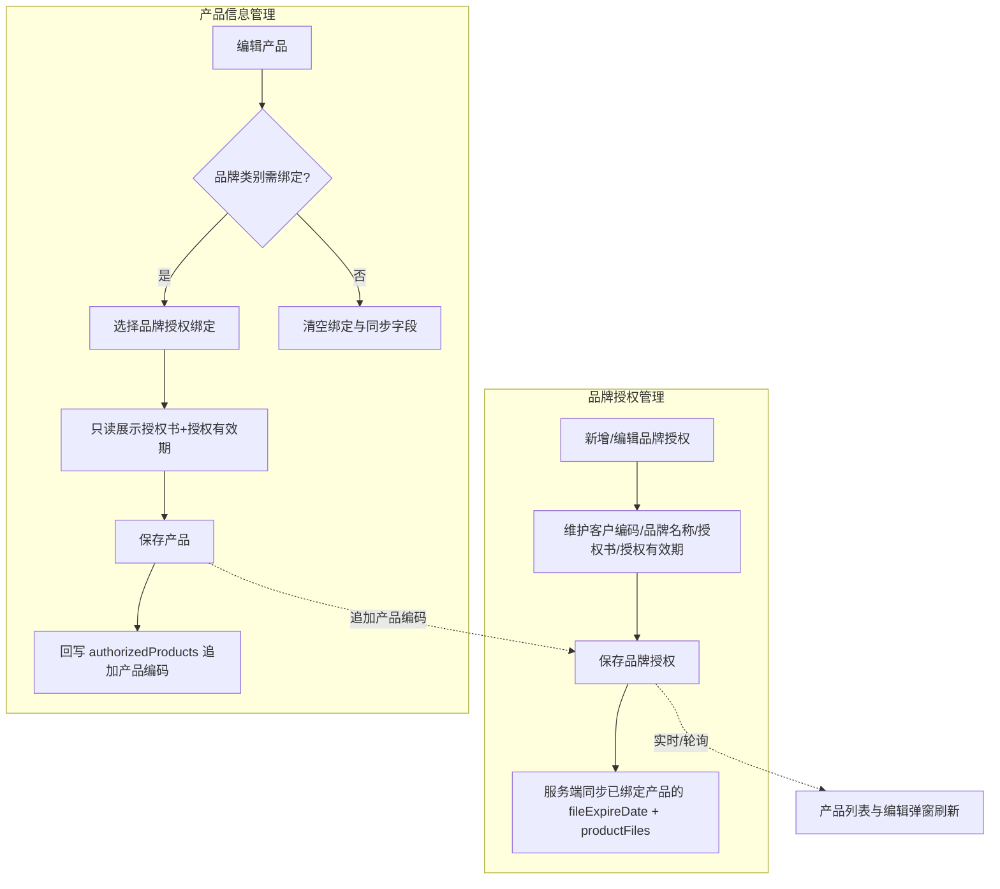

# 仓储中台 · 品牌授权文件管理与产品信息联动需求文档

## 1. 文档基础信息

### 1.1 版本记录

| 时间 | 版本 | 修改人 | 变更内容 |
| --- | --- | --- | --- |
| 2026-06-22 | v1.1 | — | 补充批量导入失败报告结构、错误说明文案及页面文案 |
| 2026-06-22 | v1.0 | — | 初版：品牌授权文件管理、产品信息品牌绑定、双向/单向同步规则、历史数据兼容策略 |

### 1.2 文档范围

| 项目 | 内容 |
| --- | --- |
| 模块名称 | 仓储中台 · 品牌授权文件管理 + 产品信息品牌联动 |
| 适用端 | 运德仓储中台 Web（`/wh/`） |
| 页面范围 | 品牌授权文件管理（`brandAuthorization.html`）、产品信息管理（`productInfo.html`） |
| 不在范围 | 客户前台产品创建/编辑（本期不改造）；PDA 产品拍照（见 `docs/仓储中台PDA产品拍照需求文档.md`）；企微 SKU 同步；关务/计费规则变更 |

### 1.3 术语表

| 术语 | 说明 |
| --- | --- |
| 品牌授权 | 客户针对某一品牌持有的授权书及有效期，由仓储中台统一维护 |
| 品牌代号 | 系统自增编号，格式 `BA0001`、`BA0002`… |
| 授权书文件 | 品牌授权记录上的 PDF/图片等附件，字段 `authFiles[]` |
| 授权有效期 | 品牌授权的有效截止日期，字段 `expireDate`；列表筛选支持「已过有效期」「30 天内过有效期」 |
| 授权产品 | 已绑定该品牌授权的产品编码集合，字段 `authorizedProducts[]`；**仅由产品管理写入，品牌授权侧只读** |
| 品牌类别 | 产品字段 `brandCategory`：未设置、有品牌无授权、自有品牌、授权品牌、不涉牌 |
| 品牌授权绑定 | 产品字段 `brandAuthId`，指向一条品牌授权记录的主键 `id` |
| 产品文件 | 产品侧展示/引用的授权类文件，字段 `productFiles[]`；绑定后从品牌授权 `authFiles` 同步 |
| 上线日 | 本功能正式投产日期，由项目组配置（如 `2026-07-01`）；用于区分历史数据与新规数据 |

### 1.4 原型入口

| 环境 | 品牌授权文件管理 | 产品信息管理 |
| --- | --- | --- |
| 本地 | `http://localhost:3847/wh/brandAuthorization.html` | `http://localhost:3847/wh/productInfo.html` |
| 线上 | `https://wedobooking200.vercel.app/wh/brandAuthorization.html` | `https://wedobooking200.vercel.app/wh/productInfo.html` |

---

## 2. 需求背景

### 2.1 背景描述

海外仓产品入库前需校验品牌授权合规性。此前产品「授权有效期」「产品文件」分散在产品维度维护，品牌授权材料重复上传、有效期不一致，客服/关务核对成本高。

本需求引入**品牌授权文件管理**作为权威数据源，产品通过「品牌授权绑定」引用授权书与有效期；授权产品集合反向由产品绑定自动汇总，避免双端手工维护运德编号/产品编码不一致。

### 2.2 需求列表

| 编号 | 用户诉求描述 | 提出人/部门 |
| --- | --- | --- |
| R-01 | 按客户维护品牌授权书、有效期，支持增删改查与操作日志 | 仓储运营/关务 |
| R-02 | 产品编辑时按品牌类别选择品牌授权，自动带出授权书与有效期 | 仓储运营/客服 |
| R-03 | 产品绑定后，品牌授权侧自动汇总授权产品列表 | 仓储运营 |
| R-04 | 品牌授权修改有效期或授权书后，已绑定产品自动同步 | 仓储运营/关务 |
| R-05 | 上线前已有产品数据不被新规则破坏，沿用原处理方式 | 产品/IT |

### 2.3 核心目标

**作为仓储中台运营人员，我希望集中维护客户品牌授权，并在产品侧一键绑定同步，以便保证授权材料一致、减少重复录入与合规风险。**

核心指标：品牌授权一次维护覆盖产品数、产品授权文件与品牌授权不一致率、授权过期预警处理时效。

---

## 3. 功能总览

### 3.1 业务流程



### 3.2 数据流向（单向 / 双向）

| 数据项 | 权威源 | 写入方 | 读取/同步方 | 说明 |
| --- | --- | --- | --- | --- |
| 客户编码、品牌名称、授权书、授权有效期 | 品牌授权 | 品牌授权管理 | 产品管理（只读展示） | 产品保存或品牌授权保存时同步到产品 |
| 授权产品（产品编码列表） | 产品绑定结果 | 产品管理 | 品牌授权管理（只读） | 品牌授权侧不可手工增删 |
| 涉及品牌 | 产品 | 产品管理 | — | 独立于品牌授权 `brandName`，不自动覆盖 |

### 3.3 功能清单

| 编号 | 功能模块 | 功能简述 |
| --- | --- | --- |
| F-01 | 品牌授权列表 | 筛选、分页、多选、查看授权书/授权产品/操作日志 |
| F-02 | 品牌授权新增/编辑 | 多行批量录入；必填客户编码+品牌名称；授权产品只读 |
| F-03 | 品牌授权删除 | 单条/批量删除，写入删除审计日志 |
| F-04 | 品牌授权操作日志 | 记录新增/编辑/删除及字段变更明细 |
| F-05 | 产品信息列表 | 展示涉及品牌、授权有效期、产品文件等 |
| F-06 | 产品编辑 · 品牌联动 | 品牌类别驱动绑定；同步授权书与有效期；保存回写授权产品 |
| F-07 | 品牌授权 → 产品同步 | 品牌授权保存后，更新所有 `brandAuthId` 匹配产品的文件与有效期 |
| F-08 | 产品页实时刷新 | 产品管理页轮询/聚焦刷新，编辑弹窗内联动字段随品牌授权变更更新 |
| F-09 | 批量导入 | Excel 导入；有错整批不落库，下载失败报告 |
| F-10 | 批量导出 | 导出当前筛选结果；提供导入模板下载 |

---

## 4. 功能详细设计

### 4.1 品牌授权文件管理（F-01 ~ F-04）

#### A. 用户故事

- **作为**仓储运营，**我想要**按客户维护品牌授权材料，**以便**关务与入库审核有统一依据。
- **作为**仓储运营，**我想要**查看某品牌下已绑定哪些产品编码，**以便**核对授权覆盖范围（只读，不可在此维护）。

#### B. 用户旅程

入口（产品管理二级菜单「品牌授权文件管理」）→ 筛选/查询 → 列表浏览 → 新增/编辑/删除 → 查看授权产品集合 / 操作日志 → 保存持久化。

#### C. 交互与界面

**布局**：顶部筛选区 + 工具栏（新增/编辑/删除）+ 列表 + 分页。

**列表列**：复选框、品牌代号、客户编码、品牌名称、授权书文件、授权产品、授权有效期、操作（编辑/日志/删除）。

**新增/编辑模态框**（支持多行批量）：

| 列 | 类型 | 必填 | 说明 |
| --- | --- | --- | --- |
| 客户编码 | 文本输入 | 是 | 与产品 `userCode` 对应 |
| 品牌名称 | 文本输入 | 是 | 授权品牌名 |
| 授权书文件 | 文件上传 | 否 | 支持 pdf/doc/docx/jpg/png 等，可多文件 |
| 授权产品（产品编码） | **只读文本** | — | 展示已绑定产品；空时提示「暂无（产品绑定自动同步）」 |
| 授权有效期 | 日期 | 否 | `YYYY-MM-DD` |

**授权产品集合弹窗**：只读列表，提示「由产品管理编辑绑定后自动同步，此处仅可查看」。

**权限**：仓储中台运营可增删改；本原型未做细粒度角色拆分。

#### D. 字段与逻辑

**1. 筛选栏**

| 筛选元素 | 组件类型 | 默认值 | 逻辑/备注 |
| --- | --- | --- | --- |
| 客户编码 | 文本 | 空 | 模糊匹配 |
| 品牌名称 | 文本 | 空 | 模糊匹配 |
| 产品编码 | 文本 | 空 | 在 `authorizedProducts` 中模糊匹配 |
| 授权有效期 | 下拉 | 全部 | `已过有效期`：`expireDate < 今天`；`30天内过有效期`：今天 ≤ `expireDate` ≤ 今天+30 天；无日期不参与筛选 |

**2. 列表数据**

| 字段 | 数据含义 | 展示逻辑 |
| --- | --- | --- |
| 品牌代号 | `brandCode` | 新建时自增 `BA`+4 位数字 |
| 授权书文件 | `authFiles[]` | 有文件显示「N 个文件」链接；无则「暂无」 |
| 授权产品 | `authorizedProducts[]` | 有则「N 个产品编码」；无则「查看」 |
| 授权有效期 | `expireDate` | 空显示 `-`；过期可标红（原型可选） |

**3. 保存规则**

- 新增：`authorizedProducts` 固定为 `[]`。
- 编辑：**不**从模态框覆盖 `authorizedProducts`，保留库中已有值。
- 操作日志：记录客户编码、品牌名称、授权有效期、授权书文件变更；**不**记录授权产品（因非本页写入）。

**4. 删除规则**

- 删除前二次确认。
- 删除记录写入 `MOCK_BRAND_AUTH_AUDIT_LOGS`（或生产等价审计表）。
- **不自动解除**产品侧 `brandAuthId`（见 §5 历史与异常）；运营需在产品侧另行处理。

---

### 4.1.1 批量导入 · 失败报告与文案（F-09）

#### A. 导入原则

- 任一行校验失败 → **整批不写入**（0 条落库）。
- 失败时必须提供 **失败报告 Excel 下载**；弹窗仅展示摘要与前 10 条预览。

#### B. 失败报告 Excel 结构

文件名：`品牌授权导入失败报告_yyyyMMdd_HHmmss.xlsx`

**Sheet1：失败明细**

| 列名 | 说明 |
| --- | --- |
| 行号 | 对应上传 Excel 中的行号（表头占第 1 行时，数据从第 2 行起） |
| 导入动作 | 系统判定：`新增` / `编辑` |
| 品牌代号 | 原文件该列值，空则显示「（空）」 |
| 客户编码 | 原文件该列值 |
| 品牌名称 | 原文件该列值 |
| 授权书文件 | 原文件该列值 |
| 授权有效期 | 原文件该列值 |
| 错误类型 | 见 §C 错误码 |
| 错误说明 | 面向运营的中文描述（可直接照此改文件） |

**Sheet2：导入摘要**（可选，便于归档）

| 项 | 值 |
| --- | --- |
| 导入时间 | yyyy-MM-dd HH:mm:ss |
| 操作人 | 当前登录用户 |
| 文件名 | 用户上传的原始文件名 |
| 总行数 | 数据行数（不含表头） |
| 错误行数 | 去重后的出错行数 |
| 导入结果 | 失败，未写入任何数据 |

#### C. 错误类型与错误说明文案

| 错误类型 | 触发条件 | 错误说明文案（写入失败报告「错误说明」列） |
| --- | --- | --- |
| `BRAND_CODE_NOT_FOUND` | 品牌代号非空，但系统中不存在 | 品牌代号「{brandCode}」不存在，请核对后重试 |
| `BRAND_CODE_FORMAT` | 品牌代号格式非法 | 品牌代号「{brandCode}」格式不正确，应为 BA+4 位数字，如 BA0001 |
| `REQUIRED_CUSTOMER` | 新增行客户编码为空 | 第 {row} 行：客户编码不能为空 |
| `REQUIRED_BRAND_NAME` | 新增行品牌名称为空 | 第 {row} 行：品牌名称不能为空 |
| `DUPLICATE_IN_FILE` | 同一文件内多行「客户编码+品牌名称」重复（新增） | 与第 {otherRow} 行重复：客户编码「{customerCode}」+ 品牌名称「{brandName}」 |
| `DUPLICATE_IN_DB` | 新增时与库内已有记录重复 | 客户编码「{customerCode}」+ 品牌名称「{brandName}」已存在（品牌代号 {existingCode}） |
| `UNIQUE_VIOLATION_ON_EDIT` | 编辑后客户编码+品牌名称与其他记录冲突 | 修改后将与品牌代号「{existingCode}」重复：客户编码「{customerCode}」+ 品牌名称「{brandName}」 |
| `EXPIRE_DATE_FORMAT` | 授权有效期格式错误 | 授权有效期「{value}」格式不正确，请使用 yyyy-MM-dd |
| `AUTH_FILE_INVALID` | 授权书文件 URL/格式不合法（若启用） | 授权书文件「{value}」无效，请填写可访问的 http(s) 链接或多个链接用分号分隔 |
| `FILE_PARSE_ERROR` | Excel 无法解析、缺表头、超行数限制等 | {具体解析错误，如：缺少必填列「客户编码」} |

同一行多条错误：在「错误说明」列用 **分号 + 空格** 拼接，如：`客户编码不能为空；品牌名称不能为空`

#### D. 页面文案（批量导入）

| 场景 | 文案 |
| --- | --- |
| 工具栏按钮 | 批量导入 |
| 工具栏按钮 | 下载导入模板 |
| 工具栏按钮 | 批量导出 |
| 选择文件标题 | 批量导入品牌授权 |
| 选择文件说明 | 请上传 .xlsx 文件。品牌代号为空视为新增，非空视为编辑。任一行有误则整批不导入。 |
| 校验中 | 正在校验，请稍候…（共 {total} 行） |
| **失败弹窗标题** | **批量导入失败** |
| **失败弹窗正文** | **共 {total} 行，发现 {errorCount} 处错误，未导入任何数据。** |
| 失败弹窗预览标题 | 错误预览（最多显示 10 条，完整内容请下载失败报告） |
| 失败弹窗主按钮 | **下载失败报告** |
| 失败弹窗次按钮 | 关闭 |
| 成功弹窗标题 | 导入成功 |
| 成功弹窗正文 | 新增 {insertCount} 条，更新 {updateCount} 条，共 {successCount} 条。 |
| 成功弹窗按钮 | 确定 |
| 文件类型错误 | 仅支持 .xlsx 格式 |
| 空文件 | 导入文件无数据行，请检查后重新上传 |
| 超行数（若限制） | 单次导入不能超过 {maxRows} 行，请分批导入 |
| 下载失败报告失败 | 失败报告生成异常，请稍后重试或联系管理员 |

#### E. 手工保存 · 唯一校验文案（与导入共用语义）

| 场景 | 文案 |
| --- | --- |
| 新增/编辑保存失败 | 客户编码「{customerCode}」+ 品牌名称「{brandName}」已存在，请更换或使用编辑导入 |
| 模态框多行保存 | 第 {row} 行：客户编码「{customerCode}」+ 品牌名称「{brandName}」已存在 |

---

### 4.2 产品信息 · 品牌联动（F-05 ~ F-06）

#### A. 用户故事

**作为**仓储运营，**我想要**编辑产品时按品牌类别绑定品牌授权，**以便**产品自动继承授权书与有效期，且无需在品牌授权页重复录入产品编码。

#### B. 用户旅程

产品列表 → 编辑 → 选择品牌类别 →（若需绑定）选择品牌授权 → 只读查看产品文件/授权有效期 → 填写其他字段 → 保存 → 品牌授权 `authorizedProducts` 追加本产品编码。

#### C. 交互与界面

**编辑模态框字段顺序**：

1. 英文申报名称（必填）
2. 特殊属性（必填，多选）
3. 品牌类别（下拉）
4. 涉及品牌（文本，独立字段）
5. 品牌授权绑定（条件展示）
6. 产品文件（条件展示，只读）
7. 授权有效期（条件展示，只读）
8. 产品状态

**品牌类别与绑定关系**：

| 品牌类别 | 是否展示品牌授权绑定 | 保存时行为 |
| --- | --- | --- |
| 未设置 | 否 | 清空 `brandAuthId`、`fileExpireDate`、`productFiles` |
| 不涉牌 | 否 | 同上 |
| 有品牌无授权 | 是 | 必选绑定；同步文件与有效期 |
| 自有品牌 | 是 | 同上 |
| 授权品牌 | 是 | 同上；**涉及品牌**必填 |

**品牌授权绑定下拉**：仅列出 `customerCode === 产品.userCode` 的品牌授权；选项文案：`品牌代号 · 品牌名称`。

#### D. 字段与逻辑

**1. 保存时产品侧写入**

| 字段 | 来源 | 说明 |
| --- | --- | --- |
| `brandAuthId` | 用户选择 | 绑定主键 |
| `fileExpireDate` | 品牌授权 `expireDate` | 快照同步 |
| `productFiles` | 品牌授权 `authFiles` 拷贝 | 结构 `{ fileName, url, uploadedAt }` |
| `hasFile` | 计算 | `productFiles.length > 0` |

**2. 保存时品牌授权侧回写**

- 若品牌类别需绑定且 `brandAuthId`、`productCode` 均有值：向该品牌授权 `authorizedProducts` **追加**产品编码（去重，不删除旧值）。
- 若用户更换绑定到其他品牌授权：原型**不自动**从旧授权移除编码（生产可扩展解绑逻辑）。

**3. 列表相关列**

| 列 | 字段 |
| --- | --- |
| 涉及品牌 | `brand` |
| 产品文件 | `productFiles` / `hasFile` |
| 授权有效期 | `fileExpireDate` |

---

### 4.3 品牌授权 → 产品实时同步（F-07 ~ F-08）

#### A. 用户故事

**作为**仓储运营，**我想要**在品牌授权页修改有效期或授权书后，已绑定产品自动更新，**以便**两端数据一致，无需逐个改产品。

#### B. 触发条件

品牌授权 **POST 保存成功** 后，服务端扫描产品库中 `brandAuthId === 该授权.id` 的记录，更新：

| 产品字段 | 同步值 |
| --- | --- |
| `fileExpireDate` | 品牌授权 `expireDate`（空则写空字符串） |
| `productFiles` | 品牌授权 `authFiles` 深拷贝 |
| `hasFile` | `productFiles.length > 0` |

#### C. 产品页刷新

| 机制 | 间隔/条件 | 行为 |
| --- | --- | --- |
| 轮询 | 页面可见时每 **4 秒** | 拉取产品列表 + 品牌授权列表，刷新表格 |
| 窗口聚焦 / 切回标签 | 立即 | 同上 |
| 编辑弹窗打开中 | 随轮询 | 按当前 `brandAuthId` 刷新只读「产品文件」「授权有效期」 |

#### D. 同步范围约束（与历史数据相关）

**仅同步满足以下全部条件的产品**：

1. `brandAuthId` 非空且能匹配到有效品牌授权记录；
2. **不属于历史兼容数据**（见 §5.1）。

不满足条件的产品 **跳过**，不做任何字段覆盖。

---

## 5. 历史数据与上线策略（重要）

> **原则：上线前的历史产品数据保留原有处理方式，不因本需求强制迁移或自动覆盖。**

### 5.1 历史数据定义

满足以下任一条件，视为**历史数据**（Legacy）：

| 判定方式 | 说明 |
| --- | --- |
| 创建时间 | `createTime < 上线日 00:00:00`（推荐） |
| 显式标记 | 产品存在 `legacyFileMode: true` 或等价字段（生产实现可选） |
| 无绑定关系 | `brandAuthId` 为空 — 视为从未接入品牌授权体系 |

### 5.2 历史数据保留的原处理方式

| 维度 | 上线前（Legacy） | 上线后（新规） |
| --- | --- | --- |
| 授权有效期 `fileExpireDate` | 产品表原值，**手工或旧流程维护** | 绑定品牌授权后由同步写入；未绑定则仍可为空或原值 |
| 产品文件 `productFiles` | 产品维度**独立维护/上传**（若有） | 绑定后从品牌授权 `authFiles` 同步；未绑定则保留原文件 |
| 品牌类别 `brandCategory` | 可为「未设置」或历史枚举 | 运营可按需改为需绑定类别并选择授权 |
| 品牌授权绑定 `brandAuthId` | **通常为空** | 编辑保存时写入 |
| 品牌授权模块 | 不存在 | 新功能，**不要求**为历史产品补建授权记录 |
| 品牌授权 → 产品自动同步 | **不触发** | 仅对 `brandAuthId` 非空且非 Legacy 的产品触发 |

### 5.3 上线迁移建议（非强制）

1. **默认策略**：历史产品零改动，列表与业务只读展示原 `fileExpireDate`、`productFiles`。
2. **自愿接入**：运营编辑某历史产品、修改品牌类别并选择品牌授权绑定且保存成功后，该产品转为新规数据，后续享受双向同步（回写授权产品 + 接收品牌授权变更同步）。
3. **批量迁移（可选）**：若业务后续要求，可单独做导入脚本，**不在本版范围**。
4. **删除品牌授权**：若仍有产品 `brandAuthId` 指向已删授权，产品侧保留最后一次快照；列表/编辑时提示「关联授权不存在」，**不自动清空**历史文件（避免误删合规材料）。

### 5.4 原型 Demo 与生产的差异说明

| 项 | 当前原型 | 生产建议 |
| --- | --- | --- |
| 历史数据判定 | 未实现 `legacyFileMode` / 上线日过滤 | 服务端同步必须增加 Legacy 跳过逻辑 |
| 数据存储 | `mock_data/*.js` 文件 | 数据库表 + 对象存储 |
| 实时刷新 | 前端 4 秒轮询 | 可改为 WebSocket / 消息队列；或仅服务端同步 + 下次打开页面一致 |

---

## 6. 规则与约束

### 6.1 业务规则

1. 品牌代号 `BAxxxx` 全局自增，不可手工修改。
2. 授权产品 **只能** 通过产品保存写入品牌授权；品牌授权页、授权产品弹窗 **禁止** 手工编辑。
3. 涉及品牌（`brand`）与品牌授权品牌名称（`brandName`）**相互独立**。
4. 同一产品编码在同一品牌授权 `authorizedProducts` 中只出现一次（追加去重）。
5. 品牌授权保存触发的同步 **只更新** `fileExpireDate`、`productFiles`、`hasFile`，不改产品其他业务字段。

### 6.2 异常处理

| 场景 | 处理 |
| --- | --- |
| 需绑定品牌类别但未选授权 | 保存拦截，提示「请选择品牌授权绑定」 |
| 当前客户无品牌授权 | 保存拦截，提示先维护品牌授权 |
| 所选品牌授权已删除 | 保存拦截，提示「所选品牌授权不存在」 |
| 授权有效期为空 | 产品侧展示 `-`；筛选「已过/30天内」不匹配 |
| 授权书为空 | 产品文件展示「暂无授权书文件」；`hasFile = false` |
| 网络失败 | Toast/行内错误「保存失败，请重试」；不部分提交 |

### 6.3 非功能约束（原型）

- 单页列表分页：每页 20 条。
- 文件上传：授权书 base64 落盘至 `mock_data/uploads/brand-auth-files/`。
- API：`GET/POST /api/mock/brand-authorization`、`GET/POST /api/mock/product-info`。

---

## 7. 核心数据模型（开发参考）

### 7.1 品牌授权 `BrandAuthorization`

```javascript
{
  id: string,              // 主键，如 brand-auth-xxx
  brandCode: string,       // BA0001
  customerCode: string,    // 客户编码
  brandName: string,       // 品牌名称
  expireDate: string,      // 授权有效期 YYYY-MM-DD
  authFiles: [{ fileName, url, uploadedAt }],
  authorizedProducts: string[],  // 产品编码，只读汇总
  operationLogs: [{ id, time, operator, action, changes[] }],
  createTime: string,
  updateTime: string
}
```

### 7.2 产品扩展字段（联动相关）

```javascript
{
  userCode: string,        // 用户编号，对应品牌授权 customerCode
  productCode: string,     // 产品编号，回写 authorizedProducts
  brand: string,           // 涉及品牌
  brandCategory: string,   // 品牌类别
  brandAuthId: string,     // 品牌授权绑定 id；空表示未绑定/历史
  fileExpireDate: string,  // 授权有效期（绑定后同步）
  productFiles: [{ fileName, url, uploadedAt }],
  hasFile: boolean,
  // legacyFileMode: boolean  // 生产可选：历史数据标记
}
```

### 7.3 同步伪代码

```
ON brand_authorization.saved(record):
  FOR EACH product IN products WHERE product.brandAuthId == record.id:
    IF product IS legacy (§5.1): CONTINUE
    product.fileExpireDate = record.expireDate OR ''
    product.productFiles = COPY(record.authFiles)
    product.hasFile = product.productFiles.length > 0
  PERSIST products

ON product.saved(product):
  IF needsBrandAuthBinding(product.brandCategory) AND product.brandAuthId:
    auth = GET brand_auth BY product.brandAuthId
    product.fileExpireDate = auth.expireDate
    product.productFiles = COPY(auth.authFiles)
    IF product.productCode NOT IN auth.authorizedProducts:
      APPEND product.productCode TO auth.authorizedProducts
    PERSIST brand_auth
```

---

## 8. 测试要点

| 编号 | 场景 | 预期 |
| --- | --- | --- |
| T-01 | 新增品牌授权，不填授权书/有效期 | 保存成功；授权产品为空 |
| T-02 | 产品绑定品牌授权并保存 | 产品带出文件与有效期；品牌授权授权产品含该产品编码 |
| T-03 | 品牌授权侧修改有效期 | 已绑定产品 `fileExpireDate` 自动更新（非 Legacy） |
| T-04 | 品牌授权侧增删授权书 | 已绑定产品 `productFiles` 自动更新 |
| T-05 | 品牌授权编辑页 | 授权产品区域不可编辑 |
| T-06 | 历史产品（无 brandAuthId） | 品牌授权变更 **不影响** 其 fileExpireDate/productFiles |
| T-07 | 产品页双 Tab | 品牌授权保存后约 4 秒内产品列表/编辑弹窗只读区更新 |
| T-08 | 品牌类别改为「不涉牌」保存 | 清空绑定与同步字段 |
| T-09 | 批量导入 1 行库内重复 | 0 条写入；失败报告含 `DUPLICATE_IN_DB` |
| T-10 | 批量导入品牌代号不存在 | 0 条写入；失败报告含 `BRAND_CODE_NOT_FOUND` |
| T-11 | 批量导入全部合法 | 成功弹窗展示新增/更新条数 |

---

## 9. 关联文档

- PDA 产品拍照：`docs/仓储中台PDA产品拍照需求文档.md`
- 仓储中台导航：`wh/js/vendor/wh-mid-legacy/wh-mid-chrome.js`（产品管理 → 产品信息 / 品牌授权文件管理）
- 本地地址汇总：项目根目录 `地址`
