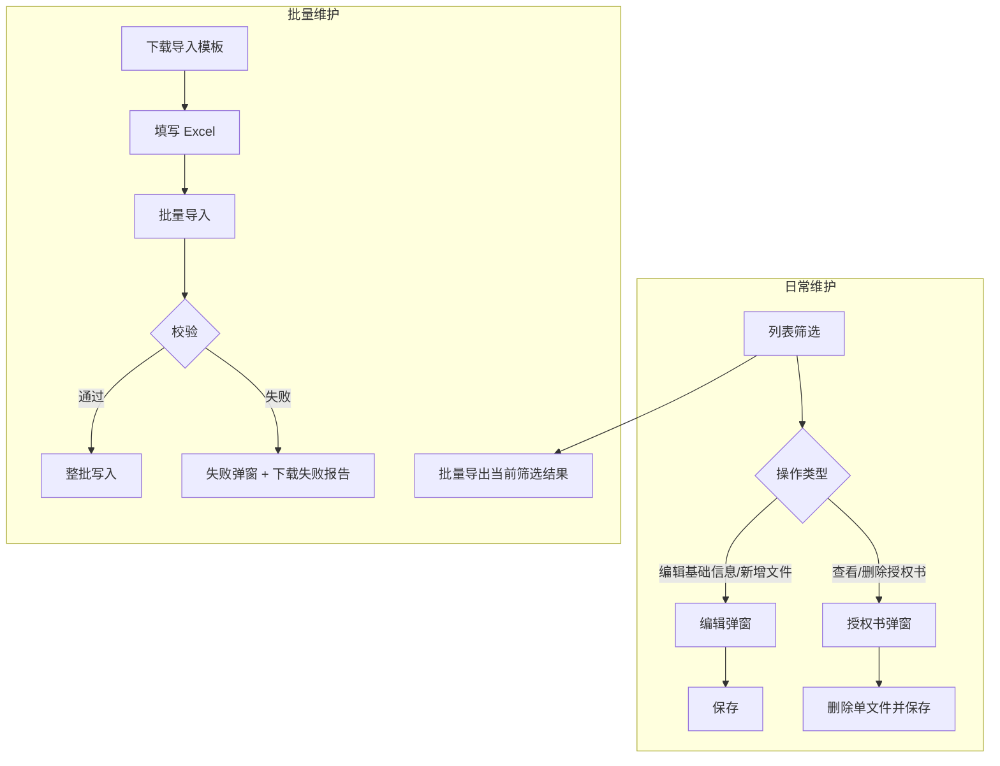

# 仓储中台 · 品牌授权批量导入与文件管理 PRD

## 1. 文档基础信息

### 1.1 版本记录

| 时间 | 版本 | 修改人 | 变更内容 |
| --- | --- | --- | --- |
| 2026-06-24 | v1.0 | — | 初版：备注、唯一校验、批量导入/导出、授权书文件交互改造 |
| 2026-06-24 | v1.1 | — | 按标准 PRD 结构重写全文 |

### 1.2 文档范围

| 项目 | 内容 |
| --- | --- |
| 模块名称 | 仓储中台 · 品牌授权文件管理（增强） |
| 关联主文档 | `docs/品牌授权与产品信息联动需求文档.md` |
| 适用端 | 运德仓储中台 Web（`/wh/`） |
| 页面范围 | 品牌授权文件管理（`brandAuthorization.html`） |
| 不在范围 | 产品信息品牌联动、PDA 产品拍照、企微同步、Excel 单元格嵌入图片导入 |

### 1.3 术语表

| 术语 | 说明 |
| --- | --- |
| 备注 | 品牌授权记录字段 `remark`，用于运营补充说明 |
| 唯一键 | `客户编码 + 品牌名称`（忽略大小写与首尾空格），库内不可重复 |
| 授权书文件 | 字段 `authFiles[]`，元素含 `fileName`、`url`、`uploadedAt` |
| 待上传文件 | 编辑弹窗选择本地文件后暂存 `pendingFiles[]`，保存时 base64 落盘 |
| 授权书链接导入 | 批量导入「授权书文件」列填写 http(s) URL，多个用分号分隔 |
| 失败报告 | 导入校验失败时下载的 Excel，含失败明细与导入摘要 |

### 1.4 原型入口

| 环境 | 地址 |
| --- | --- |
| 本地 | `http://localhost:3847/wh/brandAuthorization.html` |
| 线上 | `https://wedobooking200.vercel.app/wh/brandAuthorization.html` |

---

## 2. 需求背景

### 2.1 背景描述

品牌授权主流程（列表维护、产品联动）已在主 PRD 定义。运营在实际使用中提出三类补充诉求：

1. **批量维护**：需通过 Excel 批量新增/更新品牌授权，减少逐条录入；
2. **数据质量**：同一客户下品牌名称不可重复，需在保存与导入时统一拦截；
3. **授权书操作分离**：查看/删除已有授权书与「编辑基础信息/新增文件」场景不同，宜拆分入口，避免编辑弹窗信息过载。

本 PRD 为上述增强能力的独立说明，与主 PRD 并行；冲突时以本文档为准（仅限本 PRD 覆盖范围）。

### 2.2 需求列表

| 编号 | 用户诉求描述 | 提出人/部门 |
| --- | --- | --- |
| R-01 | 品牌授权支持备注字段，列表与导入导出可维护 | 仓储运营 |
| R-02 | 客户编码+品牌名称不可重复，手工与导入共用规则 | 仓储运营/关务 |
| R-03 | 支持 Excel 批量导入/导出及导入模板下载 | 仓储运营 |
| R-04 | 导入失败可下载失败报告，弹窗展示错误摘要 | 仓储运营 |
| R-05 | 授权书在列表单独查看/删除，编辑弹窗仅负责新增上传 | 仓储运营 |

### 2.3 核心目标

**作为**仓储运营，**我想要**批量维护品牌授权并规范授权书文件操作入口，**以便**提升录入效率、降低重复数据与误删风险。

核心指标：批量导入成功率、唯一冲突拦截率、授权书误删投诉数。

---

## 3. 功能总览

### 3.1 业务流程

### 3.2 功能清单

| 编号 | 功能模块 | 功能简述 |
| --- | --- | --- |
| F-01 | 备注字段 | 列表、编辑、导入/导出支持 `remark` |
| F-02 | 唯一校验 | 客户编码+品牌名称库内唯一；手工与导入共规则 |
| F-03 | 批量导出 | 导出当前筛选结果为 xlsx |
| F-04 | 下载导入模板 | 含表头、示例行、填写说明 Sheet |
| F-05 | 批量导入 | xlsx 导入；有错整批不落库 |
| F-06 | 导入失败报告 | 失败弹窗 + 可下载 Excel 失败报告 |
| F-07 | 授权书查看/删除 | 列表进入授权书弹窗，单条删除 |
| F-08 | 授权书新增上传 | 编辑弹窗本地上传，不展示历史文件 |

---

## 4. 功能详细设计

### 4.1 备注字段（F-01）

#### A. 用户故事

**作为**仓储运营，**我想要**为品牌授权填写备注，**以便**记录授权来源、内部说明等补充信息。

#### B. 用户旅程

列表查看备注 → 新增/编辑弹窗填写备注 → 保存 → 操作日志记录变更；或通过批量导入/导出维护备注。

#### C. 交互与界面

| 区域 | 说明 |
| --- | --- |
| 列表列「备注」 | 位于「授权有效期」与「操作」之间；空显示 `-`；超长省略，hover 显示全文 |
| 编辑弹窗 | 「品牌名称」后增加「备注」文本输入，非必填 |
| 操作日志 | 备注变更记入「数据变更记录」 |

#### D. 字段与逻辑

| 字段 | 数据含义 | 逻辑/备注 |
| --- | --- | --- |
| `remark` | 备注 | 字符串；默认空；导入/导出列名「备注」 |

---

### 4.2 客户编码 + 品牌名称唯一校验（F-02）

#### A. 用户故事

**作为**仓储运营，**我想要**系统阻止同一客户下重复品牌名称，**以便**避免授权数据冲突与产品绑定歧义。

#### B. 用户旅程

手工保存或多行编辑 → 系统校验唯一性 → 冲突则行内/弹窗错误，不落库；批量导入 → 全量校验 → 任一行冲突则整批失败。

#### C. 交互与界面

| 场景 | 交互 |
| --- | --- |
| 编辑弹窗保存失败 | 模态框底部红色错误文案 |
| 模态框多行 | 提示「第 {row} 行：客户编码「…」+ 品牌名称「…」已存在」 |
| 批量导入失败 | 失败报告含 `DUPLICATE_IN_DB` / `DUPLICATE_IN_FILE` / `UNIQUE_VIOLATION_ON_EDIT` |

#### D. 字段与逻辑

| 规则项 | 逻辑/备注 |
| --- | --- |
| 唯一键计算 | `trim(客户编码)` + `trim(品牌名称)`，比较时忽略大小写 |
| 新增 | 库内不得存在相同唯一键 |
| 编辑 | 修改后不得与其他记录（排除本条 `id`）重复 |
| 导入文件内 | 新增行：客户+品牌组合不得重复；编辑行：品牌代号不得重复 |
| 与导入共用语义 | 手工保存失败文案：「客户编码「{customerCode}」+ 品牌名称「{brandName}」已存在，请更换或使用编辑导入」 |

---

### 4.3 授权书文件管理改造（F-07 ~ F-08）

#### A. 用户故事

- **作为**仓储运营，**我想要**在列表集中查看并删除授权书，**以便**删除操作意图清晰、减少编辑弹窗误操作。
- **作为**仓储运营，**我想要**在编辑时仅上传新文件，**以便**不被历史文件列表干扰。

#### B. 用户旅程

**查看/删除**：列表「授权书文件」列 → 点击「N 个文件」或「查看」→ 授权书弹窗 → 预览链接 / 点击「删除」→ 确认 → 立即保存并刷新列表。

**新增上传**：新增或编辑 → 编辑弹窗选择本地文件 → 仅展示待上传标签 → 保存 → 服务端落盘合并至 `authFiles`。

#### C. 交互与界面

**布局 · 列表「授权书文件」列**

| 状态 | 展示 | 点击 |
| --- | --- | --- |
| 有文件 | 「N 个文件」链接 | 打开授权书弹窗 |
| 无文件 | 「查看」链接（灰色） | 打开授权书弹窗（空态） |

**授权书文件弹窗**

| 元素 | 说明 |
| --- | --- |
| 标题 | `授权书文件 · {品牌名称或品牌代号}` |
| 说明 | 有文件：「可预览或删除授权书；新增文件请在「编辑」中上传。」无文件：「暂无授权书文件，可在「编辑」中上传。」 |
| 文件行 | 左：文件名链接（新窗口打开）；右：「删除」按钮（红色边框） |
| 删除确认 | `确定删除授权书「{fileName}」？` |
| 底部按钮 | 「关闭」 |

**编辑弹窗 · 授权书文件列**

| 元素 | 说明 |
| --- | --- |
| 文件选择 | `input[type=file]`，支持 pdf/doc/docx/jpg/png 等，可多选 |
| 待上传展示 | 标签「文件名 (待上传)」，可 × 移除待上传项 |
| **不展示** | 已落盘的历史 `authFiles` |
| 空态提示 | 「选择文件上传；删除已有文件请至列表「查看授权书」」 |

**权限控制**：仓储中台运营可删可传；本原型未做细粒度角色。

#### D. 字段与逻辑

| 字段/规则 | 数据含义 | 逻辑/备注 |
| --- | --- | --- |
| `authFiles[]` | 已保存授权书 | 查看/删除弹窗数据源 |
| `pendingFiles[]` | 待上传 | 仅编辑保存时使用；落盘后清空 |
| 编辑保存 | 合并规则 | **保留**原 `authFiles` + **追加** `pendingFiles` 落盘结果；不在编辑弹窗删除历史文件 |
| 弹窗删除 | 替换规则 | 从 `authFiles` 移除指定项后立即 POST 保存 |
| 操作日志 | 删除 | 记录「授权书文件」：before 文件名列表 → after 文件名列表 |
| 落盘路径（演示） | 文件存储 | `mock_data/uploads/brand-auth-files/` |

---

### 4.4 批量导入（F-05 ~ F-06）

#### A. 用户故事

**作为**仓储运营，**我想要**通过 Excel 批量新增或更新品牌授权，**以便**高效完成大批量维护；失败时能定位错误行并导出报告。

#### B. 用户旅程

工具栏「下载导入模板」→ 填写 Excel →「批量导入」→ 选择 `.xlsx` →「开始导入」→ 校验 → 成功提示条数 / 失败弹窗 → 可选「下载失败报告」。

#### C. 交互与界面

**工具栏**

| 按钮 | 说明 |
| --- | --- |
| 批量导入 | 打开导入弹窗 |
| 下载导入模板 | 直接下载 xlsx |
| 批量导出 | 见 §4.5 |

**批量导入弹窗**

| 元素 | 说明 |
| --- | --- |
| 标题 | 批量导入品牌授权 |
| 说明 | 请上传 .xlsx 文件。品牌代号为空视为新增，非空视为编辑。授权书文件列可填 http(s) 链接，多个用分号分隔；编辑行留空表示不更新授权书。任一行有误则整批不导入。 |
| 文件选择 | 仅 `.xlsx` |
| 主按钮 | 开始导入 |
| 校验中 | 行内文案：「正在校验，请稍候…（共 {total} 行）」 |

**失败弹窗**

| 元素 | 说明 |
| --- | --- |
| 标题 | 批量导入失败 |
| 正文 | 共 {total} 行，发现 {errorCount} 处错误，未导入任何数据。 |
| 预览标题 | 错误预览（最多显示 10 条，完整内容请下载失败报告） |
| 预览项 | 第 {row} 行：{错误说明}（**错误说明红色加粗**） |
| 主按钮 | 下载失败报告 |
| 次按钮 | 关闭 |

**成功反馈**

| 元素 | 文案 |
| --- | --- |
| 弹窗 | 导入成功 / 新增 {insertCount} 条，更新 {updateCount} 条，共 {successCount} 条。 |

#### D. 字段与逻辑

**1. 导入 Excel 列定义**

| 列名 | 必填 | 默认值 | 逻辑/备注 |
| --- | --- | --- | --- |
| 品牌代号 | 编辑时必填 | 空 | 空→**新增**；非空→**编辑**；格式 `BA`+4 位数字 |
| 客户编码 | 新增必填 | — | 新增行不能为空 |
| 品牌名称 | 新增必填 | — | 新增行不能为空 |
| 授权书文件 | 否 | 空 | 多个 http(s) URL 用 `;` 或 `；` 分隔；**编辑行留空不更新**；有值则**整行替换**授权书列表 |
| 授权有效期 | 否 | 空 | `yyyy-MM-dd` |
| 备注 | 否 | 空 | 文本 |

**2. 导入原则**

| 规则 | 说明 |
| --- | --- |
| 单次行数上限 | 500 行（不含表头） |
| 原子性 | 任一行校验失败 → **0 条落库** |
| 文件格式 | 仅 `.xlsx` |
| 授权书导入方式 | **http(s) 链接**；演示环境不支持本地路径、不支持 Excel 嵌入图片 |
| URL 校验 | 非空时每段须匹配 `^https?://`；不做链接可达性探测 |

**3. 导入动作判定**

| 品牌代号 | 动作 | 说明 |
| --- | --- | --- |
| 空 | 新增 | 系统分配新 `brandCode` |
| 非空 | 编辑 | 按代号匹配记录；代号须已存在 |

**4. 错误类型与说明文案**

| 错误类型 | 触发条件 | 错误说明（写入失败报告） |
| --- | --- | --- |
| `BRAND_CODE_NOT_FOUND` | 编辑时代号不存在 | 品牌代号「{brandCode}」不存在，请核对后重试 |
| `BRAND_CODE_FORMAT` | 代号格式非法 | 品牌代号「{brandCode}」格式不正确，应为 BA+4 位数字，如 BA0001 |
| `REQUIRED_CUSTOMER` | 新增客户编码空 | 第 {row} 行：客户编码不能为空 |
| `REQUIRED_BRAND_NAME` | 新增品牌名空 | 第 {row} 行：品牌名称不能为空 |
| `DUPLICATE_IN_FILE` | 文件内重复 | 与第 {otherRow} 行重复：客户编码「…」+ 品牌名称「…」 |
| `DUPLICATE_IN_DB` | 与库内重复 | 客户编码「…」+ 品牌名称「…」已存在（品牌代号 {existingCode}） |
| `UNIQUE_VIOLATION_ON_EDIT` | 编辑后与他人冲突 | 修改后将与品牌代号「…」重复：… |
| `EXPIRE_DATE_FORMAT` | 日期格式错误 | 授权有效期「{value}」格式不正确，请使用 yyyy-MM-dd |
| `AUTH_FILE_INVALID` | URL 非法 | 授权书文件「{value}」无效，请填写可访问的 http(s) 链接或多个链接用分号分隔 |
| `FILE_PARSE_ERROR` | 解析/缺列/超行数 | {具体解析错误} |

同一行多条错误：「错误说明」列用 **分号 + 空格** 拼接。

**5. 失败报告 Excel 结构**

文件名：`品牌授权导入失败报告_yyyyMMdd_HHmmss.xlsx`

Sheet1「失败明细」列：行号、导入动作、品牌代号、客户编码、品牌名称、授权书文件、授权有效期、备注、错误类型、错误说明。

Sheet2「导入摘要」项：导入时间、操作人、文件名、总行数、错误行数、导入结果（固定「失败，未写入任何数据」）。

**6. 页面文案汇总**

| 场景 | 文案 |
| --- | --- |
| 文件类型错误 | 仅支持 .xlsx 格式 |
| 空文件 | 导入文件无数据行，请检查后重新上传 |
| 超行数 | 单次导入不能超过 {maxRows} 行，请分批导入 |
| 下载失败报告失败 | 失败报告生成异常，请稍后重试或联系管理员 |

---

### 4.5 批量导出与导入模板（F-03 ~ F-04）

#### A. 用户故事

**作为**仓储运营，**我想要**导出当前筛选结果并下载标准导入模板，**以便**线下编辑后批量回导。

#### B. 用户旅程

设置筛选条件 →「批量导出」→ 下载 xlsx；或「下载导入模板」→ 按说明填写 → 批量导入。

#### C. 交互与界面

| 按钮 | 交互 |
| --- | --- |
| 批量导出 | 无筛选结果时 toast/alert：「当前筛选结果为空，无可导出数据」 |
| 下载导入模板 | 立即下载 `品牌授权导入模板.xlsx` |

#### D. 字段与逻辑

**1. 导出范围与列**

| 项 | 逻辑/备注 |
| --- | --- |
| 数据范围 | **当前筛选条件下全部记录**（非仅当前页） |
| 文件名 | `品牌授权导出_{时间戳}.xlsx`（演示实现） |
| 列顺序 | 品牌代号、客户编码、品牌名称、授权书文件、授权有效期、备注 |
| 授权书文件列 | 多个 URL 用分号拼接 |

**2. 导入模板结构**

| Sheet | 内容 |
| --- | --- |
| 导入模板 | 表头 + 2 行示例（一行新增、一行编辑） |
| 填写说明 | 品牌代号规则、整批不落库、授权书链接格式、唯一键、编辑行授权书留空规则 |

**3. 导出规则**

- 时间格式：授权有效期 `YYYY-MM-DD`
- 空备注导出为空单元格
- 无授权书时「授权书文件」列为空

---

## 5. 规则与约束

### 5.1 业务规则

| 编号 | 规则 |
| --- | --- |
| BR-01 | 客户编码 + 品牌名称在库内唯一（忽略大小写与首尾空格） |
| BR-02 | 批量导入任一行失败则整批不写入 |
| BR-03 | 编辑弹窗不可删除历史授权书；删除仅能在授权书弹窗操作 |
| BR-04 | 编辑弹窗保存时保留原 `authFiles`，仅追加新上传文件 |
| BR-05 | 批量导入编辑行：授权书列留空保留原文件；有值则替换 |
| BR-06 | 操作日志记录备注、授权书变更；不记录授权产品 |

### 5.2 技术约束（演示实现）

| 编号 | 约束 |
| --- | --- |
| TC-01 | 前端 Excel 依赖 SheetJS（`xlsx@0.18.5` CDN） |
| TC-02 | 持久化 API：`GET/POST /api/mock/brand-authorization` |
| TC-03 | 本地上传授权书 base64 落盘：`scripts/lib/brandAuthFileApi.js` |
| TC-04 | 不支持 Excel 单元格嵌入图片导入 |
| TC-05 | 导入授权书链接不做 HTTP 可达性校验 |

### 5.3 与主 PRD 差异

| 主 PRD 描述 | 本 PRD / 现实现 |
| --- | --- |
| 编辑弹窗内管理全部授权书（含删除） | 改为列表授权书弹窗删除；编辑仅新增 |
| 列表无文件显示「暂无」 | 改为可点击「查看」进入空态弹窗 |
| 列表无「备注」列（v1.0） | 已增加备注列 |

---

## 6. 异常与边界

| 场景 | 处理 |
| --- | --- |
| 保存时网络失败 | 提示「保存失败，请重试」；不部分提交 |
| 导入解析失败 | 提示具体 `FILE_PARSE_ERROR` 文案 |
| 删除最后一个授权书 | 允许；列表显示「查看」 |
| 编辑不上传文件 | 原授权书不变 |
| 导入含非法 URL | 整批失败；失败报告含 `AUTH_FILE_INVALID` |
| 模态框多行部分唯一冲突 | 整单保存前拦截，不落库 |
| 分母为 0（导出） | 提示无可导出数据 |

---

## 7. 测试计划

| 编号 | 场景 | 预期 |
| --- | --- | --- |
| T-01 | 新增两条相同客户+品牌 | 保存拦截，提示已存在 |
| T-02 | 编辑弹窗 | 不显示历史授权书；可上传并保存新文件 |
| T-03 | 授权书弹窗删除 | 文件数减少，操作日志有「授权书文件」变更 |
| T-04 | 下载模板 → 合法数据导入 | 成功弹窗条数正确 |
| T-05 | 导入含非法 URL | 0 条写入，可下载失败报告 |
| T-06 | 编辑行导入：授权书列留空 | 原授权书保留 |
| T-07 | 编辑行导入：填新 URL | 授权书替换为新链接列表 |
| T-08 | 批量导出 | 与当前筛选一致，含备注与授权书 URL |
| T-09 | 导入失败弹窗 | 错误说明红色显示 |
| T-10 | 备注变更 | 操作日志记录备注 before → after |
| T-11 | 导入库内重复 | 0 条写入，失败报告含 `DUPLICATE_IN_DB` |

---

## 8. 实现参考（开发）

| 类型 | 路径 |
| --- | --- |
| 页面 | `wh/brandAuthorization.html` |
| 主逻辑 | `wh/js/brandAuthorization.js` |
| 导入导出 | `wh/js/brandAuthImportExport.js` |
| 样式 | `wh/css/brand-authorization.css` |
| Mock 数据 | `mock_data/brandAuthorization.js` |
| 文件落盘 | `scripts/lib/brandAuthFileApi.js` |
| Mock 读写 | `scripts/lib/brandAuthMockFile.js` |
