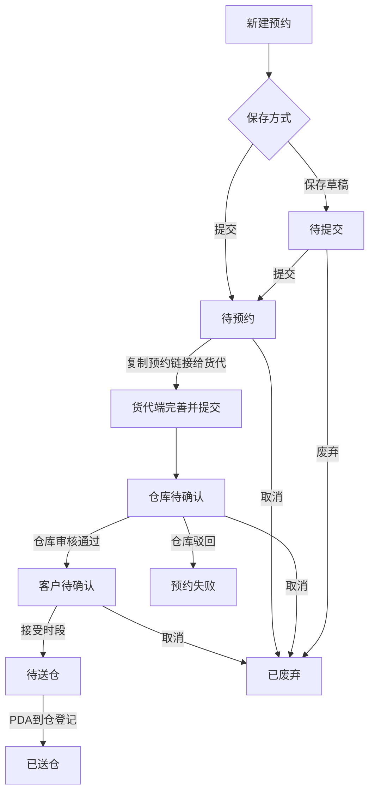

# 客户前台预约送仓需求文档

## 1. 文档基础信息

### 1.1 版本记录

| 时间 | 版本 | 修改人 | 变更内容 |
| --- | --- | --- | --- |
| 2026-06-01 | v1.0 | — | 初版，基于当前原型实现整理 |
| 2026-06-01 | v1.1 | — | 方案 A：详情页按状态展示仓库审核备注/驳回原因 |

### 1.2 文档范围

| 项目 | 内容 |
| --- | --- |
| 模块名称 | 客户前台 · 预约送仓 |
| 适用端 | 运德仓储系统 · 客户前台 Web |
| 页面范围 | 预约列表、新建/编辑预约、预约详情 |
| 不在范围 | 货代端完善提交、海外仓审核、PDA 到仓、中台管理（仅描述衔接关系） |

### 1.3 术语表

| 术语 | 说明 |
| --- | --- |
| 预约单 | 客户发起的一次送仓计划，含预约信息与关联入库单 |
| 预约单号 | 提交后系统生成的正式单号（格式如 YY20260528102） |
| 送仓码 | 6 位业务码，用于生成货代端预约链接 |
| 预约链接 | 货代通过送仓码进入货代端，补充期望日期等信息并提交仓库审核 |
| 主邮箱 | 客户创建时填写的唯一联系邮箱，货代端只读 |
| 送仓总箱数 | 预约阶段申报的预计送仓箱数（原「总箱数」） |
| 送仓总托数 | 预约阶段申报的预计托数；未打托按 0 展示 |
| 送仓箱数 | 货物明细行上该入库单的预计送仓箱数 |
| 收货总箱数 | 仓库 PDA 到仓登记的实际箱数，列表只读展示 |
| 送仓类型 | 整柜 / 散货 |
| 集装箱号 | 整柜场景的集装箱编号（原「柜号」） |
| 柜型 | 整柜集装箱规格，如 40HQ（原「柜序」） |
| W.BOL | 预约确认后的入仓凭证，待送仓/已送仓后可下载 |

---

## 2. 需求背景

### 2.1 背景描述

客户需要将计划在途货物预约送至海外仓，传统流程依赖销售/客服线下收集信息再转仓库，信息易错、状态不可查。客户前台预约送仓模块让客户**自助创建预约、关联入库单、生成货代协作链接**，并全程跟踪预约状态直至送仓完成。

### 2.2 需求列表

| 编号 | 用户诉求 | 提出人/部门 |
| --- | --- | --- |
| R-01 | 在线创建送仓预约并关联在途入库单 | 客户/销售 |
| R-02 | 区分整柜/散货，整柜需填集装箱信息 | 船务/仓库 |
| R-03 | 送仓箱数与明细一致，防止申报偏差 | 仓库/财务 |
| R-04 | 指定货代联系邮箱，后续通知可达 | 客服 |
| R-05 | 列表查看预约进度及收货结果 | 客户 |
| R-06 | 草稿保存、修改、取消等全生命周期操作 | 客户 |

### 2.3 核心目标

**作为客户，我希望在系统中自助完成送仓预约并跟踪状态，以便减少线下沟通、提前锁定仓库收货时段。**

核心指标：预约单一次提交成功率、送仓总箱数与明细一致率、从「待预约」到「待送仓」的平均处理时长。

---

## 3. 功能总览

### 3.1 业务流程

**客户前台职责边界：**

- 负责：创建/编辑预约（待提交、待预约）、查看详情、草稿/提交、取消、在「客户待确认」时接受仓库时段。
- 不负责：货代端信息完善（期望送仓日期、备注等）、仓库审核、PDA 收货（仅只读展示结果）。

### 3.2 功能清单

| 编号 | 功能模块 | 功能简述 |
| --- | --- | --- |
| F-01 | 预约列表 | 筛选、状态 Tab、分页、行内操作 |
| F-02 | 新建预约 | 填写预约信息、添加入库单明细、保存草稿/提交 |
| F-03 | 编辑预约 | 待提交/待预约状态下修改并保存 |
| F-04 | 预约详情 | 只读展示预约信息、货物明细、操作日志 |
| F-05 | 状态操作 | 按状态展示提交/修改/取消/接受时段等按钮 |
| F-06 | 预约链接 | 提交后展示货代端链接，供转发货代 |

---

## 4. 功能详细设计

### 4.1 预约列表（F-01）

#### A. 用户故事

作为客户，我想要按条件筛选并查看我的预约单列表，以便快速找到目标单据并执行操作。

#### B. 用户旅程

入口（单据管理 → 预约送仓）→ 默认展示全部 Tab → 可选筛选条件查询 → 点击 Tab 切换状态 → 点击行内操作或「新建预约」。

#### C. 交互与界面

| 区域 | 说明 |
| --- | --- |
| 顶部筛选栏 | 预约单号、预约仓库、送仓类型、状态；查询/重置按钮 |
| 状态 Tab | 全部、待提交、待预约、仓库待确认、客户待确认、待送仓、已送仓、已超时、预约失败、已废弃 |
| 列表区 | 右上角「新建预约」主按钮；表格 + 分页（每页 10 条） |
| 权限 | 仅展示当前登录客户编号（CN0000438）下的预约单；不含船务代建单（bookChannel=shipping） |

**列表字段（不展示总体积、总重量）：**

| 列名 | 说明 |
| --- | --- |
| 预约仓库 | 目的仓 |
| 预约单号 | 无则显示「-」 |
| 送仓码 | 无则显示「-」 |
| 状态 | 带颜色标签 |
| 送仓类型 | 整柜 / 散货 |
| 送仓总箱数 | 申报箱数 |
| 收货总箱数 | 到仓后由 PDA 写入；未到仓为「-」 |
| 是否打托 | 是 / 否 |
| 送仓总托数 | 未打托为 0 |
| 期望送仓日期 | 货代端填写后回显 |
| 仓库确认时段 | 审核通过后回显 |
| 实际送仓时间 | 到仓后回显 |
| 提交时间 | 首次提交时间 |
| 操作 | 按状态动态展示 |

#### D. 字段与逻辑

**1. 筛选栏**

| 筛选元素 | 组件类型 | 默认值 | 逻辑/备注 |
| --- | --- | --- | --- |
| 预约单号 | 文本输入 | 空 | 模糊匹配（包含即命中） |
| 预约仓库 | 下拉框 | 全部 | 选项来自系统仓库列表 |
| 送仓类型 | 下拉框 | 全部 | 整柜 / 散货 |
| 状态 | 下拉框 | 全部 | 选项来自当前客户已有状态去重 |
| Tab | 标签页 | 全部 | Tab 与「状态」筛选叠加：先 Tab 再筛选项 |

**2. 行内操作（按状态）**

| 状态 | 可用操作 |
| --- | --- |
| 待提交 | 详情、修改预约、提交、废弃 |
| 待预约 | 详情、修改预约、取消预约、废弃 |
| 仓库待确认 | 详情、取消预约 |
| 客户待确认 | 详情、预定时间、取消预约 |
| 待送仓 | 详情、取消预约 |
| 已送仓 / 已超时 / 预约失败 / 已废弃 | 详情 |

**3. 状态颜色**

| 状态 | 视觉 |
| --- | --- |
| 仓库待确认 | 红色加粗 |
| 客户待确认 | 橙色加粗 |
| 已送仓 | 绿色加粗 |
| 已超时 | 灰色 |
| 预约失败 | 浅灰 |

**4. 异常处理**

| 场景 | 处理 |
| --- | --- |
| 无数据 | 表格展示「暂无数据」 |
| 提交/取消/废弃 | 二次确认弹窗 |
| 提交成功 | Toast/Alert 提示并刷新列表 |

---

### 4.2 新建 / 编辑预约（F-02 / F-03）

#### A. 用户故事

作为客户，我想要填写送仓信息并关联在途入库单，以便生成预约单并交给货代完成后续提交。

#### B. 用户旅程

新建：列表点「新建预约」→ 填写预约信息 → 搜索添加入库单 → 保存草稿或提交 → 返回列表。

编辑：列表/详情点「修改预约」→ 仅「待提交」「待预约」可进入 → 修改后保存。

#### C. 交互与界面

| 区域 | 说明 |
| --- | --- |
| 预约信息 | 两列表单：目的仓、送仓类型、整柜字段、箱托信息、货代公司、主邮箱 |
| 货物明细 | 入库单搜索添加区 + 明细表格 |
| 底部按钮 | 返回、保存草稿/保存修改、提交（编辑且状态=待预约时隐藏提交） |

**联动规则：**

| 条件 | 界面行为 |
| --- | --- |
| 送仓类型 = 整柜 | 显示「集装箱号」「柜型」，均为必填 |
| 送仓类型 = 散货 | 隐藏集装箱号、柜型 |
| 是否打托 = 是 | 显示「送仓总托数」，必填正整数 |
| 是否打托 = 否 | 隐藏送仓总托数，保存时托数置空 |
| 变更目的仓且已有明细 | 弹窗提示并清空已选入库单 |

#### D. 字段与逻辑

**1. 预约信息**

| 字段 | 组件 | 必填 | 逻辑/备注 |
| --- | --- | --- | --- |
| 目的仓 | 下拉 | 是 | 选项来自系统仓库列表 |
| 送仓类型 | 单选 | 是 | 整柜 / 散货，默认散货 |
| 集装箱号 | 文本 | 整柜必填 | 散货不展示 |
| 柜型 | 文本 | 整柜必填 | 占位提示「如 40HQ」 |
| 送仓总箱数 | 数字 | 是 | 正整数，≥1 |
| 是否打托 | 单选 | 是 | 是 / 否，默认否 |
| 送仓总托数 | 数字 | 打托时必填 | 正整数，≥1 |
| 货代公司 | 文本 | 否 | 选填 |
| 联系邮箱（主邮箱） | 邮箱 | 是 | 仅允许 1 个；备注说明将作为货代端主邮箱且不可修改 |

**2. 货物明细**

| 字段 | 说明 |
| --- | --- |
| 添加入库单 | 输入入库单号，Enter 或点「添加」 |
| 入库单号 | 只读 |
| 订单状态 | 只读 |
| 收货仓 | 只读，须与目的仓一致 |
| 发货方式 | 只读 |
| 订单箱数 | 只读 |
| 送仓箱数 | 可编辑，默认=订单箱数；正整数，1 ≤ 送仓箱数 ≤ 订单箱数 |
| 提交时间 | 入库单创建时间，只读 |
| 操作 | 取消（移除该行） |

**添加入库单校验规则：**

| 规则 | 错误提示 |
| --- | --- |
| 须先选目的仓 | 请先选择目的仓 |
| 入库单须存在 | 未找到符合条件的入库单 |
| 状态 = 运输在途 | 仅可添加状态为「运输在途」的入库单 |
| 发货方式 = 客户自发头程 | 仅可添加发货方式为「客户自发头程」的入库单 |
| 收货仓 = 目的仓 | 入库单收货仓须与目的仓一致 |
| 不可重复添加 | 该入库单已添加 |
| 提交时至少 1 条 | 请至少添加一条入库单 |

**3. 送仓总箱数一致性校验（提交时）**

| 规则 | 说明 |
| --- | --- |
| 适用 | 客户渠道（bookChannel ≠ shipping） |
| 公式 | 送仓总箱数 = Σ 各明细行送仓箱数 |
| 不一致 | 弹出自定义模态框，展示总箱数与明细合计对比，按钮「我知道了」 |
| 明细行非法 | Alert 阻断，说明具体入库单及原因 |

**4. 保存逻辑**

| 操作 | 目标状态 | 副作用 |
| --- | --- | --- |
| 保存草稿 | 待提交 | 新建时 prepend 到列表；不要求明细 |
| 提交 | 待预约 | 生成预约单号、送仓码、提交时间；触发后续可展示预约链接 |
| 编辑保存（待提交） | 待提交 | 更新原记录 |
| 编辑保存（待预约） | 待预约 | 更新原记录，不重新生成单号/送仓码 |

**5. 编辑限制**

| 场景 | 处理 |
| --- | --- |
| 非待提交/待预约 | Alert「仅待提交、待预约状态可修改」，跳转详情 |
| 预约单不存在 | Alert 后返回列表 |

---

### 4.3 预约详情（F-04 / F-05 / F-06）

#### A. 用户故事

作为客户，我想要查看预约单完整信息与处理进度，并在需要时接受仓库时段或取消预约。

#### B. 用户旅程

列表点「详情」→ 查看预约信息 → 切换「货物明细 / 日志明细」Tab → 执行底部状态操作 → 返回列表。

#### C. 交互与界面

| 区域 | 说明 |
| --- | --- |
| 预约信息 | 只读字段网格；**送仓码标红展示** |
| Tab | 货物明细（默认）、日志明细 |
| 操作按钮区 | 按状态展示（同列表行内操作，不含「详情」） |
| 底部 | 「返回列表」 |

**详情展示字段：**

| 字段 | 展示规则 |
| --- | --- |
| 预约仓库、预约单号、送仓码 | 送仓码红色高亮 |
| 状态、送仓类型 | 始终展示 |
| 送仓总箱数、是否打托、送仓总托数 | 始终展示；未打托托数为 0 |
| 集装箱号、柜型 | **仅整柜展示** |
| 货代公司、联系邮箱 | 展示 emails 列表 |
| 期望送仓日期 | 货代端填写 |
| 货代备注 | remark，货代端填写 |
| 仓库确认时段、仓库审核备注 | **仅**客户待确认 / 待送仓 / 已送仓展示 |
| 驳回原因 | **仅**预约失败展示，红色高亮 |
| 实际送仓时间 | 到仓后回显 |
| 提交时间 | — |
| 预约链接 | 可点击新窗口打开货代端入口 |

**不展示：** 总体积、总重量。

#### D. 字段与逻辑

**1. 货物明细 Tab**

| 列 | 说明 |
| --- | --- |
| 入库单号 ~ 送仓箱数 | 与创建页一致，只读 |
| 空数据 | 「无关联入库单」 |

**2. 日志明细 Tab**

| 元素 | 说明 |
| --- | --- |
| 时间 | 操作时间 |
| 操作人 | 系统/角色 |
| 内容 | 状态变更、审核、确认等记录 |
| 空数据 | 「暂无日志」 |

**3. 状态操作**

| 操作 | 行为 | 目标状态 |
| --- | --- | --- |
| 修改预约 | 跳转编辑页 | — |
| 提交 | 确认后提交 | 待预约 |
| 废弃 / 取消预约 | 确认后执行 | 已废弃 |
| 预定时间 | 确认弹窗展示仓库确认时段 | 待送仓 |

**4. 预定时间（客户待确认）**

| 步骤 | 说明 |
| --- | --- |
| 点击「预定时间」 | 弹窗：是否接受仓库确认时段：{warehouseConfirmedInboundTime} |
| 确认 | 状态 → 待送仓，写操作日志 |
| 无确认时段 | 不可操作，confirm 返回 null |

---

## 5. 与上下游模块衔接

| 模块 | 衔接说明 |
| --- | --- |
| 货代端 | 客户提交（待预约）后，详情展示预约链接（/fg/index.html?code={送仓码}）；货代补充期望日期、备注、备用邮箱并提交 → 仓库待确认 |
| 海外仓 | 仓库待确认 → 审核通过（客户待确认）或驳回（预约失败） |
| 邮件通知 | 状态变更触发邮件，详见《预约送仓邮件通知需求文档》；主邮箱在客户创建时录入 |
| PDA | 待送仓 → PDA 扫码到仓登记 → 已送仓；收货总箱数回写列表 |
| W.BOL | 待送仓/已送仓状态可通过送仓码打开 W.BOL 模板（货代端/其他端下载，客户详情仅展示链接类信息） |

---

## 6. 规则与约束

### 6.1 数据范围

| 规则 | 说明 |
| --- | --- |
| 客户数据隔离 | 仅展示 customerCode = 当前客户的预约单 |
| 排除船务代建 | bookChannel = shipping 的单据不在客户列表出现 |
| 隐藏字段 | 列表、详情、W.BOL 均不展示总体积、总重量 |

### 6.2 业务规则汇总

| 编号 | 规则 |
| --- | --- |
| BR-01 | 提交后生成唯一预约单号、送仓码 |
| BR-02 | 主邮箱唯一，写入 primaryEmail 与 emails[0] |
| BR-03 | 整柜必填集装箱号、柜型；散货隐藏该二字段 |
| BR-04 | 未打托时送仓总托数为空，展示为 0 |
| BR-05 | 提交时送仓总箱数必须等于明细送仓箱数之和 |
| BR-06 | 仅「待提交」「待预约」可编辑 |
| BR-07 | 预约失败仅由仓库驳回产生；客户取消进入「已废弃」 |
| BR-08 | 客户接受仓库时段后进入「待送仓」，同步触发邮件通知 |

### 6.3 异常与空状态

| 场景 | 处理 |
| --- | --- |
| 预约单不存在 | 详情页展示「预约单不存在」 |
| 邮箱格式错误 | Alert：邮箱格式不正确 |
| 送仓箱数超限 | Alert：送仓箱数不能超过订单箱数 |
| 网络/持久化失败 | 提示已缓存，需通过 dev 服务写入源文件 |

### 6.4 非功能要求（原型阶段）

| 分类 | 要求 |
| --- | --- |
| 数据持久化 | 演示环境写入 sessionStorage + mock_data/deliveryAppointment.js |
| 多 Tab 同步 | 列表/详情监听 storage 变更自动刷新 |
| 分页 | 固定每页 10 条 |

---

## 7. 附录：状态—操作矩阵

| 状态 | 客户可操作 | 说明 |
| --- | --- | --- |
| 待提交 | 详情、修改、提交、废弃 | 草稿态 |
| 待预约 | 详情、修改、取消、废弃 | 已提交，等货代完善 |
| 仓库待确认 | 详情、取消 | 等仓库审核 |
| 客户待确认 | 详情、预定时间、取消 | 可接受仓库时段 |
| 待送仓 | 详情、取消 | 等货物到仓 |
| 已送仓 | 详情 | 流程结束 |
| 已超时 | 详情、重新预约 | 重新预约清空时段/收货数据（原型） |
| 预约失败 | 详情 | 查看驳回原因，需重新发起 |
| 已废弃 | 详情 | 终态 |

---

## 8. 待确认事项

| 编号 | 问题 | 建议 |
| --- | --- | --- |
| OQ-01 | 客户「取消预约」进入「已废弃」还是「待预约」？ | 当前原型为「已废弃」；货代端客户待取消为「待预约」，需业务统一 |
| OQ-02 | 待送仓状态客户是否仍可取消？ | 当前允许，需确认是否应限制 |
| OQ-03 | 创建页是否需「期望送仓日期」？ | 当前由货代端填写，客户创建页无此字段 |
| OQ-04 | 客户详情「联系邮箱」是否改展示主邮箱标签？ | 当前展示 emails 拼接 |
| OQ-05 | 已超时「重新预约」是否应对客户前台开放？ | 当前仅在操作矩阵中定义，详情页按钮依赖 getOperationsByStatus |
