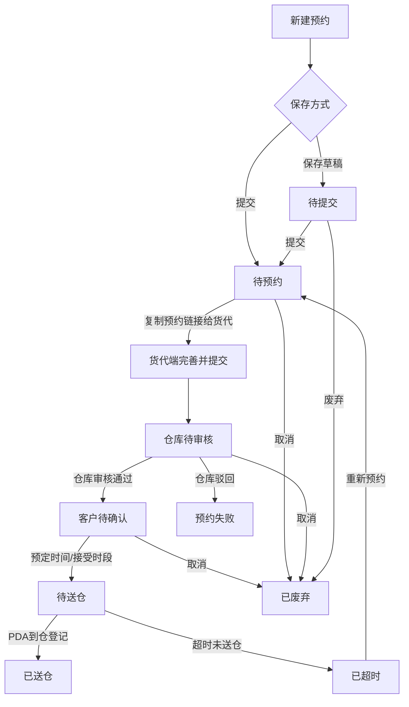

# 客户前台预约送仓需求文档

## 1. 文档基础信息

### 1.1 版本记录

| 时间 | 版本 | 修改人 | 变更内容 |
| --- | --- | --- | --- |
| 2026-06-01 | v1.0 | — | 初版，基于当前原型实现整理 |
| 2026-06-01 | v1.1 | — | 方案 A：详情页按状态展示仓库审核备注/驳回原因 |
| 2026-06-05 | v1.2 | — | 状态「仓库待确认」更名为「仓库待审核」；W.BOL 说明见独立文档 |
| 2026-06-05 | v1.3 | — | 补齐列表筛选/列设置、创建页字段、详情展示、操作记录规则等与原型对齐 |

### 1.2 文档范围

| 项目 | 内容 |
| --- | --- |
| 模块名称 | 客户前台 · 预约送仓 |
| 适用端 | 运德仓储系统 · 客户前台 Web（`/customer/`） |
| 页面范围 | 预约列表、新建/编辑预约、预约详情 |
| 不在范围 | 货代端完善提交、海外仓审核、PDA 到仓、中台管理（仅描述衔接关系） |

### 1.3 术语表

| 术语 | 说明 |
| --- | --- |
| 预约单 | 客户发起的一次送仓计划，含预约信息与关联入库单 |
| 预约单号 | 提交后系统生成的正式单号（格式如 YY20260528102） |
| 送仓码 | 6 位业务码（如 SC9QCZ），提交后生成；待提交不展示 |
| 预约链接 | `/fg/index.html?code={送仓码}`，供货代补充期望日期并提交审核 |
| 主邮箱 | 通知邮件主收件人；货代端只读；原型由 mock 数据带入，创建页暂未录入 |
| 备用邮箱 | 货代端追加，与客户主邮箱一并接收通知 |
| 送仓总箱数 | 预约阶段申报的预计送仓箱数（字段 `estimatedCartons`） |
| 送仓总托数 | 预约阶段申报的预计托数；未打托为空，展示为 0 |
| 送仓箱数 | 货物明细行上该入库单的预计送仓箱数 |
| 总体积 / 总重量 | 创建时选填；列表默认隐藏列，详情页展示 |
| 送仓类型 | 整柜 / 散货 |
| 集装箱号 | 整柜场景的集装箱编号 |
| 柜型 | 整柜规格，下拉选择：20-GP / 40-gp / 40hq / 45-hq |
| bookChannel | 创建渠道：`customer`（客户前台）/ `shipping`（船务代建，不在客户列表展示） |
| W.BOL | 入仓凭证；待送仓/已送仓后可下载（货代端），详见 [`W.BOL说明与FAQ.md`](./W.BOL说明与FAQ.md) |
| 操作记录 | 客户前台日志 Tab；展示经过滤/改写后的业务短句，详见《预约送仓操作日志 PRD》 |

---

## 2. 需求背景

### 2.1 背景描述

客户需要将计划在途货物预约送至海外仓，传统流程依赖销售/客服线下收集信息再转仓库，信息易错、状态不可查。客户前台预约送仓模块让客户**自助创建预约、关联入库单、生成货代协作链接**，并全程跟踪预约状态直至送仓完成。

### 2.2 需求列表

| 编号 | 用户诉求 | 提出人/部门 |
| --- | --- | --- |
| R-01 | 在线创建送仓预约并关联在途入库单 | 客户/销售 |
| R-02 | 区分整柜/散货，整柜需填集装箱信息 | 船务/仓库 |
| R-03 | 送仓箱数与明细一致，防止申报偏差 | 仓库/财务 |
| R-04 | 指定货代联系邮箱，后续通知可达 | 客服 |
| R-05 | 列表查看预约进度及收货结果 | 客户 |
| R-06 | 草稿保存、修改、取消等全生命周期操作 | 客户 |
| R-07 | 列表多条件筛选、自定义列显示 | 客户/运营 |
| R-08 | 在客户待确认时接受仓库核定时段 | 客户 |

### 2.3 核心目标

**作为客户，我希望在系统中自助完成送仓预约并跟踪状态，以便减少线下沟通、提前锁定仓库收货时段。**

核心指标：预约单一次提交成功率、送仓总箱数与明细一致率、从「待预约」到「待送仓」的平均处理时长。

---

## 3. 功能总览

### 3.1 业务流程

**客户前台职责边界：**

- **负责**：创建/编辑预约（待提交、待预约）、查看详情、草稿/提交、取消/废弃、在「客户待确认」时接受仓库时段（「预定时间」）、已超时重新预约。
- **不负责**：货代端期望日期/备注/备用邮箱、仓库审核、PDA 收货（只读展示结果）、W.BOL 下载（货代端/海外仓）。

### 3.2 功能清单

| 编号 | 功能模块 | 功能简述 |
| --- | --- | --- |
| F-01 | 预约列表 | 多条件筛选、状态 Tab、列设置、分页、行内操作 |
| F-02 | 新建预约 | 填写预约信息、添加入库单明细、保存草稿/提交 |
| F-03 | 编辑预约 | 待提交/待预约状态下修改并保存 |
| F-04 | 预约详情 | 只读展示预约信息、货物明细、操作记录 |
| F-05 | 状态操作 | 按状态展示提交/修改/取消/接受时段/重新预约等 |
| F-06 | 预约链接 | 提交后列表/详情展示货代端链接 |
| F-07 | 列设置 | 自定义列表显示列（本地会话，默认见附录） |
| F-08 | 货物明细弹窗 | 列表行点击「查看明细」弹窗展示关联入库单 |

### 3.3 页面路径

| 页面 | 路径 | 脚本 |
| --- | --- | --- |
| 预约列表 | `/customer/deliveryAppointment.html` | `deliveryAppointmentList.js` |
| 新建预约 | `/customer/deliveryAppointmentCreate.html` | `deliveryAppointmentCreate.js` |
| 编辑预约 | `/customer/deliveryAppointmentCreate.html?id={id}` | 同上 |
| 预约详情 | `/customer/deliveryAppointmentDetail.html?id={id}` | `deliveryAppointmentDetail.js` |
| 公共逻辑 | — | `deliveryAppointment-common.js` |

---

## 4. 功能详细设计

### 4.1 预约列表（F-01 / F-07 / F-08）

#### A. 用户故事

作为客户，我想要按条件筛选并查看我的预约单列表，以便快速找到目标单据并执行操作。

#### B. 用户旅程

入口（单据管理 → 预约送仓）→ 默认「全部」Tab → 可选筛选条件 → 点击「查询」或 Enter → 切换 Tab / 列设置 → 行内操作或「新建预约」。

#### C. 交互与界面

| 区域 | 说明 |
| --- | --- |
| 面包屑 | 单据管理 >> 预约送仓 |
| 筛选面板 | 三行筛选项 + 查询/重置；底部 `filterResultHint` 显示命中条数 |
| 状态 Tab | 与「状态」下拉联动；点击 Tab 同步下拉值 |
| 列表区 | 右上角「列设置」+「新建预约」；表格 + 分页（每页 **10** 条） |
| 权限 | 仅 `customerCode = 当前客户`；排除 `bookChannel = shipping` |

#### D. 字段与逻辑

**1. 筛选栏（完整）**

| 筛选元素 | 组件 | 默认值 | 逻辑/备注 |
| --- | --- | --- | --- |
| 预约单号 | 文本 | 空 | 模糊匹配 |
| 送仓码 | 文本 | 空 | 模糊匹配 |
| 预约仓库 | 下拉 | 全部 | 选项来自 `MOCK_IN_ORDER_WAREHOUSES` |
| 送仓类型 | 下拉 | 全部 | 整柜 / 散货 |
| 状态 | 下拉 | 全部 | 与 Tab 联动；选项来自 `MOCK_DELIVERY_APPOINTMENT_STATUS_TABS` |
| 入库单号 | 文本 | 空 | 匹配明细行 orderNo；**支持逗号分隔**多号 |
| 是否打托 | 下拉 | 全部 | 是 / 否 |
| 送仓总箱数 | 文本 | 空 | 数字模糊匹配 |
| 集装箱号 | 文本 | 空 | 整柜模糊匹配 |
| 总体积（m³） | 文本 | 空 | 数字模糊匹配 |
| 总重量（kg） | 文本 | 空 | 数字模糊匹配 |
| 联系邮箱 | 文本 | 空 | 匹配 primaryEmail / emails |
| 提交时间 | 日期范围 | 空 | 起止日期，含边界 |
| 期望送仓日期 | 日期范围 | 空 | 匹配货代填写的期望日期（多日期取并集） |
| 实际到仓时间 | 日期范围 | 空 | PDA 登记后回写 |
| Tab | 标签页 | 全部 | **先 Tab 过滤状态，再叠加其余筛选项** |

**2. 列表列与列设置**

| 列 key | 列名 | 默认显示 | 说明 |
| --- | --- | --- | --- |
| warehouse | 预约仓库 | ✓ | 目的仓 |
| appointmentNo | 预约单号 | ✓ | 待提交为「-」 |
| status | 状态 | ✓ | 带颜色标签 |
| deliveryCode | 送仓码 | ✓ | 待提交为「-」 |
| bookingLink | 预约链接 | ✓ | 待提交为「-」；否则「下载链接」新开页 |
| inboundDetail | 货物明细 | ✓ | 「查看明细(N)」打开弹窗 |
| estimatedCartons | 送仓总箱数 | ✓ | — |
| containerNo | 集装箱号 | ✓ | 散货多为「-」 |
| expectedInboundTime | 期望送仓时间 | ✓ | 货代填写后回显；附仓库时区标注 |
| actualDeliveryTime | 实际到仓时间 | ✓ | 美仓时间格式化 |
| deliveryType | 送仓类型 | ✗ | 可列设置开启 |
| totalPallets | 送仓总托数 | ✗ | 可列设置开启 |
| totalVolume | 总体积（m³） | ✗ | 可列设置开启 |
| totalWeight | 总重量（kg） | ✗ | 可列设置开启 |
| isPalletized | 是否打托 | ✗ | 可列设置开启 |
| submitTime | 提交时间 | ✗ | 可列设置开启 |
| ops | 操作 | ✓ | 固定列，不可隐藏 |

**3. 货物明细弹窗（F-08）**

| 元素 | 说明 |
| --- | --- |
| 触发 | 列表「货物明细」列点击 |
| 副标题 | 预约单号 + 送仓码 |
| 表格列 | 入库单号、订单状态、收货仓、发货方式、订单箱数、送仓箱数、提交时间 |
| 空数据 | 「无关联入库单」 |

**4. 行内操作（按状态）**

| 状态 | 可用操作 |
| --- | --- |
| 待提交 | 详情、修改预约、提交、废弃 |
| 待预约 | 详情、修改预约、取消预约、废弃 |
| 仓库待审核 | 详情、取消预约 |
| 客户待确认 | 详情、预定时间、取消预约 |
| 待送仓 | 详情、取消预约 |
| 已送仓 / 已超时 / 预约失败 / 已废弃 | 详情 |
| 已超时 | 额外：**重新预约**（详情/列表均可能展示，见 OQ-05） |

**5. 状态颜色**

| 状态 | CSS 类 | 视觉 |
| --- | --- | --- |
| 待提交 / 待预约 | pending | 默认待处理色 |
| 仓库待审核 | warehouse-pending | **红色加粗** |
| 客户待确认 | customer-pending | **橙色加粗** |
| 待送仓 | processing | 进行中色 |
| 已送仓 | delivered | **绿色加粗** |
| 已超时 | timeout | 灰色 |
| 预约失败 | failed | 浅灰 |
| 已废弃 | discarded | 浅灰 |

**6. 异常处理**

| 场景 | 处理 |
| --- | --- |
| 无数据 | 「暂无数据」 |
| 提交/取消/废弃 | `window.confirm` 二次确认 |
| 提交成功 | Alert 提示（含持久化结果）并刷新列表 |
| 多 Tab 同步 | 监听 `storage` 事件自动刷新 |

---

### 4.2 新建 / 编辑预约（F-02 / F-03）

#### A. 用户故事

作为客户，我想要填写送仓信息并关联在途入库单，以便生成预约单并交给货代完成后续提交。

#### B. 用户旅程

**新建：** 列表「新建预约」→ 填预约信息 → 搜索/批量添加入库单 → 保存草稿或提交 → 返回列表。

**编辑：** 列表/详情「修改预约」→ 仅待提交/待预约 → 修改后「保存修改」（待预约时隐藏「提交」按钮）。

#### C. 交互与界面

| 区域 | 说明 |
| --- | --- |
| 预约信息 | 目的仓、送仓类型、整柜字段、箱数/体积/重量、打托 |
| 货物明细 | 搜索栏 + 明细表；提示「仅可添加：运输在途 + 客户自发头程 + 收货仓=目的仓」 |
| 底部按钮 | 返回、保存草稿/保存修改、提交（编辑且 status=待预约 时隐藏提交） |

**联动规则：**

| 条件 | 界面行为 |
| --- | --- |
| 送仓类型 = 整柜 | 显示集装箱号、柜型（下拉组合框） |
| 送仓类型 = 散货 | 隐藏整柜字段 |
| 是否打托 = 是 | 显示送仓总托数，必填正整数 |
| 是否打托 = 否 | 隐藏托数输入，保存时 `totalPallets` 置空 |
| 变更目的仓且已有明细 | Alert 提示并**清空**已选入库单 |

#### D. 字段与逻辑

**1. 预约信息**

| 字段 | 组件 | 必填 | 逻辑/备注 |
| --- | --- | --- | --- |
| 目的仓 | 下拉 | 是 | `MOCK_IN_ORDER_WAREHOUSES` |
| 送仓类型 | 单选 | 是 | 整柜 / 散货，默认散货 |
| 集装箱号 | 文本 | 整柜必填 | — |
| 柜型 | 组合下拉 | 整柜必填 | 选项：20-GP、40-gp、40hq、45-hq；须从列表选择 |
| 送仓总箱数 | 数字 | 是 | 正整数 ≥1 |
| 总体积（m³） | 数字 | 否 | 填写时须为正数，最多 4 位小数 |
| 总重量（kg） | 数字 | 否 | 填写时须为正数，最多 4 位小数 |
| 是否打托 | 单选 | 是 | 是 / 否，默认否 |
| 送仓总托数 | 数字 | 打托时必填 | 正整数 ≥1 |
| 联系邮箱（主邮箱） | — | **原型未录入** | 目标：创建时必填 1 个；写入 primaryEmail + emails[0]；见 OQ-03 |

**2. 货物明细**

| 字段 | 说明 |
| --- | --- |
| 搜索框 | 入库单号模糊搜索；**多个单号用中英文逗号分隔**；Enter 或「添加」 |
| 入库单号 | 只读 |
| 订单状态 | 只读 |
| 收货仓 | 只读，须与目的仓一致 |
| 发货方式 | 只读 |
| 订单箱数 | 只读 |
| 送仓箱数 | 可编辑；默认=订单箱数；1 ≤ 送仓箱数 ≤ 订单箱数 |
| 提交时间 | 入库单创建时间 |
| 操作 | 取消（移除行） |

**添加入库单校验：**

| 规则 | 错误提示 |
| --- | --- |
| 须先选目的仓 | 请先选择目的仓 |
| 须存在且符合条件 | 未找到符合条件的入库单 |
| 状态 = 运输在途 | 仅可添加状态为「运输在途」的入库单 |
| 发货方式 = 客户自发头程 | 仅可添加「客户自发头程」 |
| 收货仓 = 目的仓 | 入库单收货仓须与目的仓一致 |
| 不可重复 | 该入库单已添加 |
| 批量添加 | 部分失败时 Alert 汇总成功数与失败原因 |
| 提交时至少 1 条 | 请至少添加一条入库单 |

**3. 送仓总箱数一致性（提交时）**

| 规则 | 说明 |
| --- | --- |
| 适用 | `bookChannel = customer` |
| 公式 | 送仓总箱数 = Σ 明细送仓箱数 |
| 不一致 | 模态框展示对比摘要，按钮「我知道了」（**不阻断提交**，仅提醒） |
| 明细非法 | Alert 阻断 |

**4. 保存逻辑**

| 操作 | 目标状态 | 副作用 |
| --- | --- | --- |
| 保存草稿 | 待提交 | 新建 prepend；不要求明细；无单号/送仓码 |
| 提交 | 待预约 | 生成 appointmentNo、deliveryCode、submitTime、bookingLink |
| 编辑保存 | 保持原状态 | 不重新生成单号/送仓码 |

**5. 编辑限制**

| 场景 | 处理 |
| --- | --- |
| 非待提交/待预约 | Alert 后跳转详情 |
| 预约单不存在 | Alert 后回列表 |

---

### 4.3 预约详情（F-04 / F-05 / F-06）

#### A. 用户故事

作为客户，我想要查看预约单完整信息与处理进度，并在需要时接受仓库时段或取消预约。

#### B. 用户旅程

列表「详情」→ 查看预约信息 → 切换「货物明细 / 操作记录」→ 底部状态操作 → 返回列表。

#### C. 交互与界面

| 区域 | 说明 |
| --- | --- |
| 预约信息 | 只读网格；**送仓码红色高亮** |
| Tab | 货物明细（默认）、**操作记录** |
| 操作按钮 | 同列表（不含「详情」） |
| 空态 | id 无效时「预约单不存在」 |

**详情展示字段（与原型一致）：**

| 字段 | 展示规则 |
| --- | --- |
| 预约仓库、预约单号、送仓码 | 送仓码红色 |
| 状态、送仓类型 | 始终 |
| 送仓总箱数、总体积、总重量 | 始终 |
| 是否打托、送仓总托数 | 始终；未打托托数展示 0 |
| 集装箱号、柜型 | **仅整柜** |
| 联系邮箱 | emails 去重顿号拼接 |
| 联系电话 | 有值展示，否则「-」 |
| 期望送仓日期 | 货代填写；字段名附 `(US/Pacific)` 等时区 |
| 货代备注 | remark |
| 驳回原因 | **仅预约失败**；红色高亮 |
| 实际到仓时间 | 到仓后；美仓时间格式 |
| 提交时间 | — |
| 预约链接 | 待提交为「-」；否则可点击新窗口打开 `/fg/index.html?code=` |

**目标设计（待原型补齐，见 OQ-06）：**

| 字段 | 展示条件 |
| --- | --- |
| 仓库确认时段 | 客户待确认 / 待送仓 / 已送仓 |
| 仓库审核备注 | 同上；蓝色样式 |
| 仓库确认地址 | 同上 |

#### D. 字段与逻辑

**1. 货物明细 Tab**

与创建页列一致，全部只读；空态「无关联入库单」。

**2. 操作记录 Tab**

| 元素 | 说明 |
| --- | --- |
| 数据来源 | 同一条 `operationLogs`，按客户门户规则过滤 |
| 排序 | **时间升序** |
| 操作人 | 简化为 **您 / 仓库 / 平台 / 系统** |
| 文案 | 使用 `customerSummary` 业务短句，非内部原文 |
| 隐藏 | 还空通知、仓储中台强制签收、仅仓库内部可见日志等 |
| 空态 | 「暂无操作记录」 |
| 规范 | 详见 [`预约送仓操作日志PRD.md`](./预约送仓操作日志PRD.md) |

**3. 状态操作**

| 操作 | 行为 | 目标状态 |
| --- | --- | --- |
| 修改预约 | 跳转编辑页 | — |
| 提交 | 确认后提交 | 待预约 |
| 废弃 / 取消预约 | 确认后执行 | **已废弃** |
| 预定时间 | 见下表 | 待送仓 |
| 重新预约 | 清空协商/收货字段 | 待预约 |

**4. 预定时间（客户待确认）**

| 步骤 | 说明 |
| --- | --- |
| 点击「预定时间」 | 确认框：「确认接受预约时段？」（客户门户简化文案） |
| 确认 | 状态 → 待送仓；`warehouse` 同步为 `confirmedWarehouse`；写 `customer_accept_slot` 日志 |
| 无确认时段 | `warehouseConfirmedInboundTime` 为空则不可操作 |
| 邮件 | 触发「预约成功」等通知（见邮件文档） |

**5. 重新预约（已超时）**

清空：期望日期、仓库确认时段/地址、审核备注、实际送仓时间、收货数量、到仓拍照等；状态 → **待预约**。

---

## 5. 与上下游模块衔接

| 模块 | 衔接说明 |
| --- | --- |
| 货代端 | 客户提交（待预约）后展示预约链接；货代补充期望日期、备注、备用邮箱并提交 → 仓库待审核 |
| 海外仓 | 仓库待审核 → 审核通过（客户待确认）或驳回（预约失败） |
| 邮件通知 | 状态变更触发邮件；主邮箱在创建时录入（目标）；详见 [`预约送仓邮件模板需求文档.md`](./预约送仓邮件模板需求文档.md) |
| PDA | 待送仓 → 扫码到仓 → 已送仓；实际到仓时间、收货箱数回写 |
| W.BOL | 待送仓/已送仓由货代端下载；客户前台不展示 W.BOL 入口，详见 [`W.BOL说明与FAQ.md`](./W.BOL说明与FAQ.md) |
| 仓储中台 | 船务代建单（shipping）不在客户列表；其余只读衔接 |

---

## 6. 规则与约束

### 6.1 数据范围

| 规则 | 说明 |
| --- | --- |
| 客户数据隔离 | 仅展示 `customerCode = 当前客户`（演示：CN0000438） |
| 排除船务代建 | `bookChannel = shipping` 不出现在客户列表 |
| 送仓码/链接 | `待提交` 不展示送仓码与预约链接 |
| 列表体积/重量 | 默认隐藏，可通过列设置开启 |
| 详情体积/重量 | **展示**（与列表默认列策略不同） |

### 6.2 业务规则汇总

| 编号 | 规则 |
| --- | --- |
| BR-01 | 提交后生成唯一预约单号、送仓码、bookingLink |
| BR-02 | 主邮箱唯一，写入 primaryEmail 与 emails[0]（目标；原型待补录入） |
| BR-03 | 整柜必填集装箱号、柜型（须为预设四档之一） |
| BR-04 | 未打托时 totalPallets 为空，展示为 0 |
| BR-05 | 提交时校验送仓总箱数与明细之和；不一致弹窗提醒 |
| BR-06 | 仅「待提交」「待预约」可编辑 |
| BR-07 | 预约失败仅由仓库驳回；客户取消/废弃 → **已废弃**（非待预约） |
| BR-08 | 客户「预定时间」接受时段 → 待送仓，触发邮件 |
| BR-09 | 已超时可「重新预约」→ 待预约，清空下游协商数据 |
| BR-10 | 总体积、总重量选填；填写时须为正数 |

### 6.3 异常与空状态

| 场景 | 处理 |
| --- | --- |
| 预约单不存在 | 详情「预约单不存在」 |
| 柜型非法 | 请从下拉列表中选择柜型 |
| 送仓箱数超限 | 送仓箱数不能超过订单箱数 |
| 持久化失败 | Alert 提示 sessionStorage 已缓存，需 dev 服务写回 mock |

### 6.4 非功能要求（原型阶段）

| 分类 | 要求 |
| --- | --- |
| 数据持久化 | sessionStorage + `mock_data/deliveryAppointment.js`（dev-server） |
| 多 Tab 同步 | `bindAppointmentStorageSync` 监听 storage |
| 分页 | 固定每页 10 条 |
| 公共 URL | 预约链接经 `resolvePublicUrl` 适配部署基路径 |

---

## 7. 附录

### 7.1 状态—操作矩阵

| 状态 | 客户可操作 | 说明 |
| --- | --- | --- |
| 待提交 | 详情、修改、提交、废弃 | 草稿；无送仓码 |
| 待预约 | 详情、修改、取消、废弃 | 已提交，等货代完善 |
| 仓库待审核 | 详情、取消 | 等仓库审核 |
| 客户待确认 | 详情、预定时间、取消 | 可接受仓库时段 |
| 待送仓 | 详情、取消 | 等货物到仓 |
| 已送仓 | 详情 | 终态（收货完成） |
| 已超时 | 详情、重新预约 | 清空时段/收货数据后回待预约 |
| 预约失败 | 详情 | 查看驳回原因 |
| 已废弃 | 详情 | 终态 |

### 7.2 列表默认显示列

默认 **显示**：预约仓库、预约单号、状态、送仓码、预约链接、货物明细、送仓总箱数、集装箱号、期望送仓时间、实际到仓时间、操作。

默认 **隐藏**（列设置可开）：送仓类型、送仓总托数、总体积、总重量、是否打托、提交时间。

### 7.3 操作记录—客户门户规则摘要

| 规则 | 说明 |
| --- | --- |
| 可见范围 | 排除 audience=internal/warehouse 及还空、平台强制签收等 |
| 角色映射 | 客户编码/官网动作 →「您」；海外仓/审核/PDA →「仓库」；平台 →「平台」 |
| 文案 | 优先 `customerSummary`；如「预约信息已提交，等待仓库审核。」 |
| 排序 | 升序时间线 |

### 7.4 单号生成规则（原型）

| 字段 | 规则 |
| --- | --- |
| appointmentNo | `YY` + yyyyMMdd + 递增序号 |
| deliveryCode | `SC` + 4 位大写字母/数字（排除易混淆字符） |
| id | `appt-{timestamp}-{random}` |

---

## 8. 相关文档

| 文档 | 说明 |
| --- | --- |
| [`货代端预约送仓需求文档.md`](./货代端预约送仓需求文档.md) | 货代协作、期望日期、时段确认 |
| [`海外仓预约送仓需求文档.md`](./海外仓预约送仓需求文档.md) | 审核、PDA 收货 |
| [`预约送仓操作日志PRD.md`](./预约送仓操作日志PRD.md) | 操作记录各端展示规则 |
| [`预约送仓邮件模板需求文档.md`](./预约送仓邮件模板需求文档.md) | 邮件触发节点 |
| [`W.BOL说明与FAQ.md`](./W.BOL说明与FAQ.md) | 入仓凭证（货代端下载） |

---

## 9. 待确认事项

| 编号 | 问题 | 现状 / 建议 |
| --- | --- | --- |
| OQ-01 | 客户「取消预约」进入「已废弃」还是「待预约」？ | 客户前台 → **已废弃**；货代端取消 → 待预约；需业务统一 |
| OQ-02 | 待送仓状态客户是否仍可取消？ | 原型允许 → 已废弃；建议确认是否应限制 |
| OQ-03 | 创建页是否需「主邮箱」录入？ | **原型创建页无邮箱字段**；mock 预置邮箱；上线须补 |
| OQ-04 | 详情「联系邮箱」是否改展示「主邮箱」标签？ | 当前 emails 顿号拼接 |
| OQ-05 | 已超时「重新预约」列表是否展示按钮？ | `getOperationsByStatus` 含 rebook，列表/详情均应展示 |
| OQ-06 | 详情是否展示仓库确认时段/审核备注？ | **目标有、原型暂未渲染**；客户依赖「预定时间」与操作记录 |
| OQ-07 | 箱数不一致弹窗是否应阻断提交？ | 当前仅提醒不阻断 |
