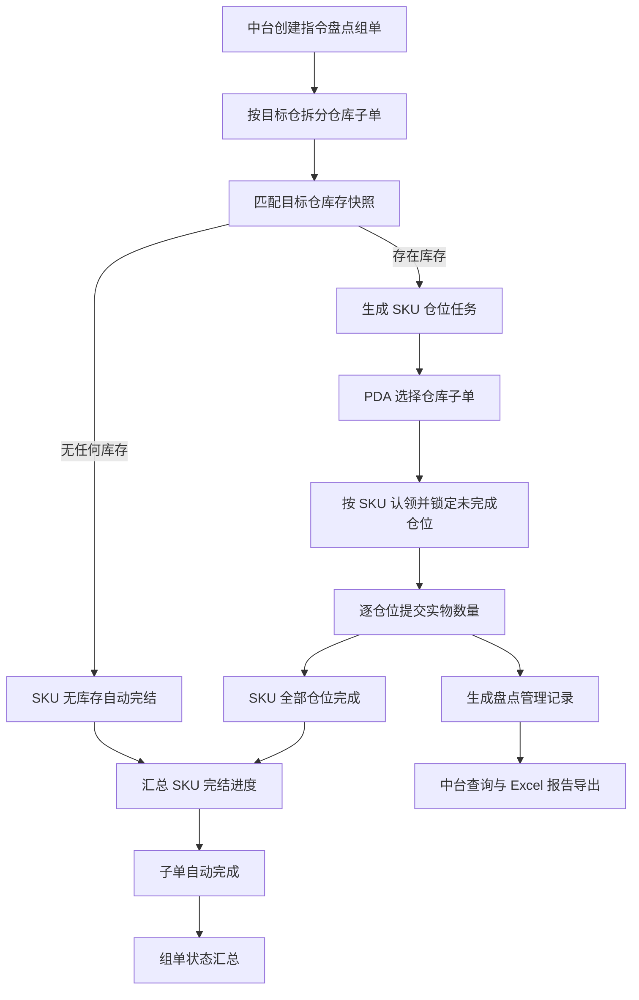
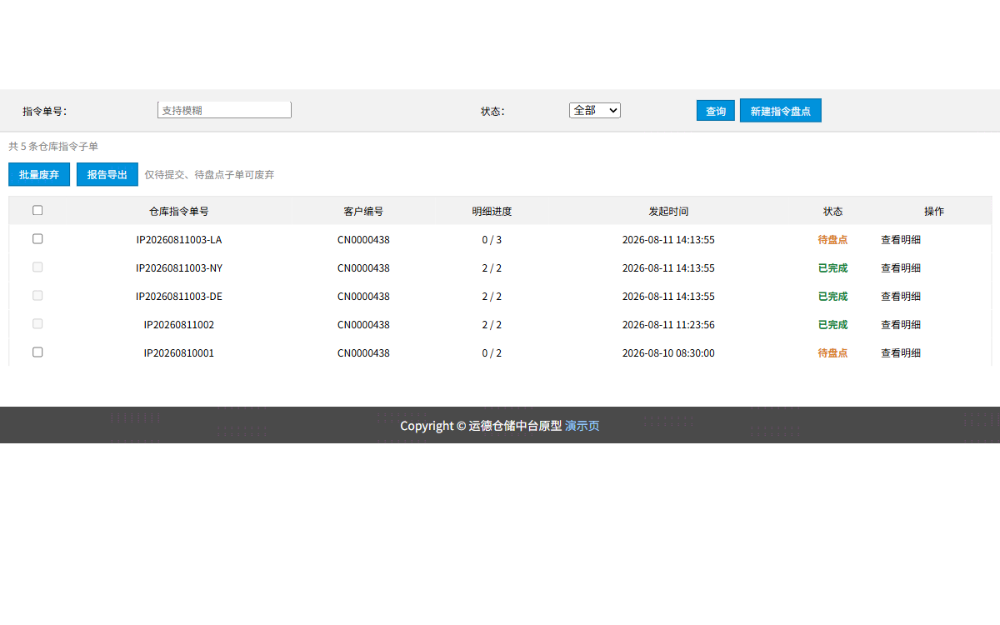
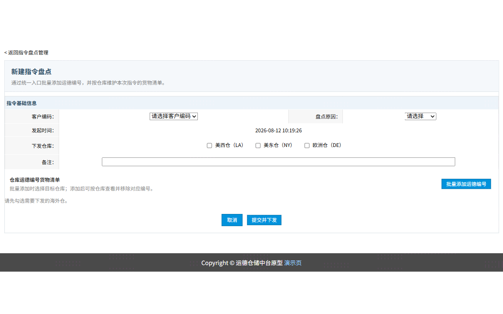
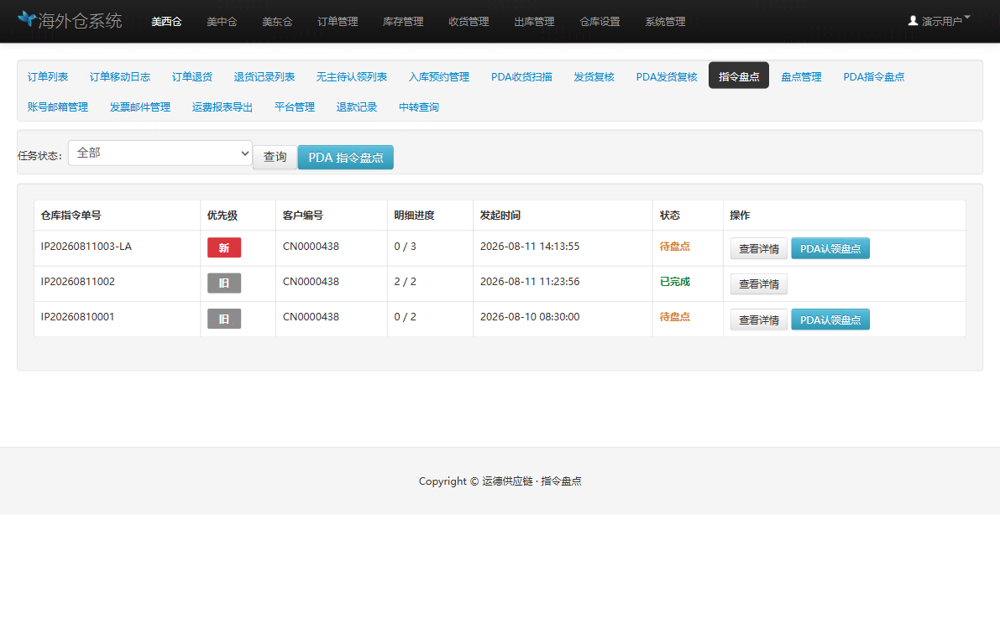
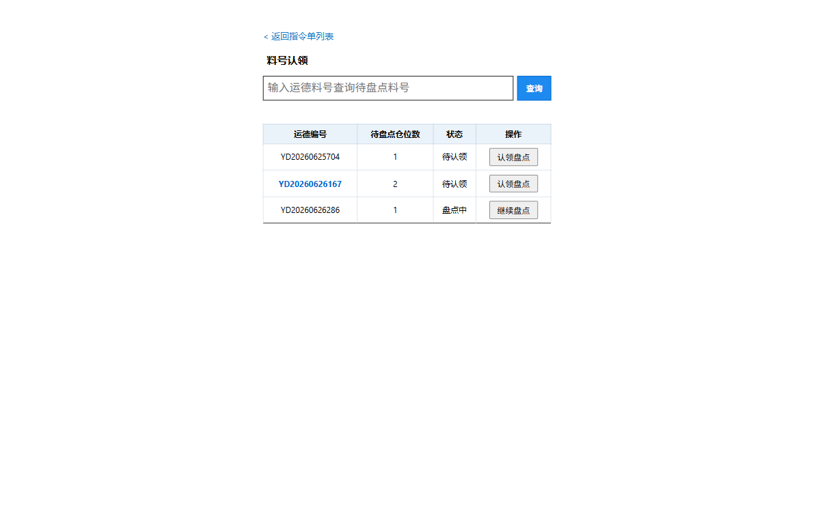
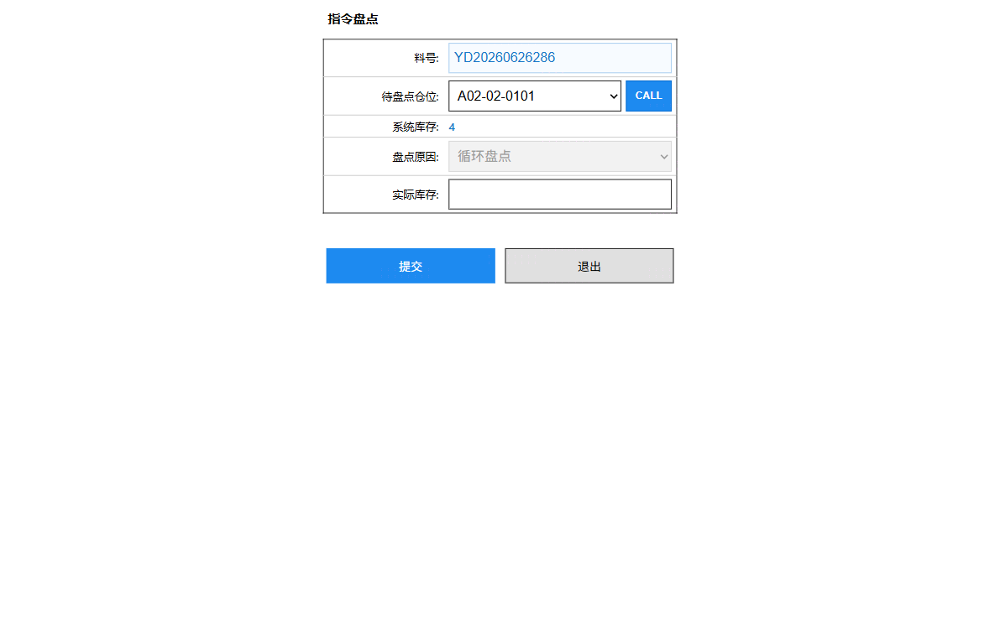
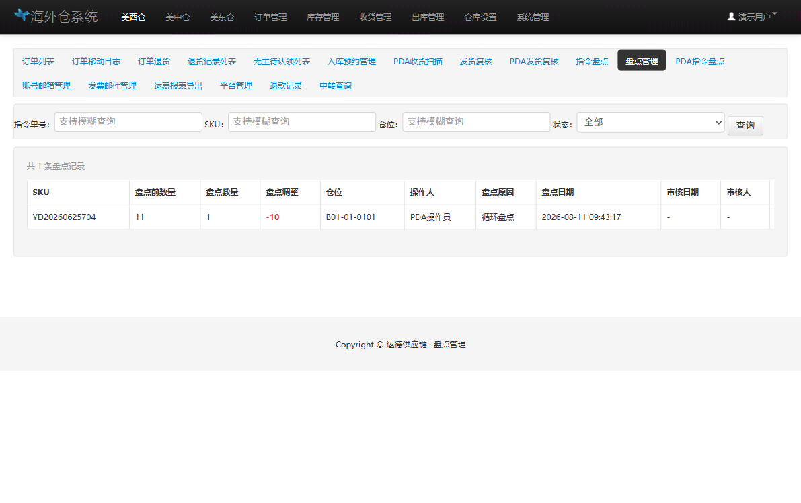

# 指令盘点需求文档

## 1. 文档基础信息

### 1.1 版本记录

| 时间 | 版本 | 修改人 | 变更内容 |
| --- | --- | --- | --- |
| 2026-08-12 | v1.0 | — | 初版，基于仓储中台、海外仓 PC 及 PDA 指令盘点原型整理 |
| 2026-08-12 | v1.1 | — | 补充按仓独立 SKU 清单、无库存自动完结、盘点管理记录及报告导出规则 |
| 2026-08-12 | v1.2 | — | 补充 A 区自动仓标识、CALL 交互及原型页面示意图 |

### 1.2 文档范围

| 项目 | 内容 |
| --- | --- |
| 模块名称 | 指令盘点 |
| 适用端 | 仓储中台 Web（`/wh/`）、海外仓 PC Web（`/us/`）、海外仓 PDA Web（`/us/`） |
| 页面范围 | 中台：列表、新建、详情、报告导出；海外仓：列表、详情、盘点管理；PDA：选单、SKU 认领、仓位盘点 |
| 数据范围 | 指令组单、仓库子单、库存快照、仓位任务、盘点管理记录、操作日志 |
| 不在范围 | 实际库存账务调整、差异盘点人工审核流、真实自动仓接口及鉴权、真实 ERP/WMS 消息集成 |

### 1.3 术语表

| 术语 | 说明 |
| --- | --- |
| 指令盘点组单 | 中台一次发起的跨仓盘点需求汇总单，统一保存客户、原因、发起信息及子单关系。 |
| 仓库子单 | 按目标海外仓拆分的实际执行单，据此生成仓位任务并由对应仓库执行。 |
| 运德编号 / SKU | 指令盘点的货物主键，一个 SKU 可对应多个仓位。 |
| 仓位任务 | SKU 在目标仓的一个实际库存仓位所生成的待盘任务。 |
| 系统库存 | 下发任务时取自共享库存快照的盘点前数量。 |
| 实物数量 | PDA 操作员针对仓位提交的实际盘点数量。 |
| 差异数量 | 实物数量减系统库存的结果。 |
| CALL | PDA 在自动仓仓位上发起自动仓出库呼叫的操作；当前原型只显示成功提示。 |
| 无库存自动完结 | 指令 SKU 在目标仓无任何在仓库存时，系统不生成仓位任务而直接完结该 SKU。 |

---

## 2. 需求背景

### 2.1 背景描述

仓储中台需要向一个或多个海外仓下达指定 SKU 的盘点任务，并实时获知海外仓执行进度及盘点差异。海外仓需在 PC 端查看任务、追踪认领人和盘点记录；仓内操作员需使用 PDA 按料号认领、按仓位执行盘点。现有循环盘点流程不能完整满足跨仓下达、料号级锁定、进度聚合和结果回传要求，因此新增指令盘点闭环。

### 2.2 需求列表

| 编号 | 用户诉求 | 提出角色 |
| --- | --- | --- |
| R-01 | 一次创建可下发至多个海外仓，且各仓可维护不同 SKU 清单 | 仓储中台 |
| R-02 | 按目标仓真实库存快照拆分 SKU 的仓位盘点任务 | 系统 / 海外仓 |
| R-03 | PDA 按 SKU 认领并锁定未完成仓位，避免多人重复盘点 | PDA 操作员 |
| R-04 | 海外仓可查看认领人、仓位进度和按指令 + SKU 筛选的盘点记录 | 海外仓管理员 |
| R-05 | 无库存 SKU 自动完结并保留完结时间和备注 | 仓储中台 / 海外仓 |
| R-06 | 中台可按当前查询结果导出全部仓位任务的 Excel 报告 | 仓储中台 |
| R-07 | 自动仓 SKU 与库位应具备明确提示和 CALL 操作入口 | PDA 操作员 |

### 2.3 核心目标

**作为仓储中台操作员，我希望能将指定 SKU 按仓下发至海外仓；作为海外仓操作员，我希望能在 PDA 上安全认领并提交仓位盘点，以便形成可追溯、可统计、可导出的盘点结果闭环。**

核心指标：任务下发成功率、SKU 认领冲突率、仓位任务完成率、差异任务占比、从下发到子单完成的平均耗时。

---

## 3. 功能总览

### 3.1 业务流程



**职责边界：**

- 仓储中台负责创建、下发、查询、废弃及导出。
- 海外仓 PC 负责查看本仓任务、追踪认领与结果、处理异常锁定。
- PDA 负责实际认领及仓位盘点提交。
- 系统负责库存任务生成、互斥锁定、状态聚合、无库存自动完结及盘点记录生成。

### 3.2 功能清单

| 编号 | 功能模块 | 功能简述 |
| --- | --- | --- |
| F-01 | 中台指令列表 | 查询仓库子单、显示明细进度、批量废弃、报告导出 |
| F-02 | 中台新建指令 | 填写基础信息，选择多个仓库，按仓维护 SKU 清单并提交下发 |
| F-03 | 中台子单详情 | 查看基础信息、SKU 状态、完成时间、备注和仓位任务进度 |
| F-04 | 海外仓任务列表 | 查看本仓任务的优先级、进度、发起时间和执行状态 |
| F-05 | 海外仓任务详情 | 查看 SKU 认领人、任务进度、完成时间，打开盘点明细或强行重置 |
| F-06 | PDA 选单与认领 | 选择可执行单据，按 SKU 查询、认领或继续盘点 |
| F-07 | PDA 仓位盘点 | 选择待盘仓位、调用自动仓、录入实物数量并提交 |
| F-08 | 盘点管理记录 | 保存每次仓位提交结果，提供指令单号、SKU、仓位和状态查询 |
| F-09 | 报告导出 | 导出当前筛选范围内全部仓位任务至 Excel 工作表 |

---

## 4. 功能详细设计

### 4.1 仓储中台指令盘点列表（F-01）

#### A. 用户故事

作为仓储中台操作员，我想按单号和状态查询已创建的指令盘点子单，并查看明细进度、废弃未执行单据或导出当前任务报告。

#### B. 用户旅程

进入指令盘点管理 → 输入指令单号或选择状态 → 查询仓库子单 → 查看详情 / 勾选废弃 / 报告导出 → 新建指令盘点。

#### C. 交互与界面



| 区域 | 说明 |
| --- | --- |
| 查询区 | 支持按仓库指令单号或所属组别模糊查询，并按状态筛选。 |
| 操作区 | 提供“查询”“新建指令盘点”“批量废弃”“报告导出”。 |
| 任务列表 | 以仓库子单维度展示，勾选框用于批量废弃。 |
| 明细进度 | 按“已完结料号数 / 需盘料号数”展示，自动完结 SKU 计入已完结。 |

#### D. 字段与逻辑

| 字段 | 说明 |
| --- | --- |
| 仓库指令单号 | 子单唯一编号；支持模糊查询。 |
| 所属组别 | 组单号，用于关联同批下发的各仓子单。 |
| 客户编号 | 创建指令时选择的客户。 |
| 明细进度 | 已完结 SKU 数 / 需盘 SKU 总数。 |
| 发起时间 | 中台提交下发的时间。 |
| 状态 | 待提交、待盘点、盘点中、已完成、已废弃。 |
| 操作 | 查看仓库子单详情。 |

**批量废弃规则：**仅“待提交”或“待盘点”子单可勾选废弃；废弃后 PDA 不可继续执行，已盘或盘点中的任务不允许通过该操作废弃。

---

### 4.2 新建指令盘点（F-02）

#### A. 用户故事

作为仓储中台操作员，我想在一次操作中选择多个目标仓库，并为每个仓库维护本次应盘的运德编号清单，以便向各仓下发匹配实际库存的任务。

#### B. 用户旅程

点击“新建指令盘点” → 填写客户和盘点原因 → 勾选下发仓库 → 批量添加 SKU 并选择对应仓库 → 核对各仓货物清单 → 提交并下发。

#### C. 交互与界面



| 区域 | 说明 |
| --- | --- |
| 指令基础信息 | 维护客户编码、盘点原因、发起时间、下发仓库和备注。 |
| 仓库 SKU 货物清单 | 以仓库为分区展示已加入的运德编号，可单条移除。 |
| 批量添加弹窗 | 输入多个 SKU，并选择本次加入的目标仓库，校验后加入各仓清单。 |
| 底部操作 | 取消返回列表；提交并下发生成组单及仓库子单。 |

#### D. 字段与逻辑

| 字段 | 组件 | 必填 | 逻辑 / 备注 |
| --- | --- | --- | --- |
| 客户编码 | 下拉框 | 是 | 用于校验本次加入的 SKU 归属。 |
| 盘点原因 | 下拉框 | 是 | 可选循环盘点、库存异常、客户要求、其他。 |
| 发起时间 | 只读文本 | — | 创建时自动生成。 |
| 下发仓库 | 多选项 | 是 | 至少选择一个海外仓。 |
| 备注 | 文本输入 | 否 | 补充本次盘点说明。 |
| 批量运德编号 | 文本域 | 是 | 英文逗号、换行或空格分隔多个 SKU。 |
| 盘点仓库 | 多选项 | 是 | 决定 SKU 被加入哪些仓库的独立清单。 |

**校验规则：**

| 场景 | 处理 |
| --- | --- |
| 未选择客户 / 原因 / 仓库 | 阻止提交并提示补齐必填信息。 |
| 批量 SKU 为空 | 提示输入至少一个运德编号。 |
| SKU 不存在或不归属当前客户 | 不加入货物清单，并反馈失败 SKU。 |
| SKU 重复加入同一仓 | 保留一条，不重复新增。 |
| 任一选中仓无 SKU 清单 | 阻止提交并提示维护对应仓清单。 |

**按仓独立清单规则：**组单的 SKU 仅用于汇总展示；每个仓库子单的 `requestedSkus` 是库存匹配和任务拆分的唯一执行来源。同一 SKU 可以下发多仓，也可以只下发特定仓。

---

### 4.3 中台子单详情与库存任务生成（F-03）

#### A. 用户故事

作为中台操作员，我想在仓库子单详情查看每个 SKU 的执行状态、仓位完成进度和自动完结信息，以便跟进任务结果。

#### B. 交互与界面

详情展示指令基础信息和货物清单。货物清单字段如下：

| 字段 | 说明 |
| --- | --- |
| 运德编码 | 子单中的 SKU。 |
| 盘点状态 | 待盘点、盘点中、已完结。 |
| 已完成仓位任务数 | 当前 SKU 已提交仓位数量。 |
| 完成时间 | 所有应盘仓位完成时的最后一次提交时间；无库存自动完结时为系统自动生成时间。 |
| 备注 | 无库存 SKU 固定展示“无库存自动完结”。 |

#### C. 库存匹配与无库存自动完结

系统按“目标仓库编码 + 运德编号”匹配共享库存快照：

1. 每一条匹配库存记录生成一条仓位任务；
2. 仓位任务保存仓位、系统库存、认领信息、实物数量、差异数量及提交信息；
3. 某 SKU 在目标仓没有任何库存记录时，不生成仓位任务；
4. 系统立即将该 SKU 标记为已完结，写入完结时间及备注“无库存自动完结”；
5. 自动完结 SKU 参与子单和组单的完成进度汇总，但不产生报告中的仓位明细行。

**SKU 状态规则：**

| 条件 | 状态 |
| --- | --- |
| 已完成仓位任务数为 0，且完成时间为空 | 待盘点 |
| 已完成仓位任务数大于 0，且完成时间为空 | 盘点中 |
| 完成时间不为空 | 已完结 |

---

### 4.4 海外仓指令盘点列表与详情（F-04、F-05）

#### A. 用户故事

作为海外仓管理员，我想查看本仓待执行的指令盘点任务及当前认领人，并能快速定位盘点记录和处理异常占用任务。

#### B. 交互与界面



| 列表字段 | 说明 |
| --- | --- |
| 仓库指令单号 | 当前仓可执行的子单号。 |
| 优先级 | 按发起时间倒序；最新任务显示“新”，其他显示“旧”。 |
| 客户编号 | 子单所属客户。 |
| 明细进度 | 已完结料号数 / 需盘料号数。 |
| 发起时间 | 中台下发时间。 |
| 状态 | 待盘点、盘点中、已完成、已废弃。 |
| 操作 | 查看详情，或进入 PDA 指令盘点入口。 |

海外仓详情的 SKU 清单字段如下：

1. 运德编号；
2. 执行状态：待认领、盘点中、已完结；
3. 仓位任务：已完成仓位数 / 总仓位数；
4. 当前认领人；
5. 完成时间；
6. 备注；
7. 操作。

**操作规则：**

- 点击“查看明细”时，在新窗口打开盘点管理，并按仓库指令单号和 SKU 自动筛选；
- 状态为“盘点中”的 SKU 显示“强行重置”；
- 强行重置只释放该 SKU 未提交仓位，已盘仓位及其盘点记录不受影响；
- 海外仓仅可查看本仓子单，不可查看其他仓任务。

---

### 4.5 PDA 步骤一：选择指令单（F-06）

#### A. 用户故事

作为 PDA 操作员，我想从当前仓库可执行的指令单列表中选择任务，以便避免扫描或手工输入错误单号。

#### B. 交互与界面

PDA 首页只展示两个字段：仓库指令单号、状态。操作员点击单据后进入 SKU 认领页。

#### C. 业务规则

- 仅展示当前海外仓的待盘点或盘点中子单；已完成、已废弃子单不可执行；
- 重新进入 PDA 首页时，系统检查当前操作员是否持有未完成认领；
- 存在未完成认领时，弹窗强制引导继续该 SKU 盘点；操作员必须继续提交，或在仓位页主动退出释放任务。

---

### 4.6 PDA 步骤二：SKU 认领与查询（F-06）

#### A. 用户故事

作为 PDA 操作员，我想搜索待盘 SKU 并一次认领该 SKU 的所有未完成仓位，以便高效执行且避免其他操作员重复盘点。

#### B. 交互与界面



| 区域 | 说明 |
| --- | --- |
| 搜索框 | 输入完整或部分运德编号，查询当前子单中的待盘 SKU。 |
| SKU 列表 | 显示运德编号、待盘点仓位数、状态和操作。 |
| 自动仓提示 | 待认领 SKU 存在 A 区仓位时，SKU 文本使用蓝色强调。 |
| 操作按钮 | 待认领显示“认领盘点”；本人已认领时显示“继续盘点”。 |

#### C. 认领与锁定规则

| 场景 | 处理 |
| --- | --- |
| 待认领 SKU | 当前操作员可认领；该 SKU 所有未完成仓位统一改为“盘点中”。 |
| 已由本人认领 | 允许继续进入仓位盘点页。 |
| 已由其他操作员认领 | 禁止认领、禁止提交，并提示当前认领人。 |
| 主动退出 | 仅未提交仓位恢复“待认领”；已盘仓位保持“已盘”。 |
| 管理员强行重置 | 与主动退出相同，仅释放未提交仓位。 |

锁定粒度为**SKU**，而非单一仓位；认领成功后记录认领人和认领时间。列表优先展示待认领 SKU，再按待盘仓位数从少到多排序。

---

### 4.7 PDA 步骤三：仓位盘点与自动仓 CALL（F-07）

#### A. 用户故事

作为 PDA 操作员，我想在已认领 SKU 下选择待盘仓位、查看系统库存并提交实物数量；当仓位属于自动仓时，我希望能先呼叫自动仓出库。

#### B. 交互与界面



| 字段 / 操作 | 组件 | 规则 |
| --- | --- | --- |
| 料号 | 只读输入框 | 展示当前已认领的运德编号。 |
| 待盘点仓位 | 下拉框 | 仅显示当前 SKU 尚未提交的仓位。 |
| CALL | 蓝色按钮 | 位于仓位右侧；仅 A 区自动仓仓位启用。 |
| 系统库存 | 只读文本 | 展示选中仓位的库存快照值。 |
| 盘点原因 | 禁用下拉框 | 显示指令单的盘点原因，禁止在 PDA 修改；提交记录的业务原因统一写入“指令盘点”。 |
| 实际库存 | 数字输入框 | 必须为非负整数。 |
| 提交 | 按钮 | 提交当前仓位实际库存。 |
| 退出 | 按钮 | 释放本 SKU 的未完成认领并返回 SKU 认领页。 |

#### C. 提交与 CALL 规则

1. 当选中仓位编码以 `A` 开头时，CALL 按钮启用；其他仓位按钮置灰。
2. 当前原型点击 CALL 后提示“已呼叫自动仓出库：{仓位编码}”，不调用真实自动仓服务。
3. 实际库存仅允许输入非负整数；校验失败时不可提交。
4. 提交后：
   - 当前仓位状态更新为“已盘”；
   - 写入实物数量、差异数量、操作人和盘点日期；
   - 自动生成一条盘点管理记录；
   - 差异数量 = 实物数量 - 系统库存。
5. SKU 下全部仓位提交后，SKU 立即完结，完成时间取该 SKU 最后一条仓位提交时间，并自动返回 SKU 认领页。

---

### 4.8 盘点管理记录（F-08）

#### A. 用户故事

作为海外仓管理员，我想查询每次 PDA 提交的仓位盘点结果及其审核状态，以便追溯差异来源。

#### B. 交互与界面



| 查询条件 | 说明 |
| --- | --- |
| 指令单号 | 支持模糊查询；从指令详情“查看明细”跳转时自动预填。 |
| SKU | 支持模糊查询；从指令详情跳转时自动预填。 |
| 仓位 | 支持模糊查询。 |
| 状态 | 支持通过、待审核、不通过筛选。 |

#### C. 记录字段与自动审核

| 字段 | 说明 |
| --- | --- |
| 仓库指令单号 | 本次提交关联的仓库子单号。 |
| 运德编号 | 已盘 SKU。 |
| 盘点前数量 | 提交时的系统库存。 |
| 盘点数量 | PDA 提交的实物数量。 |
| 盘点调整 | 盘点数量 - 盘点前数量。 |
| 仓位 | 当前盘点仓位。 |
| 操作人 / 盘点日期 | PDA 提交人及提交时间。 |
| 盘点原因 | 固定为“指令盘点”。 |
| 审核人 / 审核日期 / 状态 | 自动审核或后续人工审核信息。 |
| 备注 | 关联仓库指令单号及审核说明。 |

**自动审核规则：**差异数量等于 0 时，状态自动为“通过”，审核人写“系统自动审核”，审核日期等于盘点日期，备注追加“盈亏平衡系统自动审核”；差异数量不等于 0 时，状态为“待审核”，等待后续人工处理。

---

### 4.9 仓储中台报告导出（F-09）

#### A. 用户故事

作为中台操作员，我想导出当前查询范围内全部仓位任务及盘点结果，以便复核进度和差异。

#### B. 导出规则

- 入口：中台指令盘点列表的“报告导出”；
- 范围：使用当前单号和状态查询条件过滤后的**全部仓位任务**，包含未盘任务；
- 格式：Excel `.xlsx`；
- 文件名：`指令盘点报告_yyyyMMddHHmmss.xlsx`；
- 工作表名称：`盘点任务表`；
- 无库存自动完结 SKU 无仓位任务，不生成导出明细行；
- 当前筛选结果无仓位任务时，提示用户而不生成空文件。

#### C. 工作表字段

| 序号 | 字段 | 规则 |
| --- | --- | --- |
| 1 | 仓库指令单号 | 仓库子单唯一编号。 |
| 2 | 所属组别 | 组单号。 |
| 3 | 客户编号 | 创建时选择的客户。 |
| 4 | 仓库 | 目标仓库名称或编码。 |
| 5 | 运德编码 | 任务 SKU。 |
| 6 | 产品编号 | SKU 对应产品信息。 |
| 7 | 盘点仓位 | 仓位编码。 |
| 8 | 系统库存 | 盘点前库存快照值。 |
| 9 | 实物数量 | 已盘任务填写；未盘留空。 |
| 10 | 差异数量 | 已盘任务填写；未盘留空。 |
| 11 | 盘点结果 | 差异不等于 0 为“有差异”；等于 0 为“无差异”；未盘留空。 |
| 12 | 盘点日期 | 仓位提交时间；未盘留空。 |

---

## 5. 与上下游模块衔接

| 模块 | 衔接说明 |
| --- | --- |
| 产品管理 | 中台新建时使用客户与产品信息校验运德编号。 |
| 共享库存数据 | 指令下发后按“仓库 + SKU”匹配库存快照，生成仓位任务或无库存自动完结数据。 |
| 海外仓 PC | 接收本仓仓库子单，提供详情、认领人追踪、盘点管理查询及强行重置。 |
| PDA | 从当前仓子单中认领 SKU，提交仓位实盘数并回传状态。 |
| 盘点管理 | 每个仓位提交自动写入一条记录；差异为 0 时自动审核通过。 |
| 自动仓系统 | 目前仅保留 A 区仓位的 CALL 原型交互；真实接口、鉴权和回执待后续接入。 |

---

## 6. 规则与约束

### 6.1 状态流转

**仓位任务：**

```text
待认领 → 盘点中 → 已盘
          ↓
        待认领（主动退出或强行重置；仅未提交仓位）
```

**仓库子单：**

| 条件 | 状态 |
| --- | --- |
| 暂存未下发 | 待提交 |
| 没有已完结 SKU | 待盘点 |
| 存在已完结 SKU 但未全部完成 | 盘点中 |
| 所有 SKU 已完结，含无库存自动完结 | 已完成 |
| 中台主动废弃 | 已废弃 |

**组单：**

- 暂存未下发时为“待提交”；
- 全部有效子单尚未开始时为“待盘点”；
- 存在执行中子单且未全部完成时为“盘点中”；
- 所有有效子单完成时为“已完成”。

### 6.2 业务规则汇总

| 编号 | 规则 |
| --- | --- |
| BR-01 | 任务拆分以仓库子单的独立 SKU 清单为执行来源，不以组单汇总 SKU 直接拆分。 |
| BR-02 | SKU 锁定粒度为料号；认领后该 SKU 的全部未完成仓位由同一操作员持有。 |
| BR-03 | 释放认领和强行重置只影响未提交仓位，已盘结果不可回退。 |
| BR-04 | SKU 完成时间取全部应盘仓位完成时的最后提交时间。 |
| BR-05 | 目标仓无库存的 SKU 自动完结，备注固定为“无库存自动完结”。 |
| BR-06 | 自动完结 SKU 计入明细进度和单据完成判断，但不生成仓位任务及导出行。 |
| BR-07 | 盘点调整为 0 自动审核通过；存在差异的记录进入待审核。 |
| BR-08 | 当前自动仓定义为 A 区库位，库位编码以 `A` 开头。 |
| BR-09 | CALL 当前只提供页面成功提示，不产生真实自动仓出库指令。 |
| BR-10 | 报告导出遵循当前查询条件，并包含未盘仓位任务。 |

### 6.3 非功能要求（原型阶段）

| 分类 | 要求 |
| --- | --- |
| 技术形态 | 原生 HTML、CSS、JavaScript 与 Node.js 本地 mock 服务。 |
| 数据持久化 | 指令及盘点管理数据写入 mock 数据文件，由本地开发服务提供读写接口。 |
| 并发控制 | 认领、释放、提交、强行重置使用服务端原子动作，避免前端并发覆盖状态。 |
| 响应式 | 中台与海外仓 PC 使用桌面布局；PDA 使用移动端布局。 |
| 可追溯性 | 下发、认领、退出、提交、自动完结等关键动作保留操作日志或记录。 |

---

## 7. 待确认事项

| 编号 | 问题 | 当前原型 / 建议 |
| --- | --- | --- |
| OQ-01 | 现场操作交互性 | 自动仓拣货流程、普通仓拣货流程|
| OQ-02 | 报表数据 | 客服提供模板|
