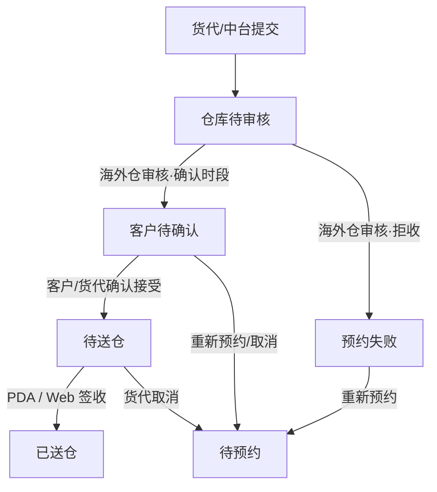
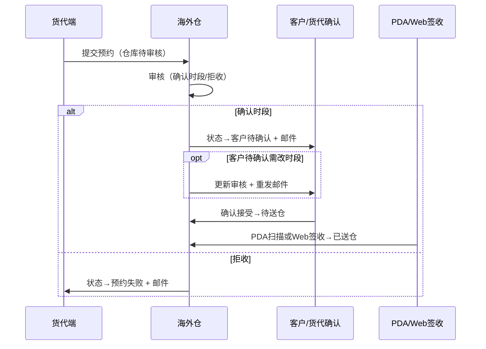

# 海外仓 · 预约送仓需求文档

## 1. 文档基础信息

### 1.1 版本记录

| 时间 | 版本 | 修改人 | 变更内容 |
| --- | --- | --- | --- |
| 2026-06-01 | v1.0 | — | 初版，基于当前原型实现整理 |
| 2026-06-01 | v1.1 | — | 新增 F-05：入库预约列表右下角站内预约提醒 |
| 2026-06-05 | v1.2 | — | 状态「仓库待确认」更名为「仓库待审核」；W.BOL 说明见独立文档 |
| 2026-06-05 | v1.3 | — | 列表勾选/还柜/Web签收/审核更新；货代联系邮箱；多候选期望日期；总体积/总重量列表展示；移除货代公司 |
| 2026-06-05 | v1.4 | — | 详情页预约/确认/到仓/货物明细字段与仓储中台对齐；保留 W.BOL 与审核/签收操作 |

### 1.2 文档范围

| 项目 | 内容 |
| --- | --- |
| 模块名称 | 海外仓 · 预约送仓（入库预约管理） |
| 适用端 | 运德海外仓系统 Web（`/us/`）；PDA 收货扫描页 |
| 页面范围 | 入库预约列表（含站内提醒）、入库预约详情（含审核）、PDA 收货确认 |
| 不在范围 | 客户前台创建预约、货代端填期望日期、仓储中台代建单（仅描述衔接）；W.BOL 字段与下载规则见 [`W.BOL说明与FAQ.md`](./W.BOL说明与FAQ.md) |

### 1.3 术语表

| 术语 | 说明 |
| --- | --- |
| 入库预约 | 客户/货代提交后进入「仓库待审核」及后续状态的送仓预约单 |
| 预约单号 | 系统正式单号，如 YY20260528102 |
| 送仓码 | 6 位业务码，货代凭此协作；PDA 可扫描识别 |
| 预约方 | 客户编号（如 CN0000438）或「运德船务」 |
| 期望送仓日期 | 货代填写的希望到仓日期（仓库当地日期）；支持最多 3 个候选，顿号展示 |
| 货代联系邮箱 | 货代端维护的通知邮箱（`emails`）；详情只读展示 |
| 预约仓库 | 预约单上的送仓仓库（`warehouse`）；列表筛选区文案仍为「目的仓」 |
| 还柜（还空通知） | 整柜或已填集装箱号的预约单，批量发送还空邮件给货代联系人 |
| Web 签收处理 | 列表/详情批量或单条登记到仓时间、收货箱托、签收文件；待送仓→已送仓 |
| 仓库确认时段 | 海外仓审核分配的入仓时间段（同日 start–end） |
| 审核备注 | 审核通过时选填，同步给客户/货代端展示（蓝色） |
| 拒收原因 | 审核驳回时必填，状态变为「预约失败」（红色） |
| 收货总箱数 / 托数 | PDA 到仓登记的实际数量，回写列表与详情 |
| 到仓拍照 | PDA 上传的现场照片，详情页缩略图展示 |
| W.BOL | 货代确认时段后（待送仓/已送仓）可下载的入仓凭证，详见 [`W.BOL说明与FAQ.md`](./W.BOL说明与FAQ.md) |
| 美仓时区 | 列表/详情时间字段追加 `(US/Pacific)` 等标注 |
| 站内预约提醒 | 列表页右下角浮层，登录后展示待办计数并支持跳转筛选 |
| 本周待送仓 | 状态为「待送仓」，且确认/期望送仓日期落在当周（周一至周日）的单据 |

---

## 2. 需求背景

### 2.1 背景描述

预约送仓链路中，**海外仓是审核与收货的执行端**：货代提交预约后，仓库人员需审核库容与时段；客户确认时段后，现场操作员通过 PDA 完成到仓登记。传统流程依赖邮件/Excel 传递审核结果，现场收货与系统状态脱节。

本模块提供：

1. **预约列表**：按状态 Tab 管理待审、待送、已到仓等预约单；
2. **预约审核**：分配仓库、确认时段或拒收；
3. **详情追溯**：查看申请信息、仓库确认、到仓收货、货物明细与日志；
4. **PDA 收货**：扫描识别预约单，登记收货数量与到仓拍照，驱动状态 → **已送仓**；
5. **站内提醒**：登录后在列表页右下角汇总待审、超时、本周待送仓数量，一键跳转处理。

### 2.2 需求列表

| 编号 | 用户诉求 | 提出人/部门 |
| --- | --- | --- |
| R-01 | 查看本仓待审核预约并分配时段 | 海外仓审核员 |
| R-02 | 库容不足或时段冲突时拒收并说明原因 | 海外仓审核员 |
| R-03 | 按单号/送仓码/预约方快速检索预约 | 仓库主管 |
| R-04 | 查看预约全貌及协商日志 | 仓库客服 |
| R-05 | PDA 扫描到仓，登记箱托数并拍照 | 卸货组/PDA 操作员 |
| R-06 | 对比送仓箱数与收货箱数差异 | 仓储/财务 |
| R-07 | 登录后快速知晓待审核/超时/本周待送仓数量 | 海外仓审核员/仓库主管 |
| R-08 | 客户待确认阶段更新审核时段并重发邮件 | 海外仓审核员 |
| R-09 | 整柜预约批量发送还空通知 | 海外仓操作员 |
| R-10 | 在 Web 端完成签收（含批量），减少仅依赖 PDA | 卸货组/仓库主管 |

### 2.3 核心目标

**作为海外仓操作员，我希望在系统内完成预约审核与到仓收货登记，以便与客户/货代协同一致、减少线下沟通与状态滞后。**

核心指标：仓库待审核平均审核时长、待送仓到仓登记及时率、送仓箱数与收货箱数差异率。

---

## 3. 功能总览

### 3.1 业务流程

**海外仓职责边界：**

| 负责 | 不负责 |
| --- | --- |
| 审核「仓库待审核」预约（确认时段 / 拒收） | 客户/货代创建预约、填写期望日期 |
| 客户待确认阶段「更新审核」并重发确认邮件 | 客户/货代「确认接受」时段 |
| 查看预约列表与详情（含只读申请信息） | 仓储中台代建单（仅 customer 渠道） |
| PDA / Web 到仓签收（待送仓 → 已送仓） | 修改已提交预约的基础货物信息 |
| 还柜（还空邮件通知） | 货代联系邮箱维护（货代端） |
| 写入审核备注、拒收原因、收货数量、到仓拍照 | — |

### 3.2 功能清单

| 编号 | 功能模块 | 功能简述 |
| --- | --- | --- |
| F-01 | 入库预约列表 | 多条件筛选、状态 Tab、行勾选、还柜/签收、行内审核、分页 |
| F-02 | 入库预约详情 | 申请/确认/到仓信息、入库明细、日志 |
| F-03 | 预约审核 | 确认时段或拒收，状态流转与邮件触发 |
| F-04 | PDA 收货扫描 | 扫描识别、收货登记、到仓拍照、提交已送仓 |
| F-05 | 站内预约提醒 | 登录后右下角浮层，展示待审/超时/本周待送仓计数与跳转 |
| F-06 | 还柜（还空通知） | 列表勾选整柜/有箱号预约，批量发送还空邮件 |
| F-07 | Web 签收处理 | 列表批量 / 详情单条签收弹窗，登记到仓与收货数据 |
| F-08 | 审核更新 | 客户待确认状态下更新仓库时段并重发「请确认时段」邮件 |

### 3.3 与各端差异对照

| 维度 | 客户前台 | 货代端 | 仓储中台 | 海外仓 |
| --- | --- | --- | --- | --- |
| 数据范围 | 当前客户 | 凭送仓码单条 | 全量 | **仓库待审核及后续** |
| 创建预约 | 有 | 无 | 有 | 无 |
| 审核 | 无 | 无 | 无 | **有** |
| 确认时段 | 有（接受/重约） | 有（确认接受） | 无 | 无 |
| PDA 收货 | 无 | 无 | 无 | **有** |
| 列表 Tab | 多状态 | 无 | 下拉筛 | **状态 Tab + 计数 + 站内提醒** |

---

## 4. 功能详细设计

### 4.1 入库预约列表（F-01）

#### A. 用户故事

作为海外仓审核员，我想要按状态 Tab 查看待处理预约并快速筛选，以便优先处理「仓库待审核」单据。

#### B. 用户旅程

登录海外仓系统 → 订单管理 → **入库预约管理** → 选择状态 Tab 或输入筛选条件 → 查询 → 点击「查看详情」。

#### C. 交互与界面

| 区域 | 说明 |
| --- | --- |
| 顶栏 | 海外仓统一导航；二级菜单高亮「入库预约管理」 |
| 筛选区 | 预约单号、单据号、送仓码、预约方、目的仓、送仓类型、集装箱号、提交时间范围 |
| 快捷入口 | 「PDA收货扫描」「还柜」「签收处理」 |
| 行勾选 | 待送仓/已送仓可签收；整柜或已填箱号可还柜 |
| 状态 Tab | 全部 + 各业务状态，括号内红色数字为计数 |
| 列表区 | 宽表展示；底部分页（每页 10 条） |

#### D. 字段与逻辑

**1. 筛选栏**

| 筛选元素 | 组件类型 | 默认值 | 逻辑/备注 |
| --- | --- | --- | --- |
| 预约单号 | 文本 | 空 | 模糊匹配，不区分大小写 |
| 单据号 | 文本 | 空 | 匹配货物明细 `orderNo`；支持逗号分隔多号 |
| 送仓码 | 文本 | 空 | 模糊匹配 |
| 预约方 | 文本 | 空 | 匹配客户编号或「运德船务」 |
| 目的仓 | 下拉 | 全部 | 选项来自当前列表出现过的仓库 |
| 送仓类型 | 下拉 | 全部 | 整柜 / 散货 |
| 集装箱号 | 文本 | 空 | 模糊匹配 |
| 提交时间 | 日期范围 | 空 | 闭区间 `[start, end]` |
| 查询 | 按钮 | — | 重置页码为 1 并刷新 |
| 重置 | 按钮 | — | 清空筛选 + Tab 回「全部」 |

**2. 状态 Tab**

| Tab | 对应状态 | 说明 |
| --- | --- | --- |
| 全部 | — | 不限状态 |
| 仓库待审核 | 仓库待审核 | 待审核，红色加粗 |
| 客户待确认 | 客户待确认 | 橙色加粗 |
| 待送仓 | 待送仓 | — |
| 已送仓 | 已送仓 | 绿色加粗 |
| 已超时 | 已超时 | 灰色 |
| 预约失败 | 预约失败 | 灰色 |

**数据范围：** 仅展示状态 ∈ {仓库待审核, 客户待确认, 待送仓, 已送仓, 已超时, 预约失败} 的预约单（不含「待预约」「待提交」等上游状态）。

**3. 列表列定义**

| 字段 | 展示逻辑 |
| --- | --- |
| 勾选 | 见 [4.6 还柜](#46-还柜还空通知f-06) / [4.7 Web签收](#47-web-签收处理f-07) |
| 预约单号 | — |
| 送仓码 | — |
| 预约方 | `getBookerParty()`：customer → 客户编号；历史 shipping → 运德船务 |
| 状态 | 见状态样式映射 |
| 送仓类型 | 整柜 / 散货 |
| 期望送仓日期 | 多候选顿号连接 + 美仓时区标注 |
| 仓库确认时段 | 未确认 `-` |
| 实际到仓时间段 | Web 签收或 PDA 提交后回显 |
| 集装箱号 | 散货可为 `-` |
| 送仓总箱数 | `estimatedCartons` 或明细汇总 |
| 总体积（m³） | 有值展示，无则 `-` |
| 总重量（kg） | 有值展示，无则 `-` |
| 收货总箱数 | 签收后回写；未到仓 `-` |
| 送仓总托数 | 未打托为 0 或 `-` |
| 提交时间 | 货代/中台提交至仓库待审核的时间 |
| 操作 | 仓库待审核：**审核**；客户待确认：**更新审核**；**查看详情** |

**4. 分页**

| 元素 | 逻辑 |
| --- | --- |
| 结果计数 | `Your search results is {n}` |
| 页码信息 | 第 x / y 页，共 n 条 |
| 上一页 / 下一页 | 边界禁用 |

**5. 多 Tab 同步**

跨标签页 `storage` 事件与 `pageshow` 时刷新 Tab 计数与列表（数据以 dev 服务写入 mock 源文件为准）。

> 列表页右下角 **站内预约提醒** 详见 [4.5 站内预约提醒（F-05）](#45-站内预约提醒f-05)。

---

### 4.2 入库预约详情（F-02）

#### A. 用户故事

作为海外仓人员，我想要在一个页面查看预约申请、仓库确认与到仓结果，以便答复现场问题并追溯协商过程。

#### B. 用户旅程

列表点「查看详情」→ 浏览头部状态与各信息区块 → 切换「入库信息 / 日志信息」Tab → 若状态为仓库待审核，点击「审核」。

#### C. 交互与界面

| 区域 | 说明 |
| --- | --- |
| 页头 | 预约单号 `#YY…`、状态标签；仓库待审核显示「审核」；客户待确认显示「更新审核」；待送仓/已送仓显示「签收处理」；「PDA收货扫描」 |
| 客户编号 | 顶部强调展示（与仓储中台一致） |
| 预约信息 | 网格只读字段（字段集与仓储中台一致） |
| 仓库确认信息 | 地址、时段、审核备注；另含 W.BOL 下载（海外仓独有） |
| 到仓收货信息 | 实际到仓时间、收货箱/托、到仓拍照缩略图 |
| Tab | 货物明细 / 日志明细 |

**操作按钮：**

| 按钮 | 展示条件 |
| --- | --- |
| 审核 | 仓库待审核 |
| 更新审核 | 客户待确认 |
| 签收处理 | 待送仓、已送仓 |
| PDA收货扫描 | 始终 |

#### D. 字段与逻辑

**1. 预约信息**（与《仓储中台预约管理需求文档》§4.3 对齐）

| 字段 | 展示规则 |
| --- | --- |
| 预约仓库、预约单号、送仓码、状态、送仓类型 | 始终展示 |
| 送仓总箱数、总体积（m³）、总重量（kg） | 始终展示；未填为「-」 |
| 是否打托、送仓总托数 | 始终展示；未打托托数为 0 |
| 集装箱号、柜型 | 始终展示；散货多为「-」 |
| 货代联系邮箱 | `formatContactEmailsDisplay` 去重顿号拼接 |
| 联系电话 | 货代端填写后回显 |
| 期望送仓日期、货代备注 | 货代端填写后回显 |
| 提交时间 | — |
| 预约链接 | `buildBookingLinkHtml`；待提交/无送仓码为「-」 |

**不展示：** 货代公司。

**2. 仓库确认信息**

| 字段 | 展示规则 |
| --- | --- |
| 仓库确认地址 | 未审核时「待确认」 |
| 仓库确认时段 | 未审核时「待确认」；美仓时区标注 |
| 仓库审核备注 | 无内容「-」 |
| W.BOL | **海外仓独有**；待送仓/已送仓可下载；否则 `-`；规则见 [`W.BOL说明与FAQ.md`](./W.BOL说明与FAQ.md) |

**3. 到仓收货信息**

| 字段 | 展示规则 |
| --- | --- |
| 实际到仓时间 | PDA 或 Web 签收写入，美仓时区 |
| 收货总箱数 / 收货总托数 | 未到仓 `-` |
| 到仓拍照 / 签收文件 | 缩略图列表，可点击；无则占位 |

**4. 货物明细 Tab**（与仓储中台一致）

| 列 | 说明 |
| --- | --- |
| 入库单号 | — |
| 订单状态 | — |
| 收货仓 | — |
| 发货方式 | — |
| 订单箱数 | — |
| 送仓箱数 | 预约申报 |
| 收货箱数 | PDA / Web 签收回写 |
| 提交时间 | 入库单创建时间 |
| 空数据 | 「无关联入库单」 |

**5. 日志明细 Tab**

| 项目 | 说明 |
| --- | --- |
| 展示范围 | 全量原文；时间降序 |
| 数据源 | 与其他端同源 `operationLogs` |
| 空状态 | 「暂无日志」 |

---

### 4.3 预约审核（F-03）

#### A. 用户故事

作为海外仓审核员，我想要确认可收货时段或拒收并填写原因，以便驱动下游客户确认或终止预约。

#### B. 用户旅程

详情页（仓库待审核）→ 点击「审核」→ 弹窗查看客户期望日期与备注 → 选择「确认时段」或「拒收」→ 填写必填项 → 提交 → 状态更新 + 邮件通知。

#### C. 交互与界面

| 区域 | 说明 |
| --- | --- |
| 弹窗标题 | 预约确认 |
| 提示条 | 黄色：无论时段是否与期望一致，提交后均进入「客户待确认」由客户拍板 |
| 只读区 | 客户期望日期（支持多候选）、客户备注 |
| 审核结论 | 单选：确认时段 / 拒收 |
| 确认面板 | 仓库下拉、时段日期+起止时间、审核备注（选填） |
| 拒收面板 | 拒收原因（必填，≥5 字） |
| 底部 | 取消 / 提交 |

#### D. 字段与逻辑

**1. 确认时段（decision = confirm）**

| 字段 | 组件 | 必填 | 逻辑/备注 |
| --- | --- | --- | --- |
| 仓库 | 下拉 | 是 | 选项：美西4仓 / 美西仓 / 美东仓；切换联动展示地址 |
| 仓库确认日期 | date | 是 | 默认 = 客户期望日期 |
| 开始时间 | time | 是 | 默认 09:00 |
| 结束时间 | time | 是 | 默认 12:00；须同日且 end > start |
| 审核备注 | textarea | 否 | ≤200 字；写入 `auditRemark`，客户/货代端蓝色展示 |

**提交结果：**

| 项目 | 值 |
| --- | --- |
| 状态 | **客户待确认** |
| 写入字段 | `confirmedWarehouse`、`warehouse`、`warehouseConfirmedAddress`、`warehouseConfirmedInboundTime`、`auditRemark`；清空 `rejectRemark` |
| 操作日志 | `第N轮审核 · 确认时段 …，状态变更为客户待确认` |
| 邮件 | 触发「审核通过，请确认时段」（见《预约送仓邮件模板需求文档》） |

**2. 拒收（decision = reject）**

| 字段 | 组件 | 必填 | 逻辑/备注 |
| --- | --- | --- | --- |
| 拒收原因 | textarea | 是 | ≥5 字，≤200 字；写入 `rejectRemark` |

**提交结果：**

| 项目 | 值 |
| --- | --- |
| 状态 | **预约失败** |
| 业务规则 | **仅海外仓拒收可进入预约失败**；货代/客户取消回「待预约」 |
| 操作日志 | `第N轮审核 · 拒收，原因：…，状态变更为预约失败` |
| 邮件 | 触发「申请被驳回」 |

**3. 更新审核（auditMode = update，客户待确认）**

| 项目 | 规则 |
| --- | --- |
| 入口 | 列表行「更新审核」、详情「更新审核」 |
| 可编辑 | 仓库、确认日期、起止时段、审核备注 |
| 不可操作 | 拒收（仅展示确认面板） |
| 提交结果 | 状态仍为 **客户待确认**；覆盖 `warehouseConfirmed*`、`auditRemark` |
| 邮件 | 重发「审核通过，请确认时段」 |

**4. 校验与异常**

| 场景 | 处理 |
| --- | --- |
| 非仓库待审核点击审核 | 按钮不展示 |
| 拒收原因 < 5 字 | 弹窗内红色错误提示 |
| 未选仓库 / 日期 / 时段 | 弹窗内错误提示 |
| 结束时间 ≤ 开始时间 | 提示「结束时间须晚于开始时间」 |
| 提交失败 | Alert「提交失败，请检查必填项后重试」 |
| 提交成功 | 关闭弹窗、刷新详情、Alert 成功文案 |

---

### 4.4 PDA 收货扫描（F-04）

#### A. 用户故事

作为 PDA 操作员，我希望扫描预约码或入库单号快速找到待送仓预约，登记收货数量并拍照，以便完成到仓确认。

#### B. 用户旅程

**第一页（扫描）：** 输入/扫描单号 → Enter 识别 → 展示预约单摘要 → 「下一步」  
**第二页（登记）：** 上传到仓拍照 → 填写收货总箱数/托数（参考送仓数）→ 提交 → 状态变 **已送仓** → 回到扫描页

#### C. 交互与界面

| 区域 | 说明 |
| --- | --- |
| 顶栏 | 操作人、站点 US、菜单（入库预约管理 / 示例详情） |
| 扫描页 | 单号输入框（autofocus）、状态提示、识别结果面板 |
| 登记页 | 到仓拍照（多张）、收货总箱/托、货物明细预览、提交/返回 |
| 弹窗 | 校验失败时用 Alert 模态（如未填照片且未填箱数） |

#### D. 字段与逻辑

**1. 扫描识别**

| 输入 | 匹配规则（优先级） |
| --- | --- |
| 送仓码 | 精确匹配（不区分大小写） |
| 预约单号 | 精确 → 包含匹配 |
| 入库单号 | 关联明细中精确 → 包含匹配 |

**2. 扫描校验（lookup）**

| 状态 | 结果 |
| --- | --- |
| 未找到 | 「未找到对应预约单，请核对单号」 |
| 已送仓 | 「该预约单已完成收货，不可重复提交」 |
| 仓库待审核 | 「预约尚未审核通过，不可收货」 |
| 客户待确认 | 「客户尚未确认仓库安排，不可收货」 |
| 非待送仓 | 「当前状态为「xxx」，不可收货」 |
| 待送仓 | 识别成功，展示预约单/码/预约方 |

**3. 收货登记**

| 字段 | 组件 | 必填 | 逻辑/备注 |
| --- | --- | --- | --- |
| 到仓拍照 | 文件上传 | 条件必填 | 支持多张；与收货总箱数**至少填一项** |
| 收货总箱数 | number | 条件必填 | 正整数；右侧绿色参考值为送仓总箱数 |
| 收货总托数 | number | 否 | 正整数；空时提交前 confirm「请现场确认是否继续」 |
| 货物明细 | 只读预览 | — | 单据号 + 送仓箱数 |

**4. 提交结果**

| 项目 | 值 |
| --- | --- |
| 状态 | **已送仓** |
| 写入字段 | `actualDeliveryTime`（当前时间）、`receivedCartons`、`receivedPallets`、`arrivalPhotos` |
| 操作日志 | `PDA收货扫描确认到仓，登记收货总托数：…，收货总箱数：…，状态变更为已送仓` |
| 成功后 | Alert 成功 → 清空表单回到扫描页 |

**5. 异常**

| 场景 | 处理 |
| --- | --- |
| 照片与箱数均未填 | 模态提示「请上传到仓文件 或录入收货总箱数」 |
| 箱数/托数非正整数 | 页内红色状态提示 |
| 提交时状态已变 | 「预约单已失效，请返回重新扫描」 |
| 修改扫描输入 | 清除当前识别结果，需重新 Enter |

---

### 4.5 站内预约提醒（F-05）

#### A. 用户故事

作为海外仓审核员，我希望每次登录后在列表页右下角看到待办预约数量摘要，以便优先处理待审核、超时跟进和本周到仓安排。

#### B. 用户旅程

登录海外仓 → 进入 **入库预约管理** → 右下角自动弹出「预约提醒」面板 → 查看三项计数 → 点击某项「查看」→ 列表自动切换 Tab/筛选并滚动至列表区 → 处理完成后可收起面板；后续点击铃铛图标可再次打开。

#### C. 交互与界面

| 区域 | 说明 |
| --- | --- |
| 展开面板 | 固定于页面右下角（`position: fixed`），宽 300px，含标题、副文案、三行统计、底部说明 |
| 收起状态 | 面板隐藏，显示蓝色圆形铃铛按钮；角标为三项计数之和 |
| 标题栏 | 「预约提醒」+ 关闭按钮（×） |
| 统计行 | 标签 + 数字 + 「查看」链接，每行一项 |
| 动效 | 会话内首次展开时面板轻微高亮脉冲（可选） |

**仅出现在：** `receiving-appointment.html`（入库预约列表页），详情页与 PDA 页不展示。

#### D. 统计项定义

| 统计项 | 计数规则 | 数字颜色 |
| --- | --- | --- |
| 待审核 | 状态 = `仓库待审核` 的预约单数量 | 红色 |
| 已超时 | 状态 = `已超时` 的预约单数量 | 橙色 |
| 本周待送仓 | 状态 = `待送仓`，且送仓日期落在**当周周一至周日** | 蓝色 |

**本周待送仓 · 送仓日期取值优先级：**

1. `warehouseConfirmedInboundTime` 的日期部分（仓库确认时段）；
2. 若无，取 `expectedInboundTime`（期望送仓日期）。

**周区间计算：** 以用户浏览器本地时间为准，周一 00:00:00 至周日 23:59:59。

**副文案示例：** `本周待送仓统计区间：2026-06-01 ~ 2026-06-07（按确认/期望送仓日期）`

#### E. 「查看」跳转逻辑

| 点击项 | 列表行为 | URL 参数（可选） |
| --- | --- | --- |
| 待审核 | 激活「仓库待审核」状态 Tab；清空本周附加筛选 | `?reminder=wh_pending` |
| 已超时 | 激活「已超时」状态 Tab | `?reminder=timeout` |
| 本周待送仓 | 激活「待送仓」Tab + **附加本周日期过滤** | `?reminder=week_pending` |

跳转后页面平滑滚动至状态 Tab / 列表区域。用户手动切换其他 Tab 或点击「重置」时，清除「本周待送仓」附加筛选。

#### F. 展示与收起规则

| 规则 | 说明 |
| --- | --- |
| 每次登录展示 | 以**浏览器会话**为单位：新会话首次进入列表页时**自动展开**面板 |
| 收起记忆 | 用户点击 × 收起后，同会话内不再自动展开，改为显示铃铛按钮 |
| 再次打开 | 点击铃铛按钮重新展开，并刷新最新计数 |
| 存储键 | `sessionStorage.us_recv_reminder_collapsed`（原型） |
| 数据刷新 | 预约单增删改（含其他 Tab 操作）时，提醒计数与角标同步更新 |

#### G. 空状态与边界

| 场景 | 处理 |
| --- | --- |
| 某项计数为 0 | 仍展示该行，数字为 `0`；「查看」可点击，列表为空态 |
| 三项均为 0 | 面板与铃铛正常展示，角标为 `0` |
| 未加载 mock 数据 | 不渲染提醒组件 |
| 从外链带 `?reminder=` 进入 | 列表按参数预选 Tab/筛选，并滚动至列表区 |

#### H. 技术实现（原型参考）

| 文件 | 职责 |
| --- | --- |
| `us/js/receiving-appointment-reminder.js` | 浮层 UI、会话展开/收起、点击跳转 |
| `us/css/receiving-appointment-reminder.css` | 右下角面板与铃铛样式 |
| `us/js/receiving-appointment-list.js` | `UsRecvAppointmentList.applyReminderFilter()`、URL 参数解析 |
| `customer/js/deliveryAppointment-common.js` | `getReceivingReminderStats()`、`isPendingDeliveryThisWeek()` |

---

### 4.6 还柜（还空通知）（F-06）

#### A. 用户故事

作为海外仓操作员，我想要对整柜或已填箱号的预约单批量发送还空通知，以便货代安排提空柜。

#### B. 交互与逻辑

| 项目 | 规则 |
| --- | --- |
| 入口 | 列表工具栏「还柜」 |
| 勾选条件 | 整柜 **或** 已填写集装箱号（`isEligibleForEmptyContainerReturn`）；**不限状态** |
| 提交前确认 | 弹窗列出预约单号 / 箱号 / 货代联系邮箱摘要 |
| 跳过规则 | 不符合条件的选中行自动跳过并提示数量 |
| 邮件 | 发送还空通知；演示环境额外抄送 `liuyongmeib@sailvan.com` |
| 操作日志 | `empty_container_return`（客户前台不展示） |

---

### 4.7 Web 签收处理（F-07）

#### A. 用户故事

作为仓库人员，我希望在 Web 端批量或单条完成签收登记，以便不依赖 PDA 也能更新到仓数据。

#### B. 交互与逻辑

| 项目 | 规则 |
| --- | --- |
| 列表入口 | 勾选待送仓/已送仓行后点击「签收处理」 |
| 详情入口 | 页头「签收处理」（待送仓/已送仓） |
| 待送仓 | 首次签收 → 状态 **已送仓** |
| 已送仓 | 更新签收内容（实际到仓时间、箱托、签收文件） |
| 必填 | 实际到仓时间（`datetime-local`） |
| 选填 | 收货总箱数、收货总托数、签收文件（图片，可多张） |
| 共用组件 | `us/js/receiving-sign-off.js` 多行弹窗 |

---

## 5. 与上下游模块衔接

| 模块 | 衔接说明 |
| --- | --- |
| 客户前台 | 客户提交 → 待预约；货代提交后 → **仓库待审核** 进入海外仓列表 |
| 货代端 | 货代提交审核；海外仓确认时段后货代/客户「确认接受」→ **待送仓** |
| 仓储中台 | 代客建单（固定 customer）直接进仓库待审核；全量只读展示同一套收货/日志字段 |
| 邮件通知 | 审核通过/驳回/更新审核、客户接受、还空通知；演示环境货代类邮件抄送 `liuyongmeib@sailvan.com` |
| W.BOL | 待送仓/已送仓后详情与货代端提供下载链接，详见 [`W.BOL说明与FAQ.md`](./W.BOL说明与FAQ.md) |

---

## 6. 规则与约束

### 6.1 权限与访问

| 规则 | 说明 |
| --- | --- |
| 登录 | 海外仓账号登录（原型为演示用户） |
| 数据范围 | 列表为「已进入仓库流程」的预约单 |
| 审核权限 | 仅仓库待审核可审核 |
| PDA 权限 | 仅待送仓可提交收货 |
| Web 签收权限 | 待送仓可首次签收；已送仓可更新签收内容 |

### 6.2 业务规则汇总

| 编号 | 规则 |
| --- | --- |
| BR-01 | 审核确认时段 → **客户待确认**（非直接待送仓） |
| BR-02 | 审核拒收 → **预约失败**；拒收原因 ≥5 字 |
| BR-03 | 预约失败仅由海外仓拒收产生 |
| BR-04 | PDA / Web 签收 → **待送仓 → 已送仓**；PDA 不可重复提交 |
| BR-05 | PDA 提交：到仓拍照与收货总箱数至少一项；Web 签收必填实际到仓时间 |
| BR-06 | 美仓时间展示追加时区标签（Pacific / Eastern 等） |
| BR-07 | 多轮审核记录在 operationLogs（第 N 轮审核） |
| BR-08 | 详情不提供修改申请基础信息；协商结果由流程节点写入 |
| BR-09 | 站内提醒统计范围与列表 `getReceivingAppointmentList()` 一致 |
| BR-10 | 「本周待送仓」须同时满足状态=待送仓 + 送仓日期在当周区间 |
| BR-11 | 客户待确认可「更新审核」，状态不变，重发确认邮件 |
| BR-12 | 还柜仅整柜或已填集装箱号；须勾选后批量发送 |
| BR-13 | Web 签收与 PDA 均可将待送仓 → 已送仓；已送仓可更新签收 |
| BR-14 | 列表/详情不展示货代公司；总体积/总重量在列表展示、详情申请区不单独列 |

### 6.3 非功能要求（原型阶段）

| 分类 | 要求 |
| --- | --- |
| UI 框架 | 列表/详情沿用海外仓 Bootstrap2 老站风格 |
| PDA | 独立样式 `pda.css`；大按钮、弱网友好、支持手套操作 |
| 持久化 | mock 源文件（需 `npm run dev`）；sessionStorage 缓存已废弃 |
| 同步 | 多 Tab / 多端 `bindAppointmentStorageSync` 自动刷新 |
| 站内提醒 | 仅列表页；会话级展开/收起；不阻塞主流程操作 |

---

## 7. 附录

### 7.1 状态—操作矩阵

| 状态 | 列表 Tab | 列表·审核 | 列表·更新审核 | 详情·审核/更新 | 还柜勾选 | Web签收 | PDA |
| --- | --- | --- | --- | --- | --- | --- | --- |
| 仓库待审核 | ✓ | ✓ | — | ✓ | ✓* | ✗ | ✗ |
| 客户待确认 | ✓ | — | ✓ | 更新审核 | ✓* | ✗ | ✗ |
| 待送仓 | ✓ | — | — | 签收 | ✓* | ✓ | ✓ |
| 已送仓 | ✓ | — | — | 更新签收 | ✓* | ✓ | ✗ |
| 已超时 | ✓ | — | — | — | ✗ | ✗ | ✗ |
| 预约失败 | ✓ | — | — | — | ✗ | ✗ | ✗ |

\* 还柜勾选须整柜或已填集装箱号。

### 7.2 页面路径

| 页面 | 路径 |
| --- | --- |
| 入库预约列表 | `/us/receiving-appointment.html` |
| 入库预约详情 | `/us/receiving-appointment-detail.html?id={id}` |
| PDA 收货扫描 | `/us/pda-receiving-scan.html` |
| 提醒跳转示例 | `/us/receiving-appointment.html?reminder=wh_pending` |

### 7.3 与各文档交叉引用

| 文档 | 关系 |
| --- | --- |
| 《客户前台预约送仓需求文档》 | 上游创建与状态操作 |
| 《货代端预约送仓需求文档》 | 货代提交、确认接受、W.BOL |
| 《W.BOL说明与FAQ.md》 | 入仓凭证下载节点、字段说明、FAQ |
| 《仓储中台预约管理需求文档》 | 中台全量只读与代建单 |
| 《预约送仓邮件模板需求文档》 | 审核/驳回/成功邮件 |

---

## 8. 待确认事项

| 编号 | 问题 | 建议 |
| --- | --- | --- |
| OQ-01 | 海外仓列表是否按登录仓库过滤？ | 当前原型展示全量 mock，上线应按仓权限过滤 |
| OQ-02 | 审核是否校验周末/库容上限？ | 当前仅前端时段格式校验，未硬校验库容 |
| OQ-03 | PDA 与 Web 签收是否统一按明细行登记？ | 公共库有 `registerMode: detail`；当前 Web/PDA 均以总数登记为主 |
| OQ-04 | 已超时预约是否允许 PDA 强制收货？ | 当前不允许，需业务确认 |
| OQ-05 | 仓库通知邮箱配置 | 邮件文档标注待按各仓独立配置 |
| OQ-06 | 联系电话是否应来自仓库主数据？ | 当前详情页有默认占位号码 |
| OQ-07 | 「本周」是否应按仓库当地时区而非浏览器本地？ | 当前原型用浏览器本地周一~周日；美仓上线建议按 US/Pacific |
| OQ-08 | 提醒是否按登录仓库过滤计数？ | 当前为全量 mock；应与 OQ-01 仓权限一并设计 |
