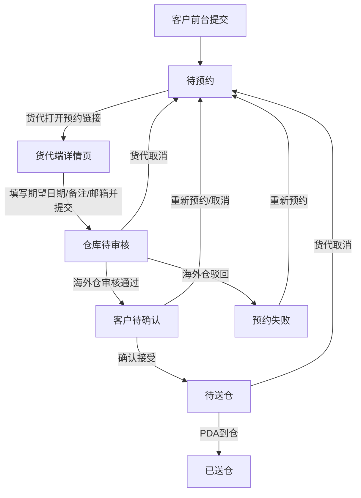

# 货代端预约送仓需求文档

## 1. 文档基础信息

### 1.1 版本记录

| 时间 | 版本 | 修改人 | 变更内容 |
| --- | --- | --- | --- |
| 2026-06-01 | v1.0 | — | 初版，基于当前原型实现整理 |
| 2026-06-01 | v1.1 | — | 方案 A：仓库审核备注/驳回原因按状态展示 |
| 2026-06-01 | v1.2 | — | 方案 B：新增移动端独立详情页 `/fg/m/reservationDetail.html` |
| 2026-06-05 | v1.3 | — | 状态「仓库待确认」更名为「仓库待审核」；新增 W.BOL 独立说明文档引用 |
| 2026-06-05 | v1.4 | — | 对齐原型：预约仓文案、多候选期望日期、联系电话、中英文切换；移除货代公司；邮件演示抄送规则 |

### 1.2 文档范围

| 项目 | 内容 |
| --- | --- |
| 模块名称 | 货代端 · 预约送仓（官网预约页） |
| 适用端 | 运德供应链 WEDO SCM · 货代端 Web（`/fg/`）；移动端仅详情页（`/fg/m/`） |
| 页面范围 | PC：预约码入口页、预约详情页；移动：预约详情页（无独立入口页） |
| 不在范围 | 客户前台创建预约、海外仓审核、PDA 到仓、中台管理（仅描述衔接关系） |

### 1.3 术语表

| 术语 | 说明 |
| --- | --- |
| 预约码 | 即送仓码，客户提交预约后生成的业务码，货代凭此进入系统 |
| 预约单号 | 系统正式单号，只读展示 |
| 主邮箱 | 客户创建预约时填写，货代端**只读不可修改** |
| 备用邮箱 | 货代端可追加/删除，与主邮箱一并接收通知邮件 |
| 预约仓 | 客户创建预约时选择的送仓仓库（字段 `warehouse`）；与入库单/票号上的「目的仓」「收货仓」区分 |
| 期望送仓日期 | 货代填写的希望到仓日期（仓库当地日期）；支持最多 3 个候选日期 |
| 仓库确认时段 | 海外仓审核通过后分配的入仓时间段 |
| 联系电话 | 货代端选填，写入 `contactPhone`，便于仓库联系 |
| 协商历史 | 预约单从首次提交到当前的全部操作日志 |
| W.BOL | 入仓凭证；货代确认时段后（待送仓/已送仓）可下载，详见 [`W.BOL说明与FAQ.md`](./W.BOL说明与FAQ.md) |
| 待仓库审核 | 货代端对「仓库待审核」状态的展示文案 |
| 待客户确认 | 货代端对「客户待确认」状态的展示文案 |

---

## 2. 需求背景

### 2.1 背景描述

客户在客户前台创建预约并生成预约链接后，货代需补充**期望送仓日期、备注、通知邮箱**，并提交海外仓审核；后续还需在仓库分配时段后**确认接受或重新协商**。货代端采用**无登录、凭预约码访问**的轻量页面，面向货代公司操作员及客户转发链接场景。

### 2.2 需求列表

| 编号 | 用户诉求 | 提出人/部门 |
| --- | --- | --- |
| R-01 | 凭预约码快速打开预约单 | 货代/客服 |
| R-02 | 补充期望送仓日期并提交仓库审核 | 货代 |
| R-03 | 维护备用通知邮箱 | 货代/客服 |
| R-04 | 查看仓库审核结果并确认时段 | 货代 |
| R-05 | 不接受时段时可重新预约或取消 | 货代 |
| R-06 | 待送仓后下载 W.BOL | 货代/司机 |
| R-07 | 查看协商历史追溯沟通过程 | 客服 |

### 2.3 核心目标

**作为货代，我希望通过预约码完成送仓信息补充、提交审核与时段确认，以便高效协同海外仓收货安排并接收系统通知。**

核心指标：货代提交成功率、从「待预约」到「仓库待审核」耗时、客户待确认状态下 48 小时内确认率。

---

## 3. 功能总览

### 3.1 业务流程

**货代端职责边界：**

- 负责：凭预约码访问、补充送仓信息、提交审核、维护备用邮箱、确认/拒绝仓库时段、撤回/重新预约、下载 W.BOL、查看协商历史。
- 不负责：修改预约单基础信息（预约仓、送仓类型、箱托数、货物明细等，均由客户前台维护）。

### 3.2 功能清单

| 编号 | 功能模块 | 功能简述 |
| --- | --- | --- |
| F-01 | 预约码入口 | 输入预约码校验并跳转详情 |
| F-02 | 预约单信息展示 | 只读展示预约单号、预约仓、箱托、整柜信息等 |
| F-03 | 发货信息展示 | 只读展示关联入库单及送仓箱数 |
| F-04 | 送仓信息编辑 | 期望日期、备注、通知邮箱（主+备用） |
| F-05 | 仓库回显信息 | 审核后展示确认时段、地址、实际送仓时间 |
| F-06 | 状态操作 | 提交、确认接受、取消、重新预约 |
| F-07 | 协商历史 | 弹窗展示全量操作日志 |
| F-08 | W.BOL 下载 | 待送仓/已送仓状态提供下载链接 |
| F-09 | 移动端详情页 | 独立移动布局，卡片化信息展示，复用同一套业务逻辑 |
| F-10 | 中英文切换 | 页眉「中文 / EN」切换；文案与校验提示双语；偏好写入 `localStorage` |

### 3.3 三步流程引导

页面顶部 Stepper 固定三步，用于引导货代理解进度：

| 步骤 | 标签 | 说明 |
| --- | --- | --- |
| 1 | 输入预约码 | 入口页为 active；详情页为 done |
| 2 | 预约送仓 | 详情页为 active |
| 3 | 送仓完成 | 状态为「已送仓」时标记 done |

---

## 4. 功能详细设计

### 4.1 预约码入口页（F-01）

#### A. 用户故事

作为货代，我想要输入客户提供的预约码进入预约详情，以便开始填写送仓信息。

#### B. 用户旅程

收到客户预约链接（含预约码）→ 打开 `/fg/index.html` 或带 `?code=` 参数的链接 → 输入/确认预约码 → 点击「确定」→ 跳转详情页。

#### C. 交互与界面

| 区域 | 说明 |
| --- | --- |
| 页眉 | 运德供应链品牌区 + 中英文切换（中文 / EN） |
| Stepper | 第 1 步高亮 |
| 输入区 | 单行文本「请输入预约码」+ 确定按钮 |
| 错误提示 | 输入框下方红色提示，校验失败时展示 |

#### D. 字段与逻辑

| 元素 | 组件 | 逻辑/备注 |
| --- | --- | --- |
| 预约码 | 文本输入 | 必填；不区分大小写匹配 |
| 确定 | 按钮 | 阻止表单默认提交，执行校验 |

**校验规则：**

| 场景 | 处理 |
| --- | --- |
| 预约码为空 | 提示「请输入预约码」，聚焦输入框 |
| 预约码无效 | 提示「预约码无效或不存在，请检查后重试」 |
| 校验通过 | 跳转 `reservationDetail.html?code={预约码}`；移动端 UA 或窄屏时自动跳转 `m/reservationDetail.html?code={预约码}` |

**URL 预填：** 若入口 URL 带 `?code=` 参数，自动填入输入框。

---

### 4.2 预约详情页（F-02 ~ F-08）

#### A. 用户故事

作为货代，我想要在一个页面查看预约全貌、补充送仓信息并按状态执行操作，以便完成与海外仓的预约协同。

#### B. 用户旅程

预约码校验通过 → 查看预约单/发货信息 → 填写期望日期与邮箱 → 提交预约 → 等待仓库审核 → 确认接受或重新协商 → 待送仓后下载 W.BOL。

#### C. 交互与界面

| 区域 | 说明 |
| --- | --- |
| 页眉 | 运德供应链品牌区 + 中英文切换（中文 / EN） |
| 顶部提示 | 固定文案：请提前 2 个工作日提交，避免时差影响 |
| 预约单信息 | 表格只读；右上角「协商历史」链接 |
| 发货信息 | 入库单明细表格只读 |
| 送仓信息 | 可编辑/只读字段混合；含 W.BOL 下载区 |
| 底部按钮 | 按状态动态展示；始终有「返回」 |

**页面顶部状态展示映射：**

| 系统状态 | 货代端展示 |
| --- | --- |
| 仓库待审核 | 待仓库审核（红色样式） |
| 客户待确认 | 待客户确认 |
| 预约失败 | 预约失败 |
| 其他 | 原状态文案 |

#### D. 预约单信息（只读）

| 字段 | 展示规则 |
| --- | --- |
| 预约单号 | — |
| 预约码 | — |
| 预约仓 | 展示客户所选 `warehouse`；**不展示**入库单维度「目的仓」 |
| 预约状态 | 见上表映射；待仓库审核标红 |
| 送仓类型 | 整柜 / 散货 |
| 送仓总箱数 | — |
| 集装箱号 | **仅整柜**展示列 |
| 柜型 | **仅整柜**展示列 |
| 是否打托 | 是 / 否 |
| 送仓总托数 | 未打托为 0 |

**不展示：** 货代公司、总体积、总重量（客户前台创建时总体积/总重量为选填，货代端始终不展示）。

#### E. 发货信息（只读）

| 列名 | 说明 |
| --- | --- |
| 入库单/票号 | 关联入库单号 |
| 运输方式 | 如客户自发头程 |
| 下单时间 | 入库单创建时间 |
| 送仓箱数 | 客户申报的该行送仓箱数 |

无明细时展示「暂无关联入库单」。

#### F. 送仓信息（可编辑区）

| 字段 | 组件 | 必填 | 可编辑状态 | 逻辑/备注 |
| --- | --- | --- | --- | --- |
| 期望送仓日期（当地） | 日期列表 | 首个必填 | 待预约、待提交 | 第 1 个为主日期，右侧「+」最多再增 2 个备选，合计 ≤3；标签附仓库时区（美西/美东等） |
| 备注 | 多行文本 | 否 | 待预约、待提交 | 最多 500 字；可补充特殊时段说明 |
| 仓库确认送仓时段 | 只读文本 | — | 始终只读 | 客户待确认及之后展示；未有时显示「-」；有值高亮 |
| 仓库确认地址 | 只读文本 | — | 始终只读 | 同上 |
| W.BOL 下载 | 链接/占位 | — | 始终只读 | 待送仓/已送仓：显示「下载 W.BOL」；否则「-」 |
| 实际送仓时段 | 只读文本 | — | 始终只读 | 已送仓后展示，否则「-」 |
| 联系电话 | 电话输入 | 否 | 待预约、待提交 | 选填；6–32 位，允许数字、空格、`+ - ( )` |
| 通知邮箱 | 邮箱列表 | 主邮箱必填 | 见下表 | 见「通知邮箱规则」 |

#### F.1 仓库反馈展示（方案 A）

海外仓审核结论在主界面独立展示；**仓库待审核及更早状态不展示以下字段**。

| 字段 | 展示条件 | 样式 | 重新预约后 |
| --- | --- | --- | --- |
| 仓库审核备注 | 客户待确认 / 待送仓 / 已送仓 | 普通只读文本；无内容显示「—」 | 清空并隐藏 |
| 驳回原因 | 预约失败 | 红色强调 | 清空并隐藏 |

- 确认接受弹窗：若有仓库审核备注，一并展示。
- 重新预约（预约失败/已超时）：确认文案提示将清空本轮驳回/审核信息，历史可在「协商历史」查看。

**期望送仓日期校验：**

| 规则 | 错误提示 |
| --- | --- |
| 首个日期未选 | 请选择期望送仓日期 |
| 任一候选早于今天 | 期望送仓日期不能早于今天 |
| 任一为周六/周日 | 仓库周末（周六、周日）不收货，请选择工作日 |
| 候选日期重复 | 候选日期不能重复：{日期} |
| 添加备选时上一项为空 | 请先填写上一个备选日期 |
| 超过 3 个 | 最多只能选择 3 个期望送仓日期 |
| 选周末后 change | 立即 Alert 并清空已选日期 |

**存储结构：** `expectedInboundDates[]`（最多 3 个）；`expectedInboundTime` 同步为第 1 个日期。

**提示文案：** 请选择期望送仓日期（{仓库当地时区}），**周末（周六、周日）不收货**。最多可添加 3 个候选日期，第一个必填。

#### G. 通知邮箱规则

| 类型 | 规则 |
| --- | --- |
| 主邮箱 | 客户创建时写入；输入框 **只读**；不可删除 |
| 备用邮箱 | 主邮箱行右侧「+」追加；每行可「×」删除；可编辑 |
| 保存结构 | `primaryEmail = emails[0]`；`emails = [主邮箱, ...备用]` |
| 校验 | 主邮箱不能为空；所有邮箱须符合格式；备用邮箱去重 |
| 可编辑 | 仅「待预约」「待提交」状态可增删改备用邮箱；其他状态整区禁用且隐藏「+」 |
| 联系电话 | 与邮箱同规则；只读状态下禁用 |

> 货代端不展示「主邮箱，不可修改」文字标签，以只读输入框体现。

#### H. 状态操作按钮

| 状态 | 展示按钮 | 行为 |
| --- | --- | --- |
| 待预约 / 待提交 | 提交预约、返回 | 校验后提交 → **仓库待审核** |
| 仓库待审核 | 取消预约、返回 | 撤回 → **待预约**，清空仓库协商字段 |
| 客户待确认 | 确认接受、重新预约、取消预约、返回 | 见下表 |
| 待送仓 | 取消预约、返回 | 撤回 → **待预约** |
| 已超时 / 预约失败 | 重新预约、返回 | 撤回 → **待预约** |
| 已送仓 / 其他 | 返回 | — |

**客户待确认状态下的三个操作：**

| 按钮 | 弹窗 | 结果状态 | 说明 |
| --- | --- | --- | --- |
| 确认接受 | 展示仓库确认地址、时段 | 待送仓 | 须已有仓库确认地址或时段 |
| 重新预约 | 确认重新预约 | 待预约 | 清空仓库确认信息；保留期望日期/备注 |
| 取消预约 | 确认取消 | 待预约 | 同上；**不产生「预约失败」** |

**撤回/重新预约时清空的字段：** 仓库确认时段、确认地址、审核备注、驳回原因、确认仓库、实际送仓时间、收货数量、到仓拍照、W.BOL 链接等协商结果字段。

#### I. 协商历史（F-07）

| 项目 | 说明 |
| --- | --- |
| 入口 | 预约单信息标题旁「协商历史」 |
| 形式 | 模态框 |
| 内容 | 时间 + 操作人 + 动作描述；与海外仓/中台同源 `operationLogs`，**时间升序** |
| 空状态 | 「暂无协商记录」 |

#### J. 提交校验汇总（点击「提交预约」）

| 序号 | 校验项 |
| --- | --- |
| 1 | 至少 1 个期望送仓日期，且全部合法（非过去、非周末、不重复、≤3 个） |
| 2 | 备注 ≤ 500 字符 |
| 3 | 联系电话格式正确（若填写） |
| 4 | 主邮箱非空且格式正确 |
| 5 | 所有备用邮箱格式正确且不重复 |
| 6 | 当前状态为「待预约」或「待提交」 |

提交成功后：状态 → **仓库待审核**；写操作日志；触发邮件「预约申请已收到」（详见《预约送仓邮件通知需求文档》）。

#### K. 确认接受校验

| 场景 | 处理 |
| --- | --- |
| 无仓库确认地址且无时段时间 | Alert「暂无仓库确认信息，请联系仓库或等待审核」 |
| 确认成功 | 状态 → **待送仓**；触发邮件「客户已接受送仓安排」「预约成功」 |

#### L. 异常与空状态

| 场景 | 处理 |
| --- | --- |
| URL 无预约码 | 展示空态「未找到该预约码对应的预约单」+ 返回链接 |
| 预约码不存在 | 同上 |
| 提交时状态不允许 | Alert「当前状态无法提交预约」 |
| 多 Tab 数据变更 | 监听 storage 同步刷新页面 |

---

### 4.3 移动端预约详情页（F-09）

#### A. 用户故事

作为货代，我希望在手机上打开预约链接后也能查看详情并完成提交/确认操作，以便外出时及时处理预约协同。

#### B. 访问路径

| 场景 | 路径 |
| --- | --- |
| 直接访问 | `/fg/m/reservationDetail.html?code={预约码}` |
| PC 详情自动跳转 | 打开 `/fg/reservationDetail.html?code=` 时，若 UA 为移动设备或视口 ≤768px，自动 replace 至移动页 |
| 入口页 | **无**独立移动入口；仍使用 PC 版 `/fg/index.html` 输入预约码，校验通过后经 PC 详情页触发跳转 |

#### C. 交互与界面（与 PC 差异）

| 区域 | 移动端处理 |
| --- | --- |
| 页眉 | 品牌区 + 中英文切换（与 PC 一致） |
| 顶部导航 | **Material 分段 Tab**：默认「送仓信息」在前；送仓信息 / 预约单信息（含发货），滑动指示器切换 |
| 预约单信息 | Material 卡片 + KV 列表；右上角 tonal 按钮「协商历史」 |
| 发货信息 | 与预约单信息同模块，独立分区标题 + 卡片列表 |
| 送仓信息 | Outlined 输入框、只读信息区、Material 提示 banner |
| 底部操作 | 圆角 Filled / Outlined 按钮，Material elevation |
| 模态框 | Bottom Sheet 样式，顶部 drag handle |
| 底部按钮 | 固定底栏（sticky），支持 safe-area |
| 模态框 | 自底部弹出，全宽 |
| 仓库审核备注 | 蓝色 `#1677ff` |
| 驳回原因 | 红色 `#ff4d4f` |

#### D. 业务逻辑

与 PC 详情页 **完全一致**：状态—按钮矩阵、多候选期望日期、联系电话、表单校验、仓库反馈展示规则、协商历史、W.BOL 下载、storage 同步等均复用 `deliveryAppointment-common.js`、`official-reservation.js` 与 `fg-i18n.js`。

「返回」按钮跳转 PC 入口页 `/fg/index.html?code={预约码}`（入口页本身未做移动适配）。

---

### 4.4 中英文切换（F-10）

| 项目 | 说明 |
| --- | --- |
| 入口 | 页眉右侧「中文 \| EN」 |
| 范围 | 静态文案、按钮、校验 Alert、空状态、Stepper 副标题 |
| 存储 | `localStorage.fg_locale`（`zh` / `en`） |
| 动态标签 | 期望送仓日期、仓库确认时段、实际送仓时段的标签后缀随预约仓时区切换（美西/美东等），切换语言后需重新渲染 |
| 状态映射 | 「待仓库审核」「待客户确认」等支持英文展示 |

---

## 5. 与上下游模块衔接

| 模块 | 衔接说明 |
| --- | --- |
| 客户前台 | 客户提交后生成预约码与链接（`/fg/index.html?code={预约码}`）；创建页字段为「预约仓」（非入库单「目的仓」）；已移除货代公司；总体积/总重量为选填 |
| 海外仓 | 货代提交后进入「仓库待审核」；仓库审核 →「客户待确认」或「预约失败」 |
| 邮件通知 | 业务收件人为 `emails`（主 + 备用）；**演示环境**所有通知邮件额外抄送 `liuyongmeib@sailvan.com`（与还柜通知一致）；审核通过邮件内链指向 `reservationDetail.html?code={预约码}` |
| W.BOL | 待送仓/已送仓时按送仓类型打开整柜/散货模板，字段与 FAQ 见 [`W.BOL说明与FAQ.md`](./W.BOL说明与FAQ.md) |
| PDA | 待送仓 → PDA 到仓登记 → 已送仓；实际送仓时段回显到货代端 |

---

## 6. 规则与约束

### 6.1 权限与访问

| 规则 | 说明 |
| --- | --- |
| 无账号登录 | 仅凭预约码访问，知道码即可打开 |
| 数据只读范围 | 预约单基础信息、货物明细不可在货代端修改 |
| 主邮箱不可改 | 保证客户指定联系邮箱不被货代覆盖 |

### 6.2 业务规则汇总

| 编号 | 规则 |
| --- | --- |
| BR-01 | 货代提交：待预约/待提交 → 仓库待审核 |
| BR-02 | 货代取消（仓库待审核/待送仓）：→ 待预约，清空协商结果 |
| BR-03 | 确认接受：客户待确认 → 待送仓 |
| BR-04 | 重新预约/取消（客户待确认）：→ 待预约，保留期望日期与备注 |
| BR-05 | 预约失败仅由仓库驳回产生，货代取消不进入预约失败 |
| BR-06 | 期望送仓日期不得为周末；最多 3 个候选且不可重复 |
| BR-07 | W.BOL 仅待送仓、已送仓可下载 |
| BR-08 | 邮件业务收件人读取 `emails` 列表（主 + 备用） |
| BR-09 | 演示环境所有预约通知邮件额外抄送 `liuyongmeib@sailvan.com` |
| BR-10 | 预约单信息展示「预约仓」，不展示货代公司与总体积/总重量 |

### 6.3 非功能要求（原型阶段）

| 分类 | 要求 |
| --- | --- |
| 品牌 | 统一 WEDO SCM 官网风格 |
| 国际化 | `fg-i18n.js` 支持中文/英文；语言偏好存 `localStorage` 键 `fg_locale` |
| 持久化 | 写入 mock 源文件（需 `npm run dev`）；sessionStorage 缓存已废弃 |
| 响应式 | PC 详情页 max-width 1100px；移动端采用独立页面 `/fg/m/reservationDetail.html`，卡片布局 + 底部固定操作栏 |
| 无障碍 | 模态框 aria 属性、表单 label 关联 |

---

## 7. 附录

### 7.1 状态—按钮—表单可编辑矩阵

| 状态 | 提交 | 确认接受 | 重新预约 | 取消 | 重新预约(失败/超时) | 期望日期/备注/联系电话/备用邮箱 |
| --- | --- | --- | --- | --- | --- | --- |
| 待提交 | ✓ | — | — | — | — | 可编辑 |
| 待预约 | ✓ | — | — | — | — | 可编辑 |
| 仓库待审核 | — | — | — | ✓ | — | 只读 |
| 客户待确认 | — | ✓ | ✓ | ✓ | — | 只读 |
| 待送仓 | — | — | — | ✓ | — | 只读 |
| 已送仓 | — | — | — | — | — | 只读 |
| 已超时 | — | — | — | — | ✓ | 只读 |
| 预约失败 | — | — | — | — | ✓ | 只读 |

### 7.2 邮件触发节点（货代相关）

| 业务节点 | 触发时机 | 收件人 |
| --- | --- | --- |
| 预约申请已收到 | 货代提交 → 仓库待审核 | 主邮箱 + 备用邮箱；演示抄送 `liuyongmeib@sailvan.com` |
| 审核通过，请确认时段 | 仓库待审核 → 客户待确认 | 同上 |
| 申请被驳回 | 仓库待审核 → 预约失败 | 同上 |
| 预约成功 | 客户待确认 → 待送仓 | 同上 |
| 还空/退柜通知 | 海外仓发起还柜 | 业务联系人 + 演示抄送 `liuyongmeib@sailvan.com` |

> 演示环境 SMTP 实际发往 `APPOINTMENT_NOTIFY_EMAIL`（默认 `zhengjianfengb@sailvan.com`），`to` 字段记录完整收件人列表（含抄送）。

详见 [`预约送仓邮件模板需求文档.md`](./预约送仓邮件模板需求文档.md)、[`W.BOL说明与FAQ.md`](./W.BOL说明与FAQ.md)。

### 7.3 与客户前台差异对照

| 维度 | 客户前台 | 货代端 |
| --- | --- | --- |
| 访问方式 | 登录客户系统 | 预约码，无登录 |
| 列表页 | 有 | 无 |
| 创建预约 | 有 | 无 |
| 仓库字段 | 创建页称「预约仓」 | 只读展示「预约仓」 |
| 货代公司 | 已移除 | 不展示 |
| 总体积/总重量 | 选填；详情可展示 | 不展示 |
| 期望送仓日期 | 无（货代填） | 有；最多 3 个候选 |
| 备注 | 无（货代填） | 有 |
| 联系电话 | 详情只读展示 | 待预约/待提交可编辑 |
| 邮箱 | 仅主邮箱 | 主邮箱只读 + 备用邮箱 |
| 语言 | 仅中文 | 中文 / EN 切换 |
| 取消（客户待确认） | 已废弃（原型） | 待预约 |
| 接受时段 | 「预定时间」 | 「确认接受」+ 模态框 |

---

## 8. 待确认事项

| 编号 | 问题 | 建议 |
| --- | --- | --- |
| OQ-01 | 预约码是否设有效期？ | 作品集提及 30 天，货代端原型未校验 |
| OQ-02 | 待送仓状态货代「取消预约」是否应限制？ | 当前允许撤回到待预约 |
| OQ-03 | 货代提交是否校验「提前 2 个工作日」？ | 当前仅 UI 提示，提交未硬校验 |
| OQ-04 | 重新预约是否需填写原因？ | 当前原型 reason 参数为空，未展示输入框 |
| OQ-05 | 预约失败状态是否允许货代修改期望日期后直接再提交？ | 当前需先点「重新预约」回到待预约 |
