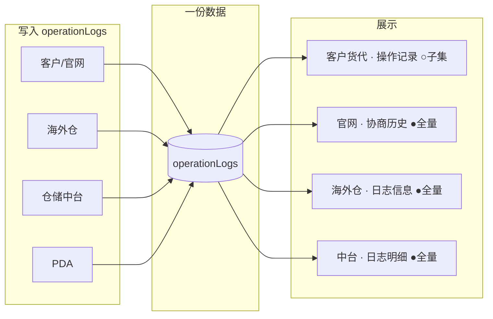

# 预约送仓 · 操作日志总览与各端展示

> **数据**：同一张预约单的 `operationLogs` 只存一份，各端读取后按规则过滤/改写文案。  
> **系统**：本 Demo 中会在详情页展示日志的共 **4 个入口**（见下表）。

---

## 0. 统一话术规范（全端中文）

| 规范项 | 统一写法 |
| --- | --- |
| 语言 | 全文中文；`Web` 改为 **网页**；状态尾句统一为 `，状态变更为「xxx」` |
| 时段 | **送仓时段**（不用「确认时段」「协商时间」） |
| 时间 | **实际送仓时间**（不用「实际到仓时间」） |
| 审核 | `第N轮审核 · 确认/更新/拒收送仓时段 …` |
| 签收 | **网页签收** / **网页更新签收** / **PDA收货签收** / **平台强制签收** |
| 操作人 | 海外仓、海外仓审核、平台（中台强制）、客户编码（客户侧动作） |
| 客户短句 | 由 `buildOperationLogBundle` 生成，与内部原文语义一致 |

实现位置：`customer/js/deliveryAppointment-common.js` → `buildOperationLogBundle` / `pushOperationLogByKind`。

---

## 1. 哪些系统会展示日志

| 系统 | 目录/页面 | 入口 | Tab/区域名 | 展示方式 |
| --- | --- | --- | --- | --- |
| **客户货代前台** | `customer/deliveryAppointmentDetail` | 预约详情 | **操作记录** | **子集** + 角色简化为 **您 / 仓库 / 平台** + 业务短句，时间 **升序** |
| **官网预约** | `fg/reservationDetail`（含移动端） | 预约详情 → **协商历史** | 弹窗内时间线 | **全量** + 真实操作人 + **原文**，时间升序 |
| **海外仓** | `us/receiving-appointment-detail` | 收货预约详情 | **日志信息** | **全量** + 真实操作人 + **原文**，时间 **降序** |
| **仓储中台** | `wh/deliveryAppointmentDetail` | 预约详情 | **日志明细** | **全量** + 真实操作人 + **原文**，时间 **降序** |

说明：

- **客户货代前台**是唯一做「对客户隐藏内部动作」的端。
- **官网预约**当前按 **全量原文** 展示（与海外仓/中台一致），未走客户前台的简化过滤；若业务要求官网与客户前台一致，需单独改 `portal`。

---

## 2. 日志类型总表（共 13 类 + 历史兼容）

| 序号 | 日志类型（业务名） | 典型触发 | 内部标识 `logKind` | 客户货代前台 | 官网协商历史 | 海外仓 | 仓储中台 | 各端示例 |
| ---: | --- | --- | --- | :---: | :---: | :---: | :---: | --- |
| 1 | 提交预约（进入<span style="color:#1677ff">仓库待审核</span>） | 官网/货代提交 | `official_submit` | ○ | ● | ● | ● | **客户**：`您` 预约信息已提交，<span style="color:#1677ff">等待仓库审核</span>。<br>**官网/海外仓/中台**：`CN0000438` 提交预约，状态变更为「<span style="color:#1677ff">仓库待审核</span>」 |
| 2 | 撤回/信息变更（回到待预约） | 官网撤回 | `official_withdraw` | ○ | ● | ● | ● | **客户**：`您` 预约信息已更新。<br>**官网/海外仓/中台**：`CN0000438` 撤回预约，状态变更为「待预约」 |
| 3 | 仓库审核通过（确认时段） | 海外仓审核 | `audit_confirm` | ○ | ● | ● | ● | **客户**：`仓库` 仓库已确认送仓时段：2026-06-20 09:00--12:00（第1次确认）。<br>**官网/海外仓/中台**：`海外仓审核` 第1轮审核 · 确认送仓时段 2026-06-20 09:00--12:00，仓库：美西仓库(CA-91761)，状态变更为「客户待确认」 |
| 4 | 仓库更新审核（改时段） | 海外仓更新审核 | `audit_update` | ○ | ● | ● | ● | **客户**：`仓库` 仓库已更新送仓时段：2026-06-21 14:00--17:00（第2次确认）。<br>**官网/海外仓/中台**：`海外仓审核` 第2轮审核 · 更新送仓时段 2026-06-21 14:00--17:00，仓库：美西仓库(CA-91761)，已重发客户确认邮件 |
| 5 | 仓库拒收 | 海外仓拒收 | `audit_reject` | ○ | ● | ● | ● | **客户**：`仓库` 仓库未能接受本次预约，原因：该日期仓库已排满。预约未通过。<br>**官网/海外仓/中台**：`海外仓审核` 第1轮审核 · 拒收，原因：该日期仓库已排满，状态变更为「预约失败」 |
| 6 | 客户接受仓库时段 | 客户/官网确认、货代「预定时间」 | `customer_accept_slot` | ○ | ● | ● | ● | **客户**：`您` 您已确认接受仓库安排的送仓时段。<br>**官网/海外仓/中台**：`CN0000438` 客户确认送仓时段 2026-06-20 09:00--12:00，状态变更为「待送仓」 |
| 7 | 客户重新预约（不接受时段） | 官网重新预约 | `customer_rebook` | ○ | ● | ● | ● | **客户**：`您` 您未接受当前时段，已重新提交预约信息。<br>**官网/海外仓/中台**：`CN0000438` 客户未接受送仓时段，重新预约，原因：希望改到上午，状态变更为「待预约」 |
| 8 | 客户取消预约 | 官网取消 | `customer_cancel` | ○ | ● | ● | ● | **客户**：`您` 您已取消本次预约。<br>**官网/海外仓/中台**：`CN0000438` 客户取消预约，原因：货物延期，状态变更为「待预约」 |
| 9 | 仓库 PDA 签收 | PDA 扫码收货 | `pda_signoff` | ○ | ● | ● | ● | **客户**：`仓库` 货物已于 2026-06-20 11:20 完成送仓。（收货箱数 48，托数 2）<br>**官网/海外仓/中台**：`海外仓` PDA收货签收，收货总托数：2，收货总箱数：48，状态变更为「已送仓」 |
| 10 | 海外仓网页签收 | 待送仓 → 已送仓 | `us_web_signoff` | ○ | ● | ● | ● | **客户**：`仓库` 货物已于 2026-06-20 11:20 完成送仓。（收货箱数 48，托数 2）<br>**官网/海外仓/中台**：`海外仓` 网页签收，实际送仓时间 2026-06-20 11:20，收货总箱数：48，收货总托数：2，上传签收文件 3 个，状态变更为「已送仓」 |
| 11 | 仓储中台强制签收 | 中台勾选强制签收 | `wh_force_signoff` | ○※ | ● | ● | ● | **客户**：`平台` 平台已确认送仓，送仓时间：2026-06-20 08:00。<br>**官网/海外仓/中台**：`平台` 平台强制签收，实际送仓时间 2026-06-20 08:00，状态变更为「已送仓」，备注：线下已到货 |
| 12 | **还柜 / 还空通知** | 海外仓列表发还空邮件 | `empty_container_return` | — | ● | ● | ● | **客户**：不展示。<br>**官网/海外仓/中台**：`海外仓` 发送还空通知，柜号 MATU1234567，通知时间 2026-06-20 15:00:00，通知邮箱：ops@forwarder.com |
| 13 | **已送仓后更新签收** | 海外仓改箱/托/补传文件 | `us_web_signoff_update` | — | ● | ● | ● | **客户**：不展示。<br>**官网/海外仓/中台**：`海外仓` 网页更新签收，实际送仓时间 2026-06-20 11:20，收货总箱数：50，收货总托数：2，追加签收文件 1 个 |
| — | **历史/无标识记录** | 旧 Mock、未写 `logKind` 的条目 | （空） | ○/—※※ | ● | ● | ● | **客户**：按关键词推断为 ○ 短句或 — 隐藏（如旧文案「官网提交预约…」→ 您 · 预约信息已提交…）。<br>**官网/海外仓/中台**：展示 Mock 中的原始 `action` 全文 |

**图例**

| 符号 | 含义 |
| --- | --- |
| **●** | 展示：**操作人 + 系统写入的完整原文**（含岗位名、邮箱、状态变更等） |
| **○** | 展示：**过滤后的业务短句**；操作人显示为 **您 / 仓库 / 平台**（不显示「海外仓审核」「仓储中台」等） |
| **○※** | 同上；中台强制签收对客户显示为 **「平台已确认送仓，送仓时间：…」** |
| **—** | **不展示** |
| **○/—※※** | 按原文关键词判断：含「还空/发送还空」「重发…邮件」的纯通知类 **不展示**；其余按 ○ 规则推断短句 |

上表 **各端示例** 列：同一行中 **客户** 为客户货代前台展示样式；**官网/海外仓/中台** 三端为同一条内部原文（●），仅排序不同（官网升序、海外仓/中台降序）。

---

## 3. 各端展示差异（同一类日志怎么说）

| 日志类型 | 客户货代前台（○） | 海外仓 / 中台 / 官网（●） |
| --- | --- | --- |
| 审核通过 / 更新审核 | 仓库已确认/更新送仓时段：…（**第 N 次确认**） | 第 N 轮审核 · 确认/更新时段 … 含仓库名、备注、**已重发客户确认邮件** 等 |
| 拒收 | 仓库未能接受…原因…预约未通过 | 第 N 轮审核 · 拒收，原因：… |
| 接受时段 | 您已确认接受仓库安排的送仓时段 | 客户确认接受仓库时段 … 状态变更为待送仓 |
| 中台强制签收 | **平台**已确认送仓，送仓时间：… | **平台强制签收**，实际送仓时间 … |
| PDA / 网页签收 | 货物已于 … 完成送仓（可有箱/托） | PDA收货签收 / 网页签收 … 含箱托、文件数等 |
| 还空通知 | **不展示** | 发送还空通知，柜号 … 通知邮箱：… |
| 已送仓后改签收 | **不展示** | 网页更新签收… |

---

## 4. 文案示例（按类型）

以下示例时间均为 `2026-06-18 10:30:00`，送仓时段示例为 `2026-06-20 09:00--12:00`，仓库示例为 `美西仓库(CA-91761)`，客户编码示例为 `CN0000438`。

**列表展示格式**

| 端 | 一行日志长什么样 |
| --- | --- |
| 客户货代前台 | `2026-06-18 10:30:00` **您** 预约信息已提交，<span style="color:#1677ff">等待仓库审核</span>。 |
| 海外仓 / 中台 / 官网 | `2026-06-18 10:30:00` **海外仓审核** 第1轮审核 · 确认送仓时段 2026-06-20 09:00--12:00，仓库：美西仓库(CA-91761)，状态变更为「客户待确认」 |

---

### 4.1 客户侧动作

| logKind | 内部原文（● 端） | 客户前台展示（○ 端） |
| --- | --- | --- |
| `official_submit` | **CN0000438** 提交预约，状态变更为「<span style="color:#1677ff">仓库待审核</span>」 | **您** 预约信息已提交，<span style="color:#1677ff">等待仓库审核</span>。 |
| `official_withdraw` | **CN0000438** 撤回预约，状态变更为「待预约」 | **您** 预约信息已更新。 |
| `official_cancel` | **CN0000438** 取消预约，状态变更为「待预约」 | **您** 您已取消本次预约。 |
| `official_rebook` | **CN0000438** 重新预约，状态变更为「待预约」 | **您** 预约信息已更新。 |
| `customer_accept_slot` | **CN0000438** 客户确认送仓时段 2026-06-20 09:00--12:00，状态变更为「待送仓」 | **您** 您已确认接受仓库安排的送仓时段。 |
| `customer_rebook` | **CN0000438** 客户未接受送仓时段，重新预约，原因：希望改到上午，状态变更为「待预约」 | **您** 您未接受当前时段，已重新提交预约信息。 |
| `customer_cancel` | **CN0000438** 客户取消预约，原因：货物延期，状态变更为「待预约」 | **您** 您已取消本次预约。 |

---

### 4.2 仓库审核

| logKind | 内部原文（● 端） | 客户前台展示（○ 端） |
| --- | --- | --- |
| `audit_confirm` | **海外仓审核** 第1轮审核 · 确认送仓时段 2026-06-20 09:00--12:00，仓库：美西仓库(CA-91761)，备注：请准时到仓，状态变更为「客户待确认」 | **仓库** 仓库已确认送仓时段：2026-06-20 09:00--12:00（第1次确认）。 |
| `audit_update` | **海外仓审核** 第2轮审核 · 更新送仓时段 2026-06-21 14:00--17:00，仓库：美西仓库(CA-91761)，备注：下午有空档，已重发客户确认邮件 | **仓库** 仓库已更新送仓时段：2026-06-21 14:00--17:00（第2次确认）。 |
| `audit_reject` | **海外仓审核** 第1轮审核 · 拒收，原因：该日期仓库已排满，请重新选择日期，状态变更为「预约失败」 | **仓库** 仓库未能接受本次预约，原因：该日期仓库已排满，请重新选择日期。预约未通过。 |

---

### 4.3 签收与内部通知

| logKind | 内部原文（● 端） | 客户前台展示（○ 端） |
| --- | --- | --- |
| `pda_signoff` | **海外仓** PDA收货签收，收货总托数：2，收货总箱数：48，状态变更为「已送仓」 | **仓库** 货物已于 2026-06-18 10:30:00 完成送仓。（收货箱数 48，托数 2） |
| `us_web_signoff` | **海外仓** 网页签收，实际送仓时间 2026-06-18 09:15，收货总箱数：48，收货总托数：2，上传签收文件 3 个，状态变更为「已送仓」 | **仓库** 货物已于 2026-06-18 09:15 完成送仓。（收货箱数 48，托数 2） |
| `wh_force_signoff` | **平台** 平台强制签收，实际送仓时间 2026-06-18 08:00，状态变更为「已送仓」，备注：客户未在系统确认，线下已到货 | **平台** 平台已确认送仓，送仓时间：2026-06-18 08:00。 |
| `us_web_signoff_update` | **海外仓** 网页更新签收，实际送仓时间 2026-06-18 09:15，收货总箱数：50，收货总托数：2，追加签收文件 1 个 | **（不展示）** |
| `empty_container_return` | **海外仓** 发送还空通知，柜号 MATU1234567，通知时间 2026-06-18 11:00:00，通知邮箱：ops@forwarder.com | **（不展示）** |

---

### 4.4 一条预约单从提交到送仓（时间线示例）

同一预约单在 **客户货代前台 · 操作记录** 中可能依次看到：

```
2026-06-18 09:00:00  您    预约信息已提交，等待仓库审核。
2026-06-18 09:30:00  仓库  仓库已确认送仓时段：2026-06-20 09:00--12:00（第1次确认）。
2026-06-18 10:00:00  您    您已确认接受仓库安排的送仓时段。
2026-06-20 11:20:00  仓库  货物已于 2026-06-20 11:20 完成送仓。（收货箱数 48，托数 2）
```

在 **海外仓 · 日志信息**（降序，最新在上）中，同一段流水对应为：

```
2026-06-20 11:20:00  海外仓      网页签收，实际送仓时间 2026-06-20 11:20，收货总箱数：48，收货总托数：2，状态变更为「已送仓」
2026-06-18 10:00:00  CN0000438   客户确认送仓时段 2026-06-20 09:00--12:00，状态变更为「待送仓」
2026-06-18 09:30:00  海外仓审核  第1轮审核 · 确认送仓时段 2026-06-20 09:00--12:00，仓库：美西仓库(CA-91761)，状态变更为「客户待确认」
2026-06-18 09:00:00  CN0000438   提交预约，状态变更为「仓库待审核」
```

若该单为整柜且已发还空通知，海外仓日志会**额外**出现（客户前台**不出现**）：

```
2026-06-20 15:00:00  海外仓  发送还空通知，柜号 MATU1234567，通知时间 2026-06-20 15:00:00，通知邮箱：ops@forwarder.com
```

---

### 4.5 更新审核（第 2 次确认）示例

仓库改时段后，客户前台会出现**两条**仓库记录（不单独记「重发邮件」）：

```
2026-06-18 09:30:00  仓库  仓库已确认送仓时段：2026-06-20 09:00--12:00（第1次确认）。
2026-06-19 14:00:00  仓库  仓库已更新送仓时段：2026-06-21 14:00--17:00（第2次确认）。
```

海外仓原文第二条为：

```
2026-06-19 14:00:00  海外仓审核  第2轮审核 · 更新送仓时段 2026-06-21 14:00--17:00，仓库：美西仓库(CA-91761)，已重发客户确认邮件
```

---

## 5. 不单独记日志、但会写在其它条里的信息

| 信息 | 是否单独一条 | 客户能否感知 |
| --- | --- | --- |
| 重发客户确认邮件 | 否，合并在 **「仓库更新审核」** 原文中 | 通过 **第 N 次确认 / 更新时段** 感知，不单独出一条 |
| 待提交 → 待预约（货代保存） | 当前 Demo **未写** operationLog | — |
| 已超时 → 重新预约（列表操作） | 当前 Demo **未写** operationLog | — |

---

## 6. 流程示意（谁写入 → 谁可见）



---

## 7. 版本

| 时间 | 说明 |
| --- | --- |
| 2026-06-04 | 整理为「全量日志类型 × 四端展示」对照表 |
| 2026-06-04 | 日志话术统一为中文模板（`buildOperationLogBundle`） |
| 2026-06-04 | 补充各类型文案示例与时间线示例 |
| 2026-06-04 | §2 总表增加「各端示例」列 |
| 2026-06-05 | 状态「仓库待确认」更名为「<span style="color:#1677ff">仓库待审核</span>」；客户侧短句「等待仓库确认」改为「<span style="color:#1677ff">等待仓库审核</span>」 |

---

## 8. 相关文档

| 文档 | 说明 |
| --- | --- |
| <span style="color:#1677ff">[`W.BOL说明与FAQ.md`](./W.BOL说明与FAQ.md)</span> | <span style="color:#1677ff">入仓凭证（待送仓后生成，邮件④中提示司机携带）</span> |
| [`货代端预约送仓需求文档.md`](./货代端预约送仓需求文档.md) | 货代端操作与状态流转 |
| [`海外仓预约送仓需求文档.md`](./海外仓预约送仓需求文档.md) | 审核与 PDA 收货 |
