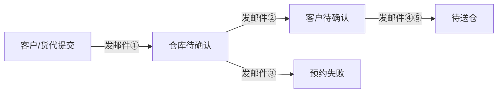

# 预约送仓邮件通知需求文档

## 1. 文档说明

| 项目 | 内容 |
| --- | --- |
| 文档名称 | 预约送仓邮件通知需求文档 |
| 适用场景 | 客户提交预约、海外仓审核、货代确认时段、预约成功等全流程自动通知 |
| 涉及角色 | 货代、海外仓 |
| 发件品牌 | 运德供应链（WEDO SCM） |

**文档目的：** 说明预约送仓各业务节点「何时发邮件、发给谁、写什么内容、需要客户/仓库做什么」，供产品、业务、运营对齐口径。

---

## 2. 邮件发送总则

### 2.1 什么时候发

邮件在**预约单状态发生变化**时自动触发，且仅在与下表匹配的流转节点发送。同一状态内修改信息（如改备注）**不重复发信**。



### 2.2 发给谁

| 收件对象 | 邮箱来源 | 说明 |
| --- | --- | --- |
| 货代 | 主邮箱 + 备用邮箱 | 主邮箱由客户创建预约时填写；货代可在货代端追加备用邮箱，均接收货代类通知 |
| 海外仓 | 仓库通知邮箱（待配置） | 当前演示环境统一发到测试邮箱；上线后应按各仓维护独立通知邮箱 |

### 2.3 邮件长什么样

所有邮件采用统一版式：

| 区域 | 内容 |
| --- | --- |
| 页眉 | 运德供应链品牌区：Logo、品牌名、一句话业务介绍 |
| 正文标题 | 本次通知主题，如「预约申请已收到」 |
| 信息表格 | 预约单号、仓库、时段等关键字段 |
| 操作引导 | 文字说明 + 链接或按钮（部分邮件有） |
| 页脚 | 「本邮件由运德预约送仓系统自动发送，请勿直接回复。」 |

部分货代邮件页脚为品牌深蓝色样式；仓库通知邮件会标注「收件角色：仓库」。

### 2.4 业务约束

| 约束 | 说明 |
| --- | --- |
| 不影响主流程 | 邮件发送失败不阻断预约单状态变更 |
| 可追溯 | 每封邮件留发送记录，含预约单号、送仓码、状态变更前后 |
| 安全 | 邮件正文中的动态内容需防注入处理 |
| 保留期限 | 发送记录最多保留 500 条 |

### 2.5 邮件公共展示字段

所有邮件的信息表格中，在「预约单号」之后统一展示以下字段：

| 展示项 | 取值说明 | 展示条件 |
| --- | --- | --- |
| 预约方 | 客户预约显示客户编号；船务代预约显示「运德船务」 | 始终展示 |
| 送仓类型 | 整柜 / 散货 | 始终展示 |
| 集装箱号 | 预约单上的集装箱号 | **仅送仓类型为「整柜」时展示** |

---

## 3. 邮件清单总览

| 序号 | 邮件名称 | 何时发送 | 发给谁 | 业务目的 |
| --- | --- | --- | --- | --- |
| ① | 预约申请已收到 | 客户/货代提交后，状态变为「仓库待确认」 | 货代 | 告知申请已受理，等待仓库审核 |
| ② | 审核通过，请确认时段 | 仓库审核通过，状态变为「客户待确认」 | 货代 | 告知核定时段，要求 48 小时内确认 |
| ③ | 申请被驳回 | 仓库驳回，状态变为「预约失败」 | 货代 | 告知驳回原因，勿安排送仓 |
| ④ | 客户已接受送仓安排 | 货代/客户接受时段，状态变为「待送仓」 | 海外仓 | 通知仓库按时段备货收货 |
| ⑤ | 预约成功 | 同上（与④同时触发） | 货代 | 告知最终入仓日期、时段、地址 |

> **说明：** 历史版本曾有「提交后通知仓库审核」邮件，当前流程未启用。若业务需要，可单独补充。

---

## 4. 各邮件详细说明

### 4.1 预约申请已收到

**触发时机：** 客户或货代提交预约，预约单进入「仓库待确认」。

**收件人：** 货代（主邮箱 + 备用邮箱）

**邮件主题：**  
`【提交成功通知】预约申请已收到 - {预约单号}`  
（若无预约单号，则用送仓码）

**正文标题：** 预约申请已收到

**邮件中展示的信息：**

| 展示项 | 取值说明 |
| --- | --- |
| 预约单号 | 系统生成的预约单号 |
| 预约方 | 客户编号或「运德船务」 |
| 送仓类型 | 整柜 / 散货 |
| 集装箱号 | 预约单集装箱号（**仅整柜**） |
| 目的地 | 目的仓名称 |
| 预约仓库地址 | 按目的仓区域匹配的标准仓库地址 |
| 预计派送日期 | 客户填写的期望到仓日期 |
| 当前状态 | 固定显示：待仓库审核（Pending Review） |
| 备注 | 客户/货代填写的备注，无则显示「-」 |
| 货量 | 送仓总箱数、送仓总托数（英文格式：cartons / pallets） |

**正文要点：**

- 告知已成功收到入仓预约申请
- 仓库管理员将在 **72 小时内** 完成审核
- 审核通过后会再发包含最终确认时间和卸货地址的邮件
- **在收到最终确认邮件前，请勿安排司机提前派送**

**是否需要操作：** 否（无按钮、无链接）

---

### 4.2 审核通过，请确认时段

**触发时机：** 海外仓审核通过并分配入仓时段，预约单进入「客户待确认」。

**收件人：** 货代（主邮箱 + 备用邮箱）

**邮件主题：**  
`您的入仓预约已审核通过，请点击确认最终时段 - 单号：{预约单号}`

**正文标题：** 入仓预约已审核通过

**邮件中展示的信息：**

| 展示项 | 取值说明 |
| --- | --- |
| 预约单号 | 系统生成的预约单号 |
| 预约方 | 客户编号或「运德船务」 |
| 送仓类型 | 整柜 / 散货 |
| 集装箱号 | 预约单集装箱号（**仅整柜**） |
| 预约仓库 | 审核确认的目的仓 |
| 仓库确认地址 | 仓库填写的详细卸货地址 |
| 核定入仓时段 | 仓库分配的入仓时间段（标注为当地时间） |

**正文要点：**

- 告知预约已通过仓库审核
- 请在 **48 小时内** 完成最后确认
- 逾期未确认，时段可能释放给其他预约
- 确认后将生成入仓凭证（W.BOL），请司机随货携带
- 司机须在核定时间内到仓；取消或变更须至少提前 **12 小时** 在系统处理

**需要操作：** 是

- 正文内嵌链接文案：**点击此处：确认是否接受预约**
- 点击后进入货代端预约详情页（通过送仓码打开）

---

### 4.3 申请被驳回

**触发时机：** 海外仓审核不通过，预约单变为「预约失败」。

**收件人：** 货代（主邮箱 + 备用邮箱）

**邮件主题：**  
`【预约失败】申请被驳回 - 单号：{预约单号} - 目的地：{目的仓}`

**正文标题：** 申请被驳回

**邮件中展示的信息：**

| 展示项 | 取值说明 |
| --- | --- |
| 预约方 | 客户编号或「运德船务」 |
| 送仓类型 | 整柜 / 散货 |
| 集装箱号 | 预约单集装箱号（**仅整柜**） |
| 驳回原因 | 仓库审核时填写的拒收原因（**上线前须必填，不可为空**） |

**正文要点：**

- 告知入仓预约未通过审核
- 请登录预约后台，按驳回原因修改信息后重新申请
- 重新选择可用派送时段
- **在重新获得审核通过前，切勿安排司机前往仓库**

**需要操作：** 是

- 正文内嵌链接文案：**登录预约后台**

---

### 4.4 客户已接受送仓安排（通知仓库）

**触发时机：** 货代或客户在货代端接受仓库分配的时段，预约单变为「待送仓」。

**收件人：** 海外仓

**邮件主题：**  
`【预约已确认】客户已接受送仓安排 {预约单号}`

**正文标题：** 客户已接受送仓安排

**邮件中展示的信息：**

| 展示项 | 取值说明 |
| --- | --- |
| 预约单号 | 系统生成的预约单号 |
| 预约方 | 客户编号或「运德船务」 |
| 送仓类型 | 整柜 / 散货 |
| 集装箱号 | 预约单集装箱号（**仅整柜**） |
| 送仓码 | 预约业务码 |
| 客户编号 | 客户代码 |
| 预约仓库 | 目的仓 |
| 原状态 / 新状态 | 由「客户待确认」变为「待送仓」 |
| 变更时间 | 确认操作的时间 |
| 仓库确认地址 | 详细卸货地址 |
| 仓库确认时段 | 已锁定的入仓时间段 |
| 货物概要 | 送仓总箱数、送仓总托数 |
| 仓库备注 | 审核时的备注 |

**正文要点：**

- 客户/货代已确认接受仓库安排
- 请仓库按确认时段做好收货准备
- 送仓完成后按流程登记到仓信息

**需要操作：** 是

- 操作按钮：**查看预约详情**
- 点击后进入海外仓预约详情页

---

### 4.5 预约成功（通知货代）

**触发时机：** 与 4.4 相同——货代/客户接受时段，预约单变为「待送仓」时，**与仓库通知同时发出**。

**收件人：** 货代（主邮箱 + 备用邮箱）

**邮件主题：**  
`【预约成功】恭喜，您的入仓申请已确认 - 单号：{预约单号}`

**正文标题：** 入仓申请已确认

**邮件中展示的信息：**

| 展示项 | 取值说明 |
| --- | --- |
| 预约单号 | 系统生成的预约单号 |
| 预约方 | 客户编号或「运德船务」 |
| 送仓类型 | 整柜 / 散货 |
| 集装箱号 | 预约单集装箱号（**仅整柜**） |
| 目的地 | 目的仓 |
| 详细地址 | 仓库确认的卸货地址 |
| 入仓日期 | 从核定时段中解析出的日期 |
| 入仓时段 | 起止时间（如 09:00 - 12:00，当地时间） |

**正文要点：**

- 告知入仓预约已成功，系统已锁定入仓时段
- 请确保货物满足入库标准（包装、贴标等）
- 可参考《运德入库货物要求说明》

**是否需要操作：** 否

---

## 5. 关键字段取值规则

| 业务字段 | 取值规则 |
| --- | --- |
| 单号标识 | 优先取预约单号；无则取送仓码 |
| 预约方 | 客户前台预约取客户编号；船务代预约取「运德船务」 |
| 送仓类型 | 取预约单送仓类型（整柜 / 散货） |
| 集装箱号 | 取预约单集装箱号；散货时不展示该字段 |
| 目的仓 | 取当前确认的目的仓；审核前取客户所选仓库 |
| 送仓总箱数 / 送仓总托数 | 取预约单上申报的送仓数量；未打托时托数按 0 |
| 仓库地址 | 按目的仓所属区域（美西/美东/美中）匹配标准地址 |
| 入仓日期 / 时段 | 从仓库确认的入仓时间段解析；无法解析时展示原始时段文本 |
| 驳回原因 | 取仓库审核拒收时填写的内容 |

---

## 6. 业务术语速查

| 术语 | 说明 |
| --- | --- |
| 预约单 | 一次完整的送仓预约记录 |
| 预约单号 | 系统正式单号，邮件与对外沟通主标识 |
| 送仓码 | 货代查询、确认预约的业务码 |
| 主邮箱 | 客户创建时填写，货代端不可修改，接收所有货代通知 |
| 备用邮箱 | 货代端追加，与主邮箱一并接收通知 |
| 送仓总箱数 / 送仓总托数 | 预约阶段申报的计划数量 |
| 收货总箱数 / 收货总托数 | PDA 到仓登记的实际数量（邮件不涉及） |
| W.BOL | 预约确认后的入仓凭证，司机随货携带 |
| 仓库待确认 | 等海外仓审核库容与时段 |
| 客户待确认 | 仓库已分配时段，等货代/客户确认 |
| 待送仓 | 时段已锁定，等货物到仓 |
| 预约失败 | 仓库审核驳回 |

---

## 7. 待确认与已知问题

| 问题 | 现状 | 建议处理方式 |
| --- | --- | --- |
| 货代收件邮箱 | 演示环境统一发到测试邮箱，未真正读取主邮箱/备用邮箱 | 上线前改为读取预约单上的主邮箱 + 备用邮箱列表 |
| 仓库收件邮箱 | 与货代共用同一测试邮箱 | 按各海外仓配置独立通知邮箱 |
| 提交后通知仓库 | 当前无「提交成功→通知仓库审核」邮件 | 若仓库需要提前感知待审单量，需新增该邮件 |
| 目的地英文后缀 | 部分邮件固定拼接「US West Warehouse」，与实际仓别可能不符 | 按目的仓区域动态展示英文仓别 |
| 驳回原因为空 | 演示环境可能展示占位示例文案 | 上线前强制仓库拒收时必须填写驳回原因 |

---

## 8. 附录：完整正文示例

### 8.1 预约申请已收到

```text
您好！

我们已成功收到您提交的入仓预约申请，相关信息如下：

预约单号：{预约单号}
预约方：{预约方}
送仓类型：{送仓类型}
集装箱号：{集装箱号}（仅整柜邮件展示）
目的地：{目的仓}
预约仓库地址：{仓库地址}
预计派送日期：{期望日期}
当前状态：待仓库审核（Pending Review）
备注：{备注}
货量：{送仓总箱数} cartons / {送仓总托数} pallets

我们的仓库管理员将在 72小时内 完成审核。
审核通过后，系统将自动向您发送包含最终确认时间和详细卸货地址的邮件。
请注意：在收到最终确认邮件前，请勿安排司机提前派送。

祝工作顺利！

仓库预约系统
[WEDO EXPRESS]

（当前为系统邮件，请勿回复）
```

### 8.2 审核通过，请确认时段

```text
您好！

好消息！您提交的入仓预约申请（单号：{预约单号}）已通过仓库审核。

为了确保您的货物能准时入仓，请您在 48小时内 完成最后的确认操作：

预约单号：{预约单号}
预约方：{预约方}
送仓类型：{送仓类型}
集装箱号：{集装箱号}（仅整柜邮件展示）
预约仓库：{目的仓}
仓库确认地址：{详细地址}
核定入仓时段：{时段}（当地时间）

【必须操作】
请点击下方链接进入系统，确认上述分配的时段。逾期未确认，该时段可能会重新释放给其他预约。

[点击此处：确认是否接受预约]

温馨提示：

确认后，系统将生成最终的「入仓凭证/W.BOL」，请交由司机随货携带。
请确保司机在核定时间内到达，如需取消或变更，请至少提前12小时在系统处理。
祝工作顺利！

仓库预约系统
[WEDO EXPRESS]

（当前为系统邮件，请勿回复）
```

### 8.3 申请被驳回

```text
您好！

很抱歉地通知您，您提交的入仓预约申请（单号：{预约单号}）未通过审核。

预约方：{预约方}
送仓类型：{送仓类型}
集装箱号：{集装箱号}（仅整柜邮件展示）

【驳回原因】
{驳回原因}

【后续操作建议】

请登录预约后台，根据上述原因修改相关信息。
重新选择可用的派送时段。
注意：在申请重新获得「审核通过」前，请务必不要安排司机前往仓库，否则将无法入仓卸货。

祝工作顺利！

仓库预约系统
[WEDO EXPRESS]

（当前为系统邮件，请勿回复）
```

### 8.4 客户已接受送仓安排（通知仓库）

```text
客户/货代已确认接受仓库安排，请仓库按确认时段做好收货准备。

预约单号：{预约单号}
预约方：{预约方}
送仓类型：{送仓类型}
集装箱号：{集装箱号}（仅整柜邮件展示）
送仓码：{送仓码}
客户编号：{客户编号}
预约仓库：{目的仓}
原状态：客户待确认
新状态：待送仓
变更时间：{变更时间}

请按确认时段准备收货，并在送仓完成后按流程登记到仓信息。
```

### 8.5 预约成功（通知货代）

```text
[系统自动通知]

您好！

恭喜，您的入仓预约申请已审核成功。系统已为您锁定以下入仓时段：

【预约信息】

预约单号：{预约单号}
预约方：{预约方}
送仓类型：{送仓类型}
集装箱号：{集装箱号}（仅整柜邮件展示）
目的地：{目的仓}
详细地址：{详细地址}
入仓日期：{入仓日期}
入仓时段：{入仓时段}（当地时间）

【入仓指引】

请确保所有货物满足入库标准，包括包装和贴标。详细信息请参阅《运德入库货物要求说明》。
感谢您的配合。

仓库预约系统
[WEDO EXPRESS]

（当前为系统邮件，请勿回复）
```
